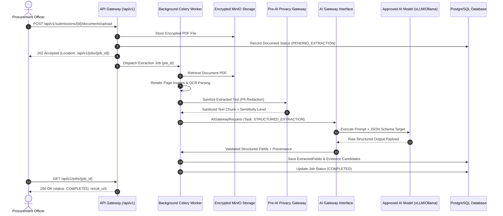
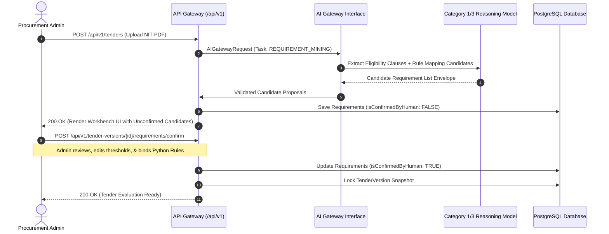
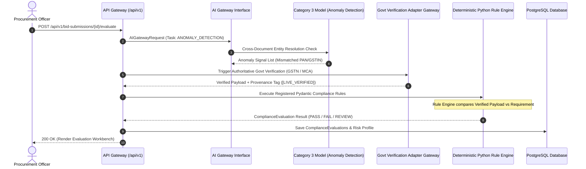
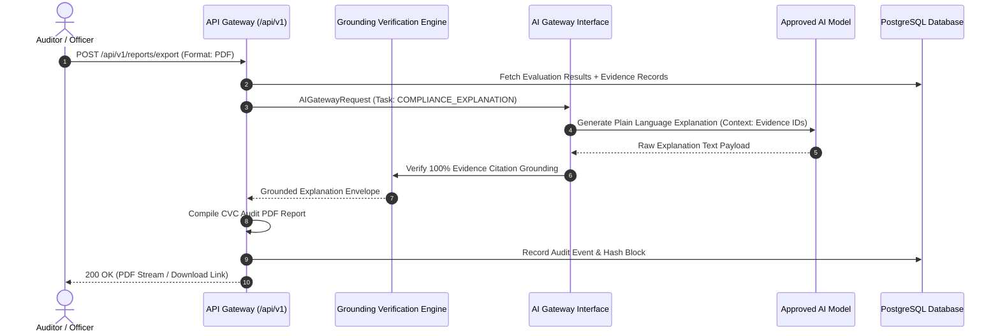

# Phase 1 AI Data Execution Flow Specification

## SIH 26100: AI-Powered Integrated Bid Compliance Verification Platform for GeM Procurement

**Organization:** Ministry of Petroleum & Natural Gas / Chennai Petroleum Corporation Limited (CPCL)  
**Phase:** 1 — Architecture & Technical Design  
**Document ID:** SIH26100-ARCH-022  
**Version:** 1.0.0  
**Date:** 2026-09-05  
**Implementation Status:** ZERO APPLICATION CODE GENERATED

---

## Executive Notice

**Core Authorization Notice:** Phase 0 & Phase 1 establish research, architecture inputs, and system boundaries; government integrations requiring authorization remain subject to official onboarding/approval.

**Zero Application Code Mandate:** This document provides visual Mermaid sequence and data flow diagrams for all AI-assisted platform workflows. No application controllers, code files, or backend scripts are created.

---

## 1. Flow 1: Document Upload, Layout Parsing, & AI Field Extraction

---

## 2. Flow 2: Tender Notice Ingestion & Human Requirement Confirmation

---

## 3. Flow 3: Multi-Document Entity Resolution & Rule Evaluation

---

## 4. Flow 4: Explanation Generation & CVC Audit Report Export

