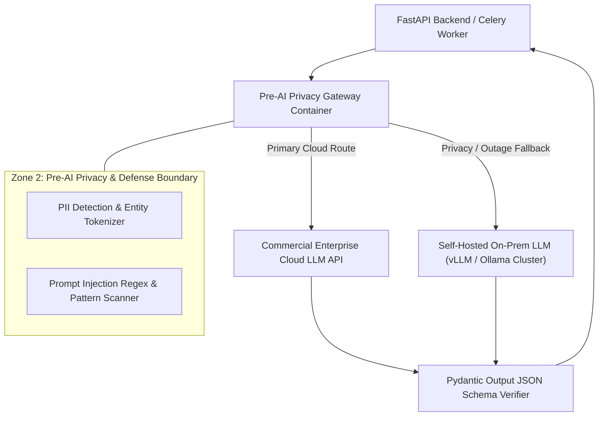

# Phase 1 — AI Infrastructure & Model Gateway Architecture Specification

**Document Control Information**
- **Project Name:** SIH26100 — AI-Powered Integrated Bid Compliance Verification Platform for GeM Procurement
- **Organization:** Ministry of Petroleum & Natural Gas / CPCL
- **Document Version:** 1.0.0 (Phase 1 — Task 10 AI Infrastructure Specification)
- **Status:** DESIGN DRAFT / PENDING REVIEW
- **Security Classification:** INTERNAL
- **Mode:** DESIGN ONLY — ZERO CODE IMPLEMENTATION

---

## 1. Executive Summary & Purpose

This specification defines the infrastructure topology for deploying the AI Gateway, managing commercial cloud AI integrations, hosting optional self-hosted/local models, and enforcing privacy boundaries.

The core AI infrastructure axiom is:
> **"AI infrastructure provides diagnostic information and fact extraction support. AI infrastructure MUST NOT execute rule evaluations, determine bidder qualification, or directly access government verification APIs."**

---

## 2. AI Gateway Infrastructure Topology

---

## 3. Supported AI Deployment Profiles

| Deployment Profile | Target Model Hosting | Network Connection | Use Case / Routing Target | Fallback Strategy |
|---|---|---|---|---|
| **Enterprise Cloud API** | Managed Enterprise API (Commercial Provider) | Outbound HTTPS (Secure TLS transport) via NAT | Complex multi-page PDF document fact extraction | Automatic fallback to secondary cloud or local model on 5xx errors |
| **Self-Hosted On-Prem vLLM**| Local vLLM Container Cluster (GPU Compute) | Private App Subnet (No Internet Access) | High-privacy restricted bid documents | Primary route for RESTRICTED data classification bids |
| **Local Offline Fixture** | Local Ollama Container | Internal Loopback | Offline unit testing & local development | Fallback for local sandbox execution |

---

## 4. AI Infrastructure Safeguards

1. **Strict Non-Authoritative Boundary:** AI Gateway container instances possess zero access credentials to PostgreSQL rule engine databases or government API gateways.
2. **Token & Cost Observability:** AI Gateway containers emit token usage metrics and prompt hashes directly to the Task 9 observability stream.
