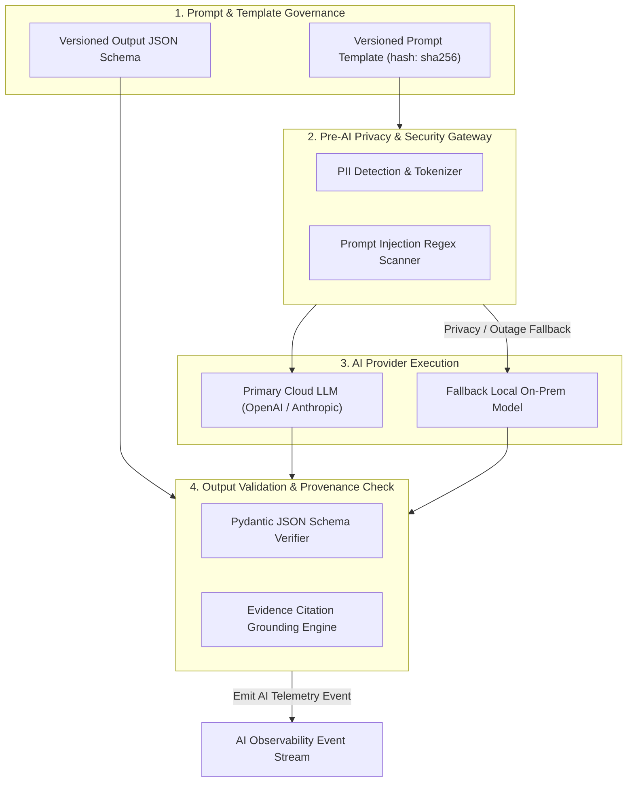

# Phase 1 — AI Observability & Model Governance Telemetry Architecture

**Document Control Information**
- **Project Name:** SIH26100 — AI-Powered Integrated Bid Compliance Verification Platform for GeM Procurement
- **Organization:** Ministry of Petroleum & Natural Gas / CPCL
- **Document Version:** 1.0.0 (Phase 1 — Task 9 AI Observability Specification)
- **Status:** DESIGN DRAFT / PENDING REVIEW
- **Security Classification:** INTERNAL
- **Mode:** DESIGN ONLY — ZERO CODE IMPLEMENTATION

---

## 1. Executive Summary & Purpose

This specification defines the AI observability, prompt governance, and model telemetry architecture for the SIH26100 platform. Artificial Intelligence models (LLMs, OCR extractors, document understanding models) are used to extract candidate facts from complex bid submissions. AI provider/model identity is recorded according to the selected provider abstraction. Examples may include commercial or self-hosted providers; final provider selection is governed separately.

The non-negotiable AI observability boundary is:
> **"AI observability tracks model performance, prompt versioning, token usage, and extraction reliability. Operational telemetry is diagnostic information and must not independently modify authoritative compliance facts, compliance evaluations, risk outcomes, or qualification outcomes."**

---

## 2. AI Provenance & Telemetry Event Schema (`AITelemetryEvent`)

Every call processed through the Pre-AI Privacy Gateway emits a structured `AITelemetryEvent`:

```mermaid
json
{
  "$schema": "https://json-schema.org/draft/2020-12/schema",
  "title": "AITelemetryEvent",
  "type": "object",
  "required": [
    "timestamp",
    "ai_telemetry_id",
    "correlation_id",
    "use_case_id",
    "provider_id",
    "model_id",
    "prompt_template_version",
    "schema_version",
    "sensitivity_classification",
    "routing_decision",
    "latency_ms",
    "schema_validation_status",
    "grounding_status"
  ],
  "properties": {
    "timestamp": { "type": "string", "format": "date-time" },
    "ai_telemetry_id": { "type": "string" },
    "correlation_id": { "type": "string" },
    "use_case_id": { "type": "string", "example": "extract_turnover_facts" },
    "provider_id": { "type": "string", "example": "openai" },
    "model_id": { "type": "string", "example": "gpt-4o-2024-08-06" },
    "prompt_template_version": { "type": "string", "example": "prompt_turnover_v2.1" },
    "prompt_hash": { "type": "string", "example": "e3b0c44298fc1c149afbf4c8996fb92427ae41e4649b934ca495991b7852b855" },
    "schema_version": { "type": "string", "example": "schema_turnover_v1.0" },
    "sensitivity_classification": { "type": "string", "enum": ["PUBLIC", "INTERNAL", "CONFIDENTIAL", "RESTRICTED", "PII"] },
    "pii_scrubbed_count": { "type": "integer" },
    "routing_decision": { "type": "string", "enum": ["PRIMARY_CLOUD", "SECONDARY_CLOUD", "LOCAL_MODEL", "FALLBACK_LOCAL"] },
    "latency_ms": { "type": "number" },
    "prompt_tokens": { "type": "integer" },
    "completion_tokens": { "type": "integer" },
    "total_tokens": { "type": "integer" },
    "estimated_cost_usd": { "type": "number" },
    "schema_validation_status": { "type": "string", "enum": ["PASSED", "REJECTED_EXTRA_KEYS", "REJECTED_MALFORMED", "REJECTED_TYPE_MISMATCH"] },
    "grounding_status": { "type": "string", "enum": ["FULLY_GROUNDED", "PARTIALLY_GROUNDED", "UNVERIFIED_CITATION_FAIL"] },
    "human_review_routed": { "type": "boolean" },
    "prompt_injection_flagged": { "type": "boolean" }
  }
}
```

---

## 3. AI Model Governance & Provenance Tracking



---

## 4. AI Metrics Taxonomy

| Metric Name | Type & Unit | Label Dimensions | Target Health Benchmark | Alert Relationship |
|---|---|---|---|---|
| `ai_requests_total` | Counter (Count) | `provider_id`, `model_id`, `use_case_id` | Baseline throughput | Tracking API usage |
| `ai_request_latency_seconds` | Histogram (Sec) | `provider_id`, `model_id`, `use_case_id` | p95 $< 5.0$ seconds | `AI_LATENCY_SPIKE_WARN` |
| `ai_token_consumption_total` | Counter (Tokens) | `provider_id`, `model_id`, `token_type` | Cost budget tracking | `AI_TOKEN_BUDGET_EXCEEDED` |
| `ai_schema_validation_failures_total` | Counter (Count) | `provider_id`, `schema_version`, `status` | Failure rate $< 5\%$ | `AI_SCHEMA_FAILURE_SPIKE` |
| `ai_fallback_events_total` | Counter (Count) | `from_provider`, `to_provider`, `reason` | Low fallback rate | `AI_PROVIDER_FALLBACK_TRIGGERED` |
| `ai_unverified_citation_total` | Counter (Count) | `use_case_id`, `model_id` | Low unverified rate | `AI_CITATION_GROUNDING_DROP` |
| `ai_prompt_injection_attempts_total` | Counter (Count) | `source_document_id`, `pattern_id` | 0 in normal operation | `PROMPT_INJECTION_DETECTED_SEV2` |

---

## 5. Non-Authoritative AI Boundary Enforcement in Telemetry

1. **Measurable Benchmarks, Not Absolute Guarantees:** Telemetry tracks empirical accuracy metrics (e.g., citation grounding verification rate). Absolute claims (such as "100% accuracy", "zero hallucinations", or "perfect AI reliability") are explicitly prohibited.
2. **Zero Automated Qualification:** High grounding or validation scores recorded in AI telemetry cannot automatically qualify a bidder or bypass AST rule engine evaluations.
3. **Audit Lineage Binding:** AI telemetry outputs carry `prompt_hash` and `model_id` attributes to guarantee complete audit reproducibility for human officer reviews.
