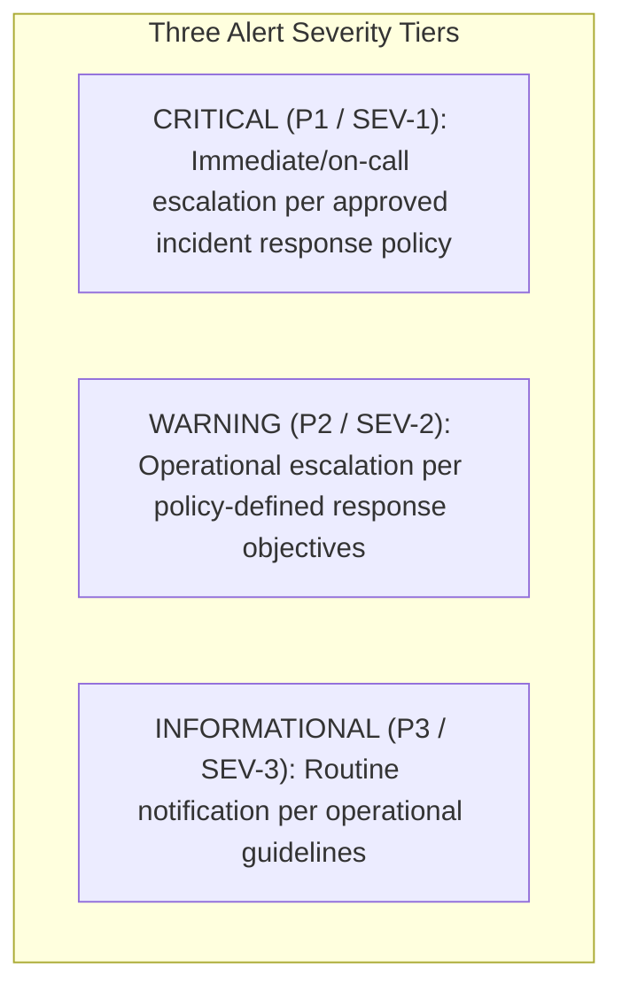

# Phase 1 — Multi-Tier Alerting & Alert Rule Architecture Specification

**Document Control Information**
- **Project Name:** SIH26100 — AI-Powered Integrated Bid Compliance Verification Platform for GeM Procurement
- **Organization:** Ministry of Petroleum & Natural Gas / CPCL
- **Document Version:** 1.0.0 (Phase 1 — Task 9 Alerting Architecture Specification)
- **Status:** DESIGN DRAFT / PENDING REVIEW
- **Security Classification:** INTERNAL
- **Mode:** DESIGN ONLY — ZERO CODE IMPLEMENTATION

---

## 1. Executive Summary & Purpose

This specification defines the alerting architecture, alert rule taxonomy, and alert routing policies for the SIH26100 platform. Alerts provide real-time notification to engineers, security operations, and vigilance officers when system thresholds are breached or operational failures occur.

The core alerting principle is:
> **"Alert quality strictly supersedes alert quantity. Every production alert MUST be actionable, carry explicit diagnostic context, specify an immediate runbook action, and enforce deduplication rules to prevent alert fatigue."**

---

## 2. Three-Tier Alert Severity Hierarchy

> **"Illustrative examples only; not production commitments. All alert thresholds and escalation paths are policy-defined and environment-dependent."**

Alerts are categorized across three operational severity tiers:
- **P1 (CRITICAL / SEV-1):** Immediate/on-call escalation according to the organization's approved incident response policy (subsystem outage, audit hash break, malware, security breach).
- **P2 (WARNING / SEV-2):** Operational escalation according to policy-defined response objectives (latency spike, non-critical dependency outage, queue backlog, high fallback rate).
- **P3 (INFORMATIONAL / SEV-3):** Routine operational notification (system state changes, scheduled job completions, routine configuration updates).



---

## 3. Master Alert Rule Catalog

The following table documents eighteen core alert rules across system domains:

| Alert ID | Alert Name & Severity | Trigger Condition | Diagnostic Context / Labels | Immediate Action Step | Assigned Owner |
|---|---|---|---|---|---|
| **ALT-01** | **`AUDIT_HASH_CHAIN_MUTATED`** (CRITICAL) | `audit_hash_verification_status == 0` | `table_name`, `last_valid_ulid` | Lock DB writes, take immediate cryptographic DB snapshot. | Lead Auditor / SecOps |
| **ALT-02** | **`MALWARE_DETECTED_SEV1`** (CRITICAL) | `document_ingestion_viruses_total > 0` | `document_ulid`, `file_type` | Isolate quarantined file; purge CDR scratch buffer. | Security Ops |
| **ALT-03** | **`PROMPT_INJECTION_DETECTED`** (WARNING) | `ai_prompt_injection_attempts_total > 0` | `document_ulid`, `pattern_id` | Flag document as high risk; route bid to human review. | AI Security Lead |
| **ALT-04** | **`DB_CONNECTION_POOL_EXHAUSTED`** (CRITICAL) | `pg_pool_active_connections >= 95%` | `db_name`, `pool_type` | Scale DB connection pool; inspect slow query traces. | Database Admin |
| **ALT-05** | **`REDIS_BROKER_UNREACHABLE`** (CRITICAL) | `redis_ping_status == 0` for $> 30$s | `broker_channel` | Restart Redis container; verify network subnets. | Infrastructure Lead |
| **ALT-06** | **`CELERY_WORKER_OUTAGE`** (CRITICAL) | `celery_worker_active_count < 2` | `queue_name`, `worker_node` | Restart Celery worker container pool. | Operations Lead |
| **ALT-07** | **`API_5XX_ERROR_SPIKE`** (CRITICAL) | 5xx HTTP error rate $> 5\%$ in 5 min | `route`, `status_code` | Inspect API exception logs; check DB connectivity. | Application Lead |
| **ALT-08** | **`API_LATENCY_DEGRADED`** (WARNING) | p95 HTTP request latency $> 1.0$s | `route` | Identify bottleneck span via distributed tracing. | Application Lead |
| **ALT-09** | **`WORKFLOW_QUEUE_BACKLOG`** (WARNING) | `celery_queue_depth > 500` for 10 min | `queue_name` | Autoscale background worker container pool. | Operations Lead |
| **ALT-10** | **`AI_PROVIDER_OUTAGE`** (WARNING) | Cloud AI API 5xx rate $> 20\%$ in 5 min | `ai_provider`, `model_id` | Switch AI Gateway routing to secondary cloud or local model. | AI Engineering |
| **ALT-11** | **`AI_SCHEMA_FAILURE_SPIKE`** (WARNING) | Schema validation error rate $> 10\%$ | `schema_version`, `model_id` | Inspect LLM JSON outputs; update prompt template. | AI Engineering |
| **ALT-12** | **`GOVT_CIRCUIT_BREAKER_OPEN`** (WARNING) | `govt_circuit_breaker_state == OPEN` | `govt_source` | Switch government integration adapter to `MANUAL_FALLBACK`. | Integration Lead |
| **ALT-13** | **`GOVT_PORTAL_TIMEOUT_SPIKE`** (WARNING) | 504 Timeout rate $> 25\%$ in 5 min | `govt_source` | Check government gateway firewall status. | Integration Lead |
| **ALT-14** | **`COMPLIANCE_REVIEW_SPIKE`** (WARNING) | Human review routing rate $> 30\%$ | `policy_version_id` | Inspect missing evidence trends across submissions. | Compliance Lead |
| **ALT-15** | **`AUTHZ_CAPABILITY_DENIAL_SPIKE`** (WARNING) | 403 Forbidden rate $> 50$ per min | `component`, `capability` | Check for privilege escalation attempt or expired token bugs. | Security Ops |
| **ALT-16** | **`MINIO_STORAGE_CAPACITY_WARN`** (WARNING) | MinIO bucket usage $> 85\%$ | `bucket_name` | Trigger policy-controlled document retention purge. | Infrastructure Lead |
| **ALT-17** | **`HUMAN_REVIEW_QUEUE_BACKLOG`** (WARNING) | Review queue pending age $> 48$h | `tenant_org_id` | Notify CPCL Department Lead to reassign review workload. | Department Lead |
| **ALT-18** | **`IDEMPOTENCY_CONFLICT_SPIKE`** (INFORMATIONAL)| Duplicate job POST requests $> 50$/min | `endpoint` | Check client frontend submit button double-click behavior. | Frontend Lead |

---

## 4. Alert Specification Standard & Suppression Rules

Every alert rule definition MUST conform to the standard **Alert Specification Template**:

```yaml
alert_rule_spec:
  alert_name: API_5XX_ERROR_SPIKE
  severity: CRITICAL
  owner: Application Security & Core Lead
  summary: "HTTP 5xx server error rate exceeded 5% over 5 minutes."
  condition: "sum(rate(http_requests_total{status_code=~'5..'}[5m])) / sum(rate(http_requests_total[5m])) * 100 > 5"
  for_duration: "3m"
  diagnostic_context:
    - route
    - status_code
    - environment
  runbook_link: "docs/PHASE_1_OPERATIONAL_RUNBOOKS.md#runbook-api-outage"
  deduplication_window: "15m"
  recovery_condition: "5xx HTTP error rate drops below 1% for 10 consecutive minutes."
  escalation_path: "Primary On-Call Engineer -> Lead Application Architect (after 15m unacknowledged)."
```

### 4.1 Alert Suppression & Noise Reduction Principles
1. **Deduplication:** Repeated firings of the same alert for the same resource within a 15-minute window are grouped into a single notification.
2. **Inhibition:** Higher-severity alerts suppress child warnings (e.g., a `DB_CONNECTION_POOL_EXHAUSTED` Critical alert suppresses downstream `WORKFLOW_TASK_STUCK` Warnings).
3. **Flap Suppression:** Alerts that alternate rapidly between firing and resolved require 5 consecutive clean evaluation cycles before closing.
