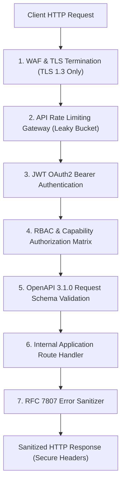
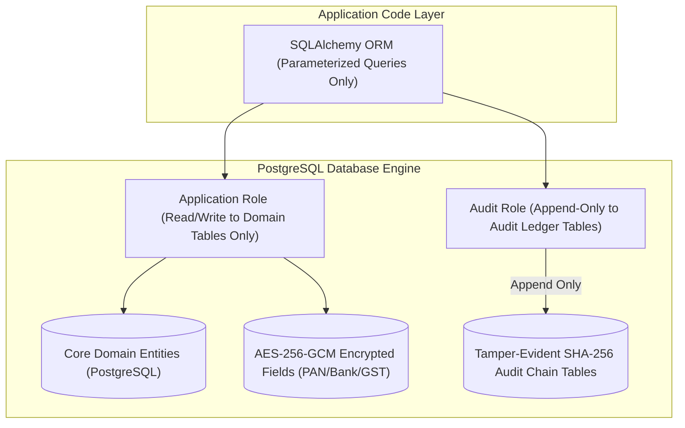
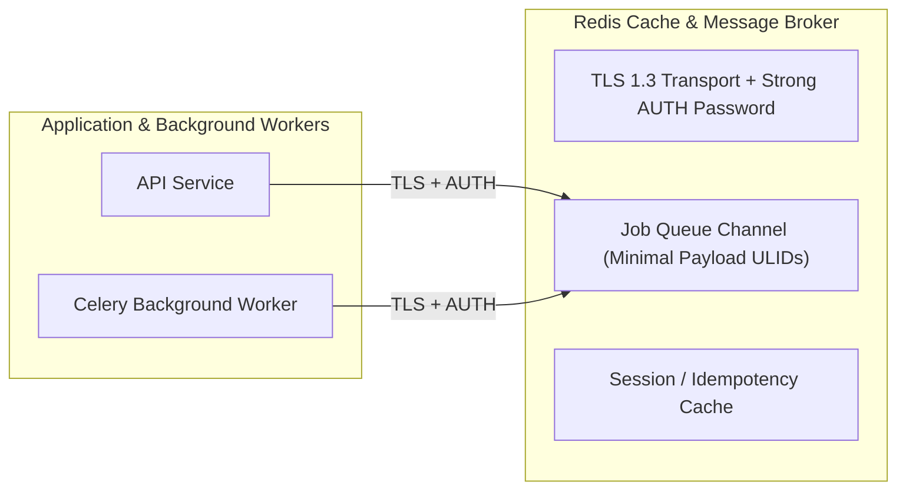
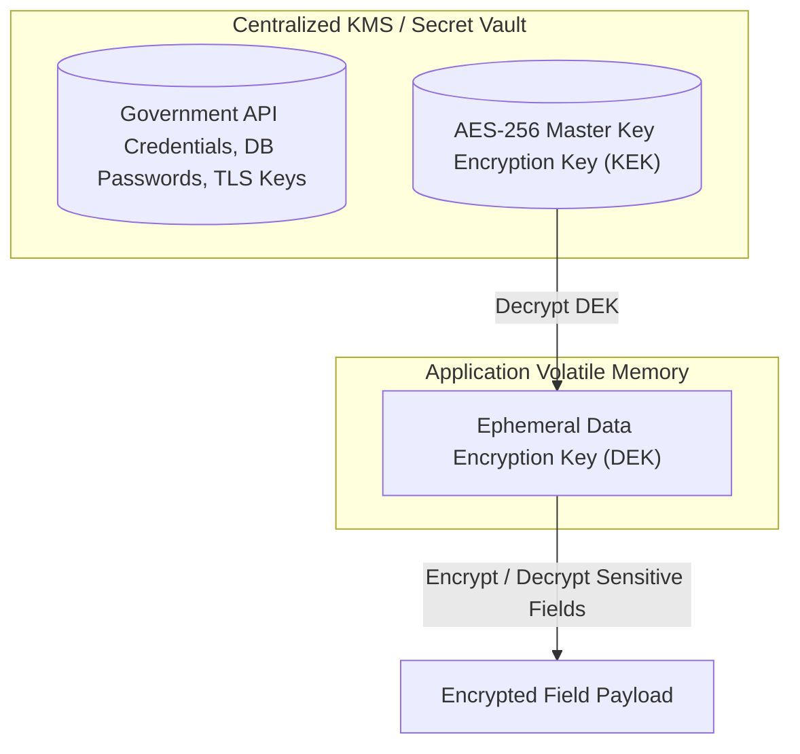

# Phase 1 — API, Database, Storage & Infrastructure Security Architecture

**Document Control Information**
- **Project Name:** SIH26100 — AI-Powered Integrated Bid Compliance Verification Platform for GeM Procurement
- **Organization:** Ministry of Petroleum & Natural Gas / CPCL
- **Document Version:** 1.0.0 (Phase 1 — Task 8 Infrastructure & Storage Security Specification)
- **Status:** DESIGN DRAFT / PENDING REVIEW
- **Security Classification:** INTERNAL
- **Mode:** DESIGN ONLY — ZERO CODE IMPLEMENTATION

---

## 1. Executive Summary & Purpose

This specification defines the core API, database, object storage, and task queue security architecture for the SIH26100 platform. It integrates the technical specifications established across Tasks 2 (Database Architecture), Task 3 (API Contracts), and Task 7 (Workflow & Orchestration) into a unified defense-in-depth security framework protecting system infrastructure assets.

The core infrastructure security principle is:
> **"Every storage engine, database table, API endpoint, and message queue enforces strict transport security, authenticated access, least-privilege service accounts, field-level encryption for sensitive payloads, and isolated secret management."**

---

## 2. API Security Architecture

Integrating Task 3 API specifications, the platform API layer enforces security controls across every HTTP transaction:



### 2.1 API Security Controls
- **Authentication & Authorization:** All non-public endpoints require OAuth2 JWT Bearer tokens validated against the internal OIDC public key. Capability policies enforce fine-grained permissions before route handler execution.
- **Request Input & Schema Validation:** Every incoming JSON payload is validated strictly against OpenAPI 3.1.0 JSON schemas. Undefined keys or extra payload properties are rejected (`extra = "forbid"`).
- **Rate Limiting & Throttling:** API rate limiters operate on a sliding window / leaky bucket algorithm, protecting endpoints against brute-force, credential stuffing, and DoS attacks.
- **Idempotency Enforcement:** Mutative asynchronous job endpoints (e.g., bid verification execution) enforce `X-Idempotency-Key` headers stored in Redis to prevent duplicate processing vulnerabilities.
- **Secure HTTP Headers:** Application API responses include mandatory security headers:
  - `Content-Security-Policy: default-src 'self'`
  - `Strict-Transport-Security: max-age=31536000; includeSubDomains`
  - `X-Content-Type-Options: nosniff`
  - `X-Frame-Options: DENY`
  - `Referrer-Policy: strict-origin-when-cross-origin`
- **Error Sanitization & RFC 7807 Compliance:** API errors return standardized RFC 7807 Problem Details payloads. Internal stack traces, raw SQL queries, environment variables, and system file paths are completely scrubbed before sending error responses to clients.

---

## 3. Database Security Architecture

Integrating Task 2 database specifications, primary storage in PostgreSQL enforces multi-layered database protection:



### 3.1 Parameterized Query Enforcement
- All database interactions execute strictly through parameterized queries via SQLAlchemy ORM. Raw SQL string concatenation is strictly prohibited to neutralize SQL injection vectors.

### 3.2 Least-Privilege Database Accounts
- The application connects to PostgreSQL using restricted service accounts:
  - `app_runtime_user`: Granted `SELECT`, `INSERT`, `UPDATE` permissions on standard domain tables. Expressly forbidden from `DROP TABLE`, `ALTER TABLE`, or administrative database commands.
  - `audit_writer_user`: Granted append-only (`INSERT`, `SELECT`) permissions on the `AuditEvent` hash-chain audit table. Cannot execute `UPDATE` or `DELETE` operations on audit tables.

### 3.3 Field-Level AES-256-GCM Encryption
- Highly sensitive fields tagged as `RESTRICTED` or `PII` (such as PAN numbers, bank account details, and government API credentials) are encrypted at the application layer using **AES-256-GCM** before writing to PostgreSQL.
- Authenticated Data Tags: AES-256-GCM uses the entity ULID as additional authenticated data (AAD) to prevent ciphertext swapping between database rows.

---

## 4. Object Storage (MinIO) Security Architecture

Document storage for PDFs, scans, and evidence artifacts in MinIO (S3-compatible object storage) enforces strict access boundaries:

```mermaid
graph TD
    subgraph Public_Internet ["Public Zone"]
        UserBrowser["User Browser"]
    end

    subgraph Gateway_Zone ["API Gateway Zone"]
        APIServer["API Gateway"]
    end

    subgraph Object_Storage ["MinIO Object Storage Zone"]
        QuarantineBucket[("staging-quarantine/ Bucket")]
        TenderBucket[("tenders-valid/ Bucket")]
        EvidenceBucket[("evidence-artifacts/ Bucket")]
    end

    UserBrowser -->|1. Request Doc View| APIServer
    APIServer -->|2. Validate Capability & Context| APIServer
    APIServer -->|3. Issue Short-Lived Pre-Signed URL (15 min exp)| UserBrowser
    UserBrowser -->|4. Read via Pre-Signed URL| TenderBucket

    UserBrowser -.->|Direct Anonymous Access (BLOCKED)| QuarantineBucket
    UserBrowser -.->|Direct Anonymous Access (BLOCKED)| TenderBucket
```

### 4.1 Storage Security Principles
- **No Public Bucket Access:** All MinIO buckets strictly forbid anonymous or public read/write access (`BucketAccessPolicy = PRIVATE`).
- **Pre-Signed Short-Lived URLs:** Access to valid document artifacts is mediated exclusively via temporary, pre-signed S3 URLs with short expiration periods (e.g., 15 minutes max).
- **Server-Side Encryption (SSE-S3):** All objects written to MinIO are encrypted at rest using server-side AES-256 encryption.
- **Integrity Digest Verification:** Object uploads store the SHA-256 digest of clean disarmed files in metadata headers (`x-amz-meta-sha256`), enabling continuous file integrity validation.

---

## 5. Queue & In-Memory Storage (Redis) Security

Integrating Task 7 queue specifications, Redis in-memory message broker and caching services enforce transport and data isolation:



### 5.1 Redis Security Controls
- **Authenticated Connections:** Redis connections mandate strong password authentication (`AUTH` command) and network isolation within internal container subnets.
- **TLS Encryption in Transit:** All client-to-Redis communication is encrypted using TLS 1.3.
- **Minimal Queue Message Payloads:** Celery task payloads carry minimal ULID references (e.g., `workflow_instance_ulid`, `bid_submission_ulid`) rather than raw document texts, financial figures, or PII payloads.
- **Dead-Letter Handling & TTL:** Failed background tasks are routed to dead-letter queues (`DLQ`) with configurable time-to-live (TTL) limits to prevent message queue poison pills.

---

## 6. Centralized Secret & Encryption Key Management

The architecture abstracts secret management behind a unified interface (`SecretManagerInterface`), enforcing six core rules:



### 6.1 Secret Management Rules
1. **Zero Hardcoded Secrets:** Absolute prohibition against storing passwords, API keys, private certificates, or JWT signing keys in Git repositories or source code files.
2. **Secrets vs. Configuration Separation:** Application configuration settings (`APP_ENV`, `LOG_LEVEL`) are stored separately from cryptographic secrets and API credentials.
3. **Environment Injection:** Production secrets are injected into volatile process memory at runtime via secure Key Management Systems (KMS) or vault abstractions.
4. **Envelope Encryption:** Field-level data encryption uses a Key Encryption Key (KEK) managed in KMS to wrap short-lived Data Encryption Keys (DEKs) in application RAM.
5. **Secret Rotation Support:** Government API keys and database credentials support seamless zero-downtime rotation.
6. **No Secrets in Logs or Prompts:** Log sanitization filters and Pre-AI Privacy Gateways scan outgoing text streams to prevent secret keys or credentials from appearing in application logs or LLM prompts.

---

## 7. Infrastructure Security Control Matrix

| Infrastructure Layer | Security Threat | Primary Architectural Control | Validation Mechanism |
|---|---|---|---|
| **API Gateway** | Replay Attacks, DoS, OWASP Top 10 | Rate limiting, OAuth2 JWT auth, RFC 7807 error sanitization, secure headers | Gateway security tests |
| **PostgreSQL DB** | SQL Injection, Data Theft, Audit Tampering | Parameterized ORM queries, least-privilege DB roles, AES-256 field encryption, append-only audit tables | DB permission audit & SQL injection scans |
| **MinIO Object Store** | Unrestricted Access, File Corruption | Private buckets, short-lived pre-signed URLs, SSE-S3 encryption, SHA-256 integrity digests | Bucket policy tests & digest verifiers |
| **Redis Queue** | Queue Interception, Poison Pills | TLS 1.3, strong password AUTH, task payload minimization, dead-letter queue TTL | Redis AUTH tests & DLQ monitoring |
| **Key / Secret Vault** | Credential Exposure, Hardcoded Secrets | `SecretManagerInterface`, envelope encryption, secret rotation, zero secrets in Git/logs | Static code analysis & secret scanner |
