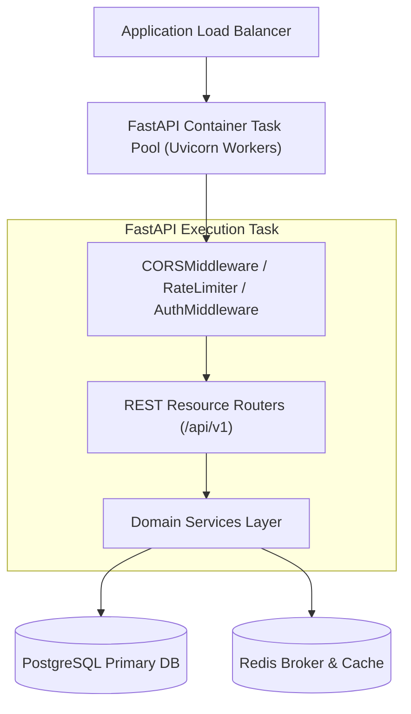

# Phase 1 — API Backend Deployment Specification

**Document Control Information**
- **Project Name:** SIH26100 — AI-Powered Integrated Bid Compliance Verification Platform for GeM Procurement
- **Organization:** Ministry of Petroleum & Natural Gas / CPCL
- **Document Version:** 1.0.0 (Phase 1 — Task 10 API Deployment Specification)
- **Status:** DESIGN DRAFT / PENDING REVIEW
- **Security Classification:** INTERNAL
- **Mode:** DESIGN ONLY — ZERO CODE IMPLEMENTATION

---

## 1. Executive Summary & Purpose

This specification defines the deployment architecture for the FastAPI REST API backend (`/api/v1`).

---

## 2. API Backend Topology

---

## 3. API Deployment Standards

1. **Uvicorn Process Manager:** FastAPI container tasks run using Uvicorn worker processes managed by gunicorn/uvicorn worker configurations (`workers = 4`).
2. **Correlation ID Middleware:** Middleware extracts or generates `X-Correlation-ID` header values for every incoming HTTP request.
3. **RFC 7807 Error Handlers:** Unhandled application exceptions are caught and transformed into standard RFC 7807 problem detail JSON responses.
