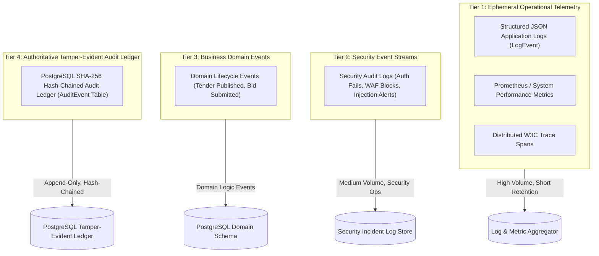
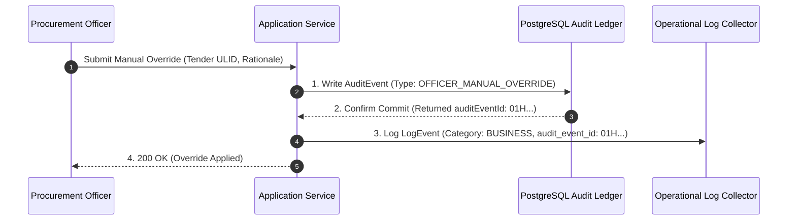

# Phase 1 — Operational Telemetry vs. Authoritative Audit Ledger Architecture

**Document Control Information**
- **Project Name:** SIH26100 — AI-Powered Integrated Bid Compliance Verification Platform for GeM Procurement
- **Organization:** Ministry of Petroleum & Natural Gas / CPCL
- **Document Version:** 1.0.0 (Phase 1 — Task 9 Audit vs. Observability Specification)
- **Status:** DESIGN DRAFT / PENDING REVIEW
- **Security Classification:** INTERNAL
- **Mode:** DESIGN ONLY — ZERO CODE IMPLEMENTATION

---

## 1. Executive Summary & Purpose

This specification defines the formal boundary separating operational telemetry (logs, metrics, distributed traces) from the authoritative tamper-evident audit ledger (`AuditEvent`). Both operational monitoring and vigilance record-keeping process system event signals; however, their security guarantees, storage engines, integrity requirements, and operational goals are fundamentally distinct.

The core boundary principle is:
> **"Operational telemetry monitors system health, performance, and technical errors. AuditEvent records system and user actions for authoritative application audit lineage, subject to applicable governance, evidentiary, and legal requirements. Operational telemetry MUST NOT replace or alter the tamper-evident audit ledger."**

---

## 2. Four-Tier Data Event Classification Architecture

The platform categorizes system data streams into four distinct operational tiers:

---

## 3. Comparative Architectural Matrix

| Architectural Feature | Ephemeral Operational Telemetry | Authoritative Audit Ledger (`AuditEvent`) |
|---|---|---|
| **Primary Objective** | Operational monitoring, performance tuning, diagnostic debugging | Authoritative application audit lineage, vigilance oversight, and record-keeping |
| **Integrity Assurance** | Best-effort transport; non-cryptographic log collection | Cryptographic SHA-256 sequential hash chain ($H_n = \text{SHA256}(H_{n-1} \parallel P_n)$) |
| **Storage Destination** | Ephemeral log collectors / Elasticsearch / OpenSearch | PostgreSQL Append-Only Ledger (`AuditEvent` database table) |
| **Database Privileges** | Application runtime service accounts | Dedicated append-only database account (`audit_writer_user`) |
| **Retention Policy** | Policy-controlled operational retention (e.g., 30–90 days) | Statutory policy-controlled retention with legal hold support |
| **Failure Reaction** | Non-blocking drop if log pipeline is overloaded | Transaction rollback if audit write fails |
| **Data Sensitivity** | Scrubbed of PII, raw documents, and secrets | Strictly structured audit records (contains officer ULIDs, timestamps) |
| **Digital Signatures** | None | None (Preserves SHA-256 hash chain per ADR-064; zero PKI overhead) |

---

## 4. Cross-Reference Integration: Telemetry-to-Audit Linkage

Operational telemetry and the audit ledger are linked via non-mutating cross-references:

### 4.1 Cross-Reference Rules
1. **Unidirectional Linkage:** Log events carry the `audit_event_id` attribute of committed audit records. Log events never modify audit ledger payloads.
2. **Audit Verification Observability:** Background audit integrity verifiers inspect the SHA-256 hash chain daily, emitting an `audit_hash_verification_status` metric (Value: `1` for valid, `0` for broken).

---

## 5. Summary of Audit vs. Telemetry Boundary Governance

1. **No Replacements:** An engineer cannot claim that storing application debug logs satisfies CVC vigilance audit requirements.
2. **No Silent Drops:** Critical vigilance actions (such as manual overrides or policy modifications) MUST execute inside PostgreSQL database transactions alongside the `AuditEvent` write.
3. **No PKI Alterations:** The audit architecture relies strictly on the SHA-256 sequential hash chain established in Task 2 and ADR-064; no PKI digital signature frameworks are introduced.
