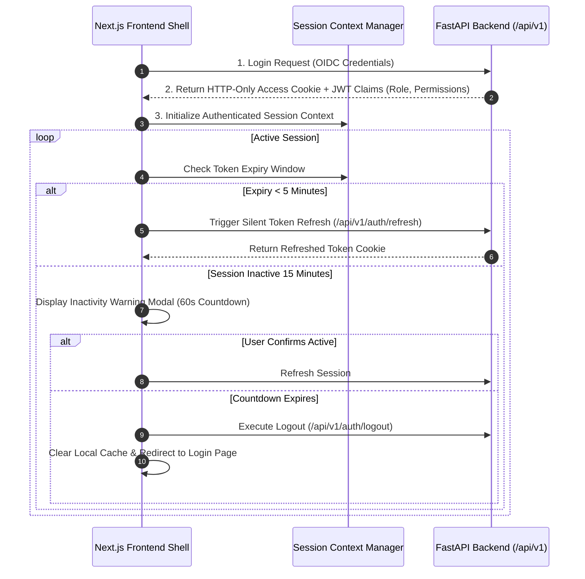

# Phase 1 — Authenticated UI Architecture Specification

**Document Control Information**
- **Project Name:** SIH26100 — AI-Powered Integrated Bid Compliance Verification Platform for GeM Procurement
- **Organization:** Ministry of Petroleum & Natural Gas / CPCL
- **Document Version:** 1.0.0 (Phase 1 — Task 11 Authenticated UI Specification)
- **Status:** DESIGN DRAFT / PENDING REVIEW
- **Security Classification:** INTERNAL
- **Mode:** DESIGN ONLY — ZERO CODE IMPLEMENTATION

---

## 1. Executive Summary & Session Boundary

This specification defines the frontend authenticated shell, token lifecycle handling, session timeout prompts, and authorization-aware UI component rendering.

---

## 2. Authenticated Session & Token Flow

---

## 3. Client-Side RBAC Rendering Controls

1. **Authorization-Aware Component Hiding:** UI elements requiring specific permissions (e.g., "Record Qualification Decision" button) strictly check JWT role claims before rendering.
2. **Backend Authority Baseline:** Client-side UI hiding is a UX convenience only. The backend FastAPI API remains the authoritative security boundary and enforces RBAC independently on every request.
