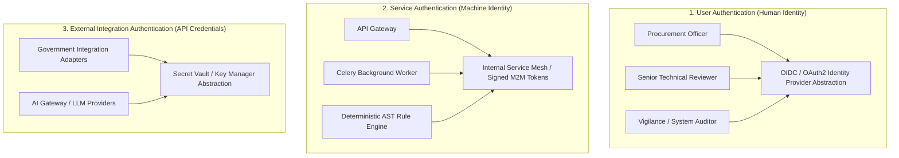
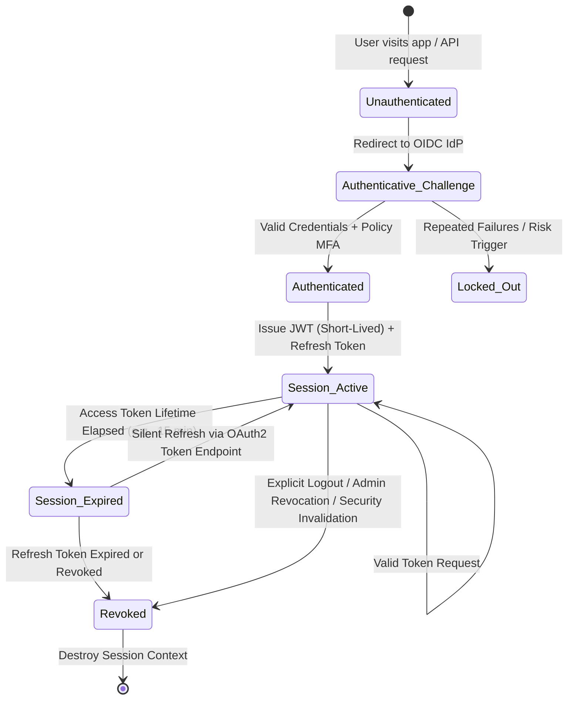
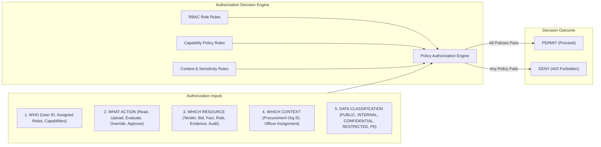

# Phase 1 — Authentication & Authorization Architecture Specification

**Document Control Information**
- **Project Name:** SIH26100 — AI-Powered Integrated Bid Compliance Verification Platform for GeM Procurement
- **Organization:** Ministry of Petroleum & Natural Gas / CPCL
- **Document Version:** 1.0.0 (Phase 1 — Task 8 Auth Architecture Specification)
- **Status:** DESIGN DRAFT / PENDING REVIEW
- **Security Classification:** INTERNAL
- **Mode:** DESIGN ONLY — ZERO CODE IMPLEMENTATION

---

## 1. Executive Summary & Purpose

This document specifies the conceptual authentication and authorization architecture for the SIH26100 platform. It defines how human identities, machine services, background workers, and external integration points are authenticated, how sessions are managed, and how fine-grained access control is enforced across system resources.

The fundamental authorization axiom is:
> **"Authentication establishes identity; Authorization evaluates capability, context, and data classification. Access is denied by default unless an explicit authorization policy permits the operation."**

---

## 2. Distinction Between Identity Spheres

The system explicitly segregates authentication mechanisms into three distinct identity spheres:

### 2.1 User Authentication (Human Identity)
- **Scope:** Human users accessing the presentation layer or API (Procurement Officers, Reviewers, Auditors, System Administrators).
- **Mechanism:** OpenID Connect (OIDC) / OAuth2 authorization code flow with PKCE. Supports enterprise identity federation (e.g., Government single sign-on / SAML 2.0 / OIDC abstractions).
- **Authentication Credentials:** Managed exclusively by the enterprise Identity Provider (IdP). The application backend never stores or processes raw user passwords.

### 2.2 Service Authentication (Machine Identity)
- **Scope:** Inter-service communications within the internal modular monolith boundary (API Gateway $\rightarrow$ Orchestrator $\rightarrow$ Rule Engine $\rightarrow$ Object Storage).
- **Mechanism:** Short-lived machine-to-machine (M2M) bearer tokens signed by an internal token authority, combined with TLS 1.3 transport security.
- **Service Isolation:** Background workers operate under restricted service identity profiles that grant access only to assigned workflow execution tasks.

### 2.3 Integration Authentication (External Credentials)
- **Scope:** System-to-system integrations connecting to external government portals (MCA, GSTN, MSME, Income Tax) and cloud AI providers.
- **Mechanism:** API keys, OAuth2 client credentials, mTLS certificates, or signed HTTP headers managed securely through a Key Management / Secret Isolation interface.
- **Isolation Boundary:** External integration credentials are isolated from application user sessions. No user request can supply or override government API credentials.

---

## 3. User Identity & Session Lifecycle Architecture

### 3.1 Authentication Provider Abstraction
The system accesses identity capabilities through an abstraction layer (`IdentityProviderInterface`), avoiding vendor lock-in to specific cloud identity services. The abstraction defines contracts for:
- User authentication and token exchange (`authenticate_code`, `refresh_token`).
- Claims extraction (`extract_user_claims`).
- User profile and group synchronization (`sync_user_groups`).
- Session revocation (`revoke_user_session`).

### 3.2 Policy-Controlled Multi-Factor Authentication (MFA)
- MFA requirement is **policy-controlled** based on role risk and context.
- High-risk operations (e.g., manual compliance override, tender evaluation final approval, security policy modification) require active step-up MFA verification.
- MFA enforcement is handled at the IdP level or verified via step-up session claims (`amr: ["mfa"]`).

### 3.3 Session & Token Lifecycle Controls
- **Access Token:** Short-lived JSON Web Token (JWT), signed via RS256/ES256. Recommended validity lifetime is short (e.g., 15 minutes).
- **Claims Payload:** Contains standard claims (`sub`, `iss`, `aud`, `exp`, `nbf`, `iat`) plus custom context claims (`user_ulid`, `tenant_org_id`, `role`, `capabilities`).
- **Refresh Token:** Stored in HttpOnly, Secure, SameSite=Strict cookies (for browser web app) or secure storage. Bound to device/client fingerprint.
- **Token Revocation:** Supported via an internal Redis-backed revocation blocklist (`revoked_tokens:{jti}`). Upon user logout, password reset, or admin termination, the token's unique identifier (`jti`) is blocklisted instantly.
- **Account Lockout & Risk Controls:** Brute-force protection, IP velocity checks, and anomaly detection are managed by the OIDC IdP, returning standardized authentication error codes (`invalid_grant`, `account_locked`) to the application.

---

## 4. Multi-Dimensional Authorization Architecture

Authorization in the platform is **not a simple static role check**. It enforces a 5-dimensional evaluation formula for every protected action:

$$\text{Authorization Decision} = \mathcal{F}\Big(\text{WHO}, \text{WHAT ACTION}, \text{WHICH RESOURCE}, \text{WHICH CONTEXT}, \text{DATA CLASSIFICATION}\Big)$$

---

## 5. Role-Based Access Control (RBAC) & Role Hierarchy

The platform defines five primary system roles with explicit separation of duties:

| Role ID | Role Name | Description & Boundary | Allowed Actions | Restricted Actions |
|---|---|---|---|---|
| **R-01** | `ProcurementOfficer` | Primary operational role for managing tenders and bids. | Create tender, upload bid docs, initiate verification workflow, view evaluation traces, submit officer decisions. | Cannot alter compliance policies, view unmasked system audit logs, or perform admin tasks. |
| **R-02** | `SeniorReviewer` | Elevated review role for high-value tenders or four-eyes verification. | Review paused evaluations, perform second-officer four-eyes signoffs, approve manual overrides where policy requires dual control. | Cannot alter global system configuration or modify underlying AST rules. |
| **R-03** | `Auditor` | Read-only vigilance / compliance oversight role. | Read all tender evaluations, export tamper-evident audit traces, verify SHA-256 hash chains, view evidence lineages. | Read-only access across all endpoints. Cannot create, edit, evaluate, or approve any resource. |
| **R-04** | `SystemAdmin` | System configuration and technical administration role. | Manage user provisioning, update system settings, monitor service health, manage integrations. | **Strictly prohibited** from overriding bid compliance evaluation outcomes or altering audit ledgers. |
| **R-05** | `ServiceWorker` | Internal machine role for automated background tasks. | Execute workflow tasks, call AI Gateway, invoke Government Adapters, write normalized facts. | Cannot initiate user workflows or bypass authorization checks. |

### 5.1 Separation of Duties Matrix
To prevent insider threats and administrative overreach, strict operational barriers are enforced:
- **No Self-Approval:** A Procurement Officer who creates a tender or submits an override cannot act as the second-eyes reviewer for that same tender if four-eyes review is enabled by policy.
- **Admin Isolation:** System Administrators cannot execute bid compliance reviews or modify evaluation results.
- **Auditor Independence:** Auditor roles are strictly read-only and isolated from operational modification paths.

---

## 6. Capability-Based Authorization & Resource Isolation

In addition to coarse roles, fine-grained access relies on explicit **Capabilities**. A capability is a granular permission string required to perform a specific operation on a specific resource.

### 6.1 System Capability Taxonomies
- `tender:create`, `tender:read`, `tender:update`, `tender:publish`
- `bid:upload`, `bid:read`, `bid:delete`
- `workflow:start`, `workflow:pause`, `workflow:cancel`, `workflow:retry`
- `fact:read`, `fact:override`
- `rule:read`, `rule:test`, `rule:publish`
- `evidence:read`, `evidence:export`
- `audit:read`, `audit:verify_chain`
- `government:query_live`, `government:override_manual`

### 6.2 Resource-Level & Organizational Isolation
- Access to bids and tenders is bound to the user's **Procurement Context (Organization ID)**.
- A Procurement Officer belonging to CPCL (Chennai Petroleum Corporation Limited) cannot view or modify tender evaluations belonging to another ministry or division unless explicit multi-agency audit permissions are assigned.
- Bidders are assigned unique resource isolation contexts; officers cannot access bidder data outside active assigned tenders.

---

## 7. Service Identity & Machine-to-Machine (M2M) Security

Communication between internal subsystems within the modular monolith follows strict machine identity rules:
1. **Service Accounts:** Internal workers and components run under isolated service identities (`svc-workflow-runner`, `svc-ai-gateway`, `svc-govt-adapter`).
2. **Mutual TLS (mTLS):** Internal network traffic between micro-containers or pods enforces mTLS encryption and identity verification.
3. **Internal Bearer Tokens:** Asynchronous Celery tasks carry short-lived context tokens containing the initiating user's ULID, organization ID, and task correlation ID. Workers cannot manufacture administrative privileges beyond the initiating context.

---

## 8. Summary of Authorization Denials & Failure Behavior

| Security Failure Condition | HTTP Error Code | Internal Action | Audit Event Recorded |
|---|---|---|---|
| Missing Authentication Header | `401 Unauthorized` | Terminate request at API Gateway | `AUTH_MISSING_CREDENTIALS` |
| Expired / Invalid JWT Token | `401 Unauthorized` | Terminate request, require refresh | `AUTH_TOKEN_EXPIRED` |
| Insufficient Role / Capability | `403 Forbidden` | Terminate request | `AUTHZ_CAPABILITY_DENIED` |
| Organization Context Mismatch | `403 Forbidden` | Terminate request | `AUTHZ_ORG_ISOLATION_DENIED` |
| Data Classification Restriction | `403 Forbidden` | Mask response fields or deny | `AUTHZ_DATA_CLASSIFICATION_DENIED` |
| Account Lockout / Risk Violation | `401 Unauthorized` | Block user account session | `AUTH_ACCOUNT_LOCKED` |
