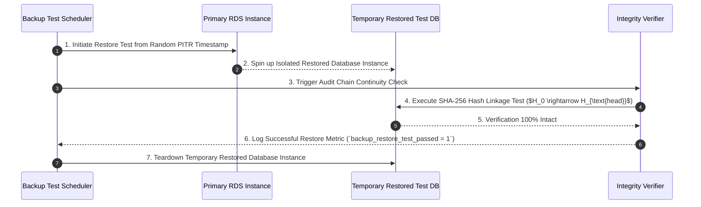

# Phase 1 — Backup Architecture & Restoration Verification Specification

**Document Control Information**
- **Project Name:** SIH26100 — AI-Powered Integrated Bid Compliance Verification Platform for GeM Procurement
- **Organization:** Ministry of Petroleum & Natural Gas / CPCL
- **Document Version:** 1.0.0 (Phase 1 — Task 10 Backup Specification)
- **Status:** DESIGN DRAFT / PENDING REVIEW
- **Security Classification:** INTERNAL
- **Mode:** DESIGN ONLY — ZERO CODE IMPLEMENTATION

---

## 1. Executive Summary & Purpose

This specification defines the backup architecture, automated snapshot schedules, Point-In-Time Recovery (PITR), encryption standards, and automated restoration verification procedures.

---

## 2. Master Backup Schedule & Policy Matrix

1. **PITR Backup Policy:** Continuous WAL archiving and PITR retention SHALL be configured according to approved backup and retention policy.
2. **Restoration Verification:** Periodic automated restore verification SHALL be performed according to the approved backup/DR testing policy.

| Storage Asset Class | Backup Type | Frequency / Schedule | Retention Period | Encryption Standard | Restoration Test Cadence |
|---|---|---|---|---|---|
| **PostgreSQL Database** | Automated RDS Snapshot + WAL Logs | Daily Snapshots + Continuous WAL | Policy-Defined PITR Window | AWS KMS (CMK) | Periodic Restore Verification |
| **Object Storage (S3)** | S3 Bucket Replication & Versioning | Continuous Replication | Policy-Controlled (Legal Hold Compatible) | AWS KMS (CMK) | Periodic Restore Verification |
| **Secrets Manager & Vault**| Exported Secret Metadata Backups | Periodic Encrypted Export | Policy-Defined | AWS KMS (CMK) | Periodic Failover Test |
| **IaC & Config Repo** | Git Version Control | Continuous Commit Push | Permanent Repository History | Signed Git Commits | Continuous CI/CD Validation |

---

## 3. Automated Backup Restoration Verification Lifecycle

