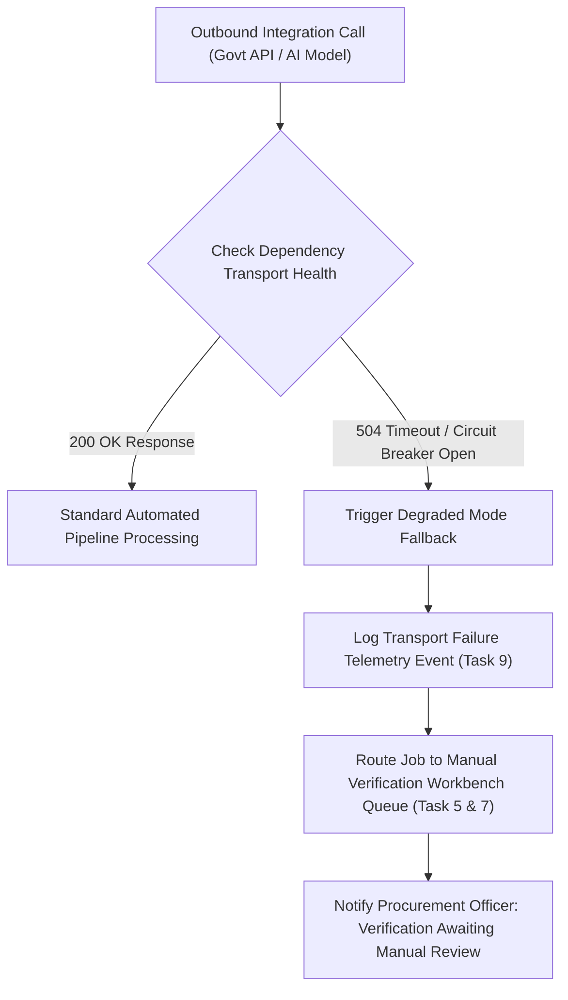

# Phase 1 — Business Continuity & Degraded Mode Architecture Specification

**Document Control Information**
- **Project Name:** SIH26100 — AI-Powered Integrated Bid Compliance Verification Platform for GeM Procurement
- **Organization:** Ministry of Petroleum & Natural Gas / CPCL
- **Document Version:** 1.0.0 (Phase 1 — Task 10 Business Continuity Specification)
- **Status:** DESIGN DRAFT / PENDING REVIEW
- **Security Classification:** INTERNAL
- **Mode:** DESIGN ONLY — ZERO CODE IMPLEMENTATION

---

## 1. Executive Summary & Purpose

This specification defines business continuity protocols, degraded operational modes, dependency failure isolation, and fallback workflows.

The non-negotiable business continuity axiom is:
> **"Infrastructure outages or external integration failures MUST NEVER silently cause a bidder to be disqualified or marked non-compliant (`FAIL`). System degradation routes affected submissions to MANUAL_FALLBACK or checkpoint review."**

---

## 2. Degraded Operational Mode Matrix

| Failure / Degradation Event | System Operating Mode | Operational Impact & Mitigation | Compliance Engine Behavior |
|---|---|---|---|
| **Government Portal Outage / 504 Timeout** | `MANUAL_FALLBACK` Mode | Adapter switches to manual fallback; tasks routed to Officer Workbench queue | Verification status set to `NOT_EVALUATED_DUE_TO_TRANSPORT_ERROR`; requirement routes to human review |
| **Cloud AI Provider Outage** | Secondary Cloud / Local Model Fallback | AI Gateway redirects prompt execution to secondary cloud or self-hosted local model | Facts extracted carry fallback model metadata; AST rule engine executes normally |
| **OCR Sandbox Resource Degradation** | Throttled Document Processing | Document queue backlog scales OCR worker tasks; user notified of delay | Ingestion status set to `PROCESSING_DELAYED`; submission status preserved |
| **Redis Cache Failure** | DB Direct Cache Fallback | FastAPI queries PostgreSQL directly for session/token verification | Processing latency increases slightly; zero loss of domain evaluation state |

---

## 3. Fallback Route & Continuity Sequence

