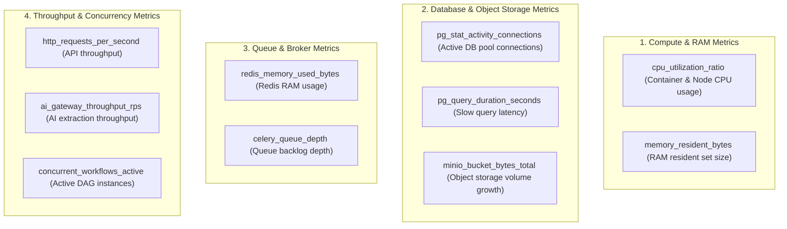

# Phase 1 — Capacity, Throughput & Performance Observability Architecture

**Document Control Information**
- **Project Name:** SIH26100 — AI-Powered Integrated Bid Compliance Verification Platform for GeM Procurement
- **Organization:** Ministry of Petroleum & Natural Gas / CPCL
- **Document Version:** 1.0.0 (Phase 1 — Task 9 Capacity & Performance Specification)
- **Status:** DESIGN DRAFT / PENDING REVIEW
- **Security Classification:** INTERNAL
- **Mode:** DESIGN ONLY — ZERO CODE IMPLEMENTATION

---

## 1. Executive Summary & Purpose

This specification defines the capacity, throughput, and performance observability framework for the SIH26100 platform. Monitoring resource usage (CPU, RAM, DB connection pools, Redis memory, MinIO storage growth, network bandwidth) is necessary to ensure platform stability during peak bid submission windows without creating resource bottlenecks.

The core capacity principle is:
> **"Capacity observability tracks system resource utilization trends and throughput metrics. Capacity thresholds are framed as conceptual architectural benchmarks rather than hardcoded production limits."**

---

## 2. Resource Utilization Metrics Taxonomy

---

## 3. Conceptual Resource Thresholds & Alert Triggers

| Resource Metric Name | Measurement Scope | Conceptual Warning Threshold | Conceptual Critical Threshold | Operational Response Action |
|---|---|---|---|---|
| `cpu_utilization_ratio` | API & Worker Containers | $> 75\%$ for 5 min | $> 90\%$ for 3 min | Autoscale container instance pool. |
| `memory_resident_bytes` | Worker Containers | $> 80\%$ RAM cap | $> 95\%$ RAM cap | Restart worker to prevent OOM crash. |
| `pg_active_connections` | PostgreSQL Pool | $> 75\%$ pool limit | $> 90\%$ pool limit | Scale DB connection pool size. |
| `redis_memory_used_bytes` | Redis In-Memory Store | $> 70\%$ maxmemory | $> 85\%$ maxmemory | Trigger cache eviction (TTL cleanup). |
| `minio_bucket_bytes_total` | MinIO Storage | $> 80\%$ volume cap | $> 90\%$ volume cap | Trigger policy document purge. |
| `concurrent_workflows_active` | Workflow Engine | $> 500$ instances | $> 1000$ instances | Throttling new workflow initiation. |

---

## 4. Performance Scaling & Bottleneck Isolation

1. **Database Connection Isolation:** API route handlers use short-lived connection checkouts, while background Celery workers utilize separate connection pools to prevent worker queue spikes from starving client API requests.
2. **MinIO Storage Growth Monitoring:** Object storage growth is tracked daily by bucket (`staging-quarantine/`, `tenders-valid/`, `evidence-artifacts/`) to project storage scaling needs.
3. **AI Throughput Throttling:** Outbound calls to external AI providers are rate-limited to match vendor tier limits, preventing HTTP 429 throttling blocks.
