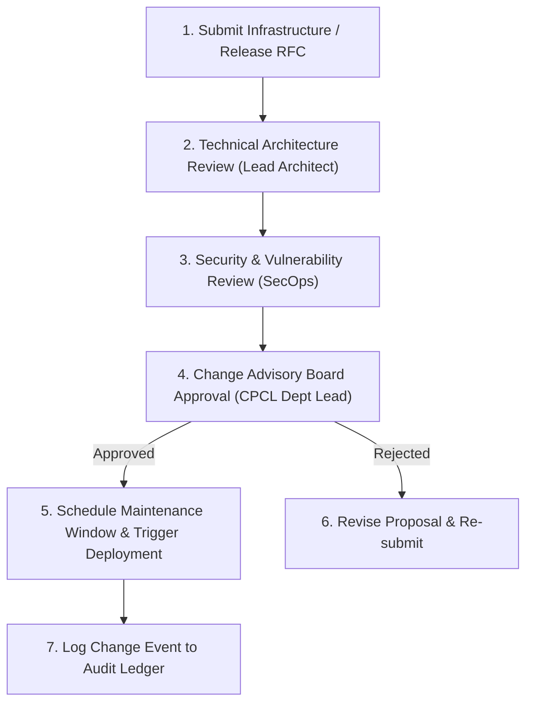

# Phase 1 — Change Management & Operational Governance Specification

**Document Control Information**
- **Project Name:** SIH26100 — AI-Powered Integrated Bid Compliance Verification Platform for GeM Procurement
- **Organization:** Ministry of Petroleum & Natural Gas / CPCL
- **Document Version:** 1.0.0 (Phase 1 — Task 10 Change Management Specification)
- **Status:** DESIGN DRAFT / PENDING REVIEW
- **Security Classification:** INTERNAL
- **Mode:** DESIGN ONLY — ZERO CODE IMPLEMENTATION

---

## 1. Executive Summary & Purpose

This specification defines deployment change management, RFC approval workflows, infrastructure review gates, and emergency hotfix procedures.

---

## 2. Change Approval Lifecycle

---

## 3. Standard vs. Emergency Change Governance

1. **Standard Changes:** Pre-approved routine changes (e.g., minor patch updates, static asset deployments) executing automated CI/CD pipeline gates.
2. **Emergency Hotfixes:** Critical security patch or major system outage repairs; require verbal approval from Lead Architect and SecOps, with retroactive RFC documentation within 24 hours.
