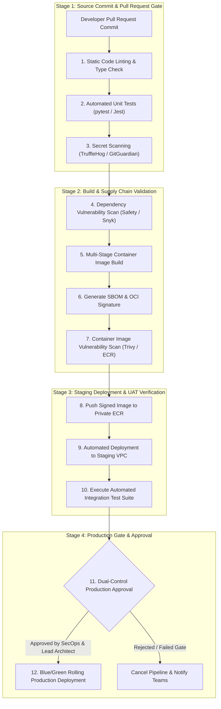

# Phase 1 — CI/CD Pipeline Architecture Specification

**Document Control Information**
- **Project Name:** SIH26100 — AI-Powered Integrated Bid Compliance Verification Platform for GeM Procurement
- **Organization:** Ministry of Petroleum & Natural Gas / CPCL
- **Document Version:** 1.0.0 (Phase 1 — Task 10 CI/CD Specification)
- **Status:** DESIGN DRAFT / PENDING REVIEW
- **Security Classification:** INTERNAL
- **Mode:** DESIGN ONLY — ZERO CODE IMPLEMENTATION

---

## 1. Executive Summary & Purpose

This specification defines the continuous integration and continuous deployment (CI/CD) pipeline architecture, quality gates, automated security scanners, container build workflows, and deployment promotion paths.

> **"This specification defines CI/CD pipeline architecture. No GitHub Actions workflows are executed, no build runners are provisioned, and no pipelines are executed in Task 10."**

---

## 2. CI/CD Pipeline Flow & Gate Topology

---

## 3. Mandatory CI/CD Quality & Security Gates

| Pipeline Gate | Execution Stage | Validation Tool | Failure Action / Threshold |
|---|---|---|---|
| **Gate 1: Static Analysis** | PR Commit | `flake8`, `mypy`, `eslint` | Any type error or lint violation blocks build |
| **Gate 2: Unit Testing** | PR Commit | `pytest`, `jest` | Code coverage $< 85\%$ or any test failure blocks build |
| **Gate 3: Secret Scanning** | PR Commit | `trufflehog` | Immediate build fail on hardcoded key/password match |
| **Gate 4: Dependency Check** | Build Stage | `pip-audit`, `npm audit` | Any `HIGH` or `CRITICAL` vulnerability blocks build |
| **Gate 5: Container Scan** | Image Stage | `trivy` | Any `CRITICAL` container CVE blocks image push |
| **Gate 6: SBOM & Signing** | Image Stage | `syft`, `cosign` | Image unsigned or missing SBOM blocks deployment |
| **Gate 7: Integration Tests** | Staging Stage | Pytest Integration Suite | Any API or workflow contract failure triggers rollback |
| **Gate 8: Prod Gate Approval** | Release Stage | GitHub / AWS Gate | Requires explicit sign-off from Lead Architect & SecOps |

---

## 4. Pipeline Security Isolation

1. **No Production Keys in CI Runners:** CI/CD runners do not possess production database credentials or AWS root keys.
2. **Short-Lived OIDC Tokens:** Deployment tasks authenticate to AWS using OpenID Connect (OIDC) short-lived IAM session tokens.
