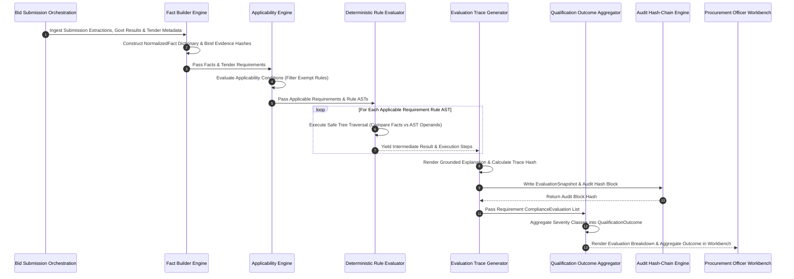

# Phase 1 — Compliance Engine End-to-End Data Flow Architecture

## Overview

This document specifies the end-to-end data flow architectures, sequence diagrams, and Procurement Officer UI visibility controls for the deterministic compliance engine in the **SIH26100 Bid Compliance Verification Platform**.

---

## 1. End-to-End Compliance Evaluation Data Flow

The following Mermaid sequence diagram traces the complete lifecycle of a compliance evaluation—from submission fact ingestion to UI presentation in the Procurement Officer Workbench:



---

## 2. Procurement Officer Workbench UI Specifications

Procurement Officers inspect deterministic compliance determinations via the Workbench UI:

```
+---------------------------------------------------------------------------------------------------+
| COMPLIANCE REQUIREMENT EVALUATION CARD (Procurement Officer Workbench UI)                        |
+---------------------------------------------------------------------------------------------------+
| REQUIREMENT: Financial Turnover Eligibility (Clause Ref: Clause 4.2)                             |
| SEVERITY CLASS: [ DISQUALIFYING_IF_PROVEN ] | CATEGORY: [ FINANCIAL ]                            |
+---------------------------------------------------------------------------------------------------+
|                                                                                                   |
|  EVALUATION OUTCOME BADGE:                                                                        |
|  +---------------------------------------------------------------------------------------------+  |
|  | EVALUATION STATUS: [ PASS ] (Deterministically Verified via Evidence ID 01J7A8EVIDENCE001)   |  |
|  +---------------------------------------------------------------------------------------------+  |
|                                                                                                   |
|  DETERMINISTIC EVALUATION TRACE:                                                                  |
|  • Rule Code: RULE-FIN-TURNOVER-GTE (Version 1)                                                   |
|  • Policy Version: POL-MII-LOCAL-CONTENT-v2026.1                                                  |
|  • Evaluated At: 2026-09-05 14:30:05 UTC                                                          |
|  • Input Fact: bidder_average_annual_turnover_inr = ₹15.00 Crore (Status: VERIFIED)               |
|  • Policy Parameter: required_annual_turnover_inr = ₹10.00 Crore                                  |
|  • Executed Operator: GTE (₹15.00 Cr >= ₹10.00 Cr) ──► True                                       |
|                                                                                                   |
|  GROUNDED EXPLANATION:                                                                            |
|  "Requirement PASSED: Bidder average annual turnover of ₹15.00 Crore meets or exceeds the        |
|   required policy threshold of ₹10.00 Crore (Ref: Clause 4.2, Policy POL-MII-v2026.1).           |
|   Evidence verified from Audited Financial Statement (Evidence ID: 01J7A8EVIDENCE0000000000001)."  |
|                                                                                                   |
|  PROVENANCE & AUDIT TRAIL:                                                                        |
|  • Evidence Hash (SHA-256): a4f8b91c...8821a90e                                               |
|  • Snapshot Hash (SHA-256): e7d19902...3312a019                                                   |
|  • Audit Block Link: Block #14890 (Hash: 8b11c009...7710)                                        |
|  • Evidence Record Link: [ View Audited Balance Sheet PDF ] [ Inspect Raw AST JSON ]             |
+---------------------------------------------------------------------------------------------------+
```

---

## 3. Evaluation Status Visual Badging

UI components enforce consistent visual styling to reflect evaluation status severity:

| Status | Badge Color & Style | Header Notice Banner |
| :--- | :--- | :--- |
| `PASS` | **Solid Green Badge** (`#10B981`) | *"Requirement Compliance Verified via Deterministic Rule Trace"* |
| `FAIL` | **Solid Red Badge** (`#EF4444`) | *"REQUIREMENT VIOLATION: Disqualifying Condition Proven with Verified Evidence"* |
| `REQUIRES_HUMAN_REVIEW` | **Amber Badge** (`#F59E0B`) | *"ACTION REQUIRED: Ambiguity or Discrepancy Escalated to Procurement Officer"* |
| `MISSING_EVIDENCE` | **Orange Badge** (`#F97316`) | *"NOTICE: Mandatory Submitted Evidence Item Absent"* |
| `NOT_APPLICABLE` | **Muted Gray Badge** (`#6B7280`) | *"EXEMPT: Requirement Not Applicable for Bidder Category"* |
