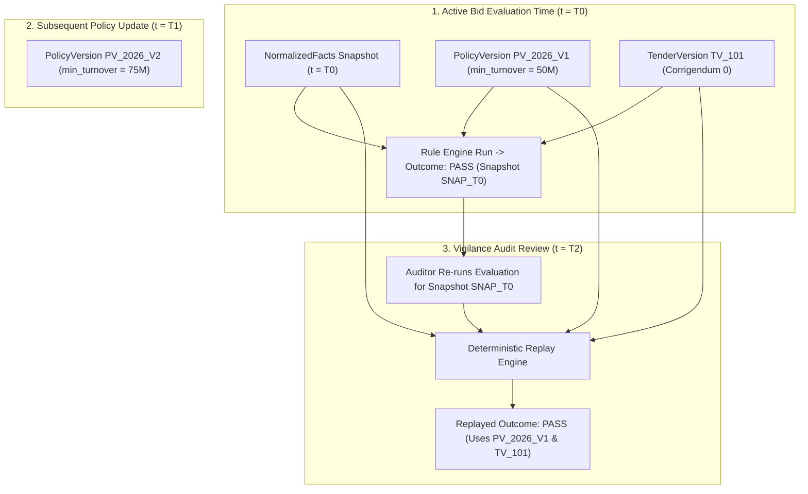

# Phase 1 — Compliance & Policy Version Drift Observability Architecture

**Document Control Information**
- **Project Name:** SIH26100 — AI-Powered Integrated Bid Compliance Verification Platform for GeM Procurement
- **Organization:** Ministry of Petroleum & Natural Gas / CPCL
- **Document Version:** 1.0.0 (Phase 1 — Task 9 Compliance Drift Specification)
- **Status:** DESIGN DRAFT / PENDING REVIEW
- **Security Classification:** INTERNAL
- **Mode:** DESIGN ONLY — ZERO CODE IMPLEMENTATION

---

## 1. Executive Summary & Purpose

This specification defines the compliance drift, policy versioning, and evaluation reproducibility observability architecture for the SIH26100 platform. Tender criteria, policy thresholds (such as minimum Local Content percentages), and government rules evolve over time. Observability must track policy version updates, corrigenda amendments, and rule revisions without corrupting historical evaluation snapshots.

The core compliance drift principle is:
> **"Compliance drift observability tracks changes in policies, rules, and tender corrigenda over time. Historical evaluation snapshots MUST remain 100% reproducible based on their bound PolicyVersion, TenderVersion, and NormalizedFact snapshots."**

---

## 2. Evaluation Reproducibility & Temporal Binding Topology

---

## 3. Compliance Drift Telemetry Metrics

- `compliance_policy_version_updates_total` (Counter: tracks publication of new `PolicyVersion` records).
- `compliance_corrigendum_amendments_total` (Counter: tracks tender eligibility rule amendments).
- `compliance_reproducibility_verifications_total` (Counter: tracks audit evaluation replay runs).
- `compliance_historical_snapshot_mismatches_total` (Counter: MUST remain 0; alerts if a historical snapshot replay yields a different result).

---

## 4. Historical Evaluation Reproducibility Guarantee

1. **Immutable Snapshot Locking:** When a bid compliance evaluation completes, the rule inputs (`normalized_fact` values), rule definitions (`ASTExpression`), policy bounds (`PolicyVersion`), and tender version (`TenderVersion`) are locked in an immutable PostgreSQL `EvaluationSnapshot` record.
2. **Zero Retroactive Mutation:** Publishing a new `PolicyVersion` (e.g., increasing local content rules from 50% to 60%) affects only *future* tender evaluations. Past completed evaluation snapshots are NEVER mutated or re-evaluated automatically.
3. **Replay Audit Endpoint:** Authorized auditors can invoke a diagnostic evaluation replay tool (`POST /api/v1/compliance/snapshots/{id}/re-evaluate`) which executes the AST rule engine against the exact historical snapshot inputs, verifying 100% evaluation reproducibility.
