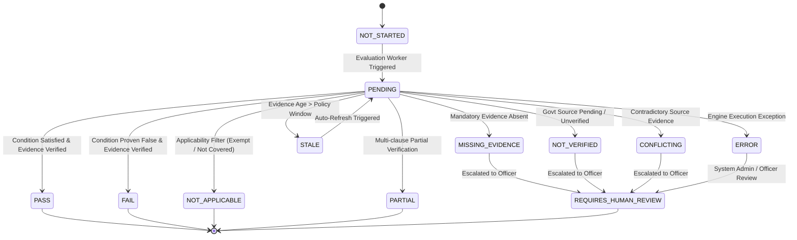

# Phase 1 — Compliance Evaluation Lifecycle Specification

## Overview

This document specifies the state machine, transition rules, snapshot model, and audit trail requirements for requirement-level compliance evaluations (`ComplianceEvaluation`) within the **SIH26100 Bid Compliance Verification Platform**.

---

## 1. ComplianceEvaluation State Machine

A `ComplianceEvaluation` records the deterministic rule evaluation outcome for a specific bidder submission against an individual `TenderRequirement`.



---

## 2. Evaluation Status Taxonomy

| Status Code | Classification | Category | Definition & Business Rule |
| :--- | :--- | :--- | :--- |
| **`NOT_STARTED`** | Initial | Intermediate | Evaluation job instantiated; pending queue dispatch. |
| **`PENDING`** | Active | Intermediate | Engine currently parsing facts, resolving dependencies, and evaluating AST. |
| **`NOT_APPLICABLE`** | Terminal | Terminal | Requirement is exempt for this bidder class (e.g., MSME EMD exemption). |
| **`PASS`** | Business Terminal | Terminal | Rule condition proven TRUE with valid, current evidence. |
| **`FAIL`** | Business Terminal | Terminal | Rule condition proven FALSE with valid, verified evidence. |
| **`PARTIAL`** | Business Terminal | Terminal | Composite rule partially satisfied; child elements pending or mixed. |
| **`MISSING_EVIDENCE`** | Intermediate | Escalable | Mandatory evidence item absent in submission. |
| **`NOT_VERIFIED`** | Intermediate | Escalable | External government verification pending or unverified. |
| **`CONFLICTING`** | Intermediate | Escalable | Multi-source evidence contradiction detected. |
| **`STALE`** | Intermediate | Retryable | Evidence timestamp exceeds allowed freshness window. |
| **`REQUIRES_HUMAN_REVIEW`**| Human Review | Terminal | Discrepancy, ambiguity, or missing evidence escalated to Procurement Officer. |
| **`ERROR`** | System Error | Escalable | System execution error encountered during AST parsing or database query. |

> [!CRITICAL]
> **TECHNICAL ERROR IS NOT COMPLIANCE FAIL:**
> System errors (`ERROR`), missing data (`MISSING_EVIDENCE`), unverified statuses (`NOT_VERIFIED`), or transport timeouts can **NEVER** automatically be recorded as a compliance `FAIL` or result in automated bidder disqualification. These intermediate states transition to `REQUIRES_HUMAN_REVIEW`.

---

## 3. Evaluation Snapshot & Version Selection Architecture

### 3.1 Design Objective for Historical Reproducibility
The system is designed to support reproducible historical evaluation by preserving the exact evaluation snapshot, applicable `TenderVersion`, `PolicyVersion`, rule versions, normalized facts, evidence references, calculation trace, and relevant configuration metadata. Reproducibility depends on preservation of all required inputs and metadata and is therefore a system design objective, not an unconditional mathematical guarantee.

```
+-----------------------------------------------------------------------------------+
|                              EVALUATION SNAPSHOT                                  |
+-----------------------------------------------------------------------------------+
|  * snapshot_id: ULID                                                              |
|  * evaluation_id: ULID                                                            |
|  * tender_version_id: ULID                                                        |
|  * corrigendum_ids: Array[ULID] (Applicable amendments/corrigenda)                |
|  * requirement_version_id: ULID                                                   |
|  * rule_version_id: ULID                                                          |
|  * policy_version_id: ULID                                                        |
|  * selection_basis_reason: String (Explanation of version binding logic)          |
|  * effective_timestamp: ISO 8601 UTC Timestamp                                    |
|  * fact_snapshot_hash: SHA-256 (JSON map of all input facts at evaluation time)  |
|  * evidence_record_hashes: Array[SHA-256]                                         |
|  * evaluation_ast_hash: SHA-256                                                   |
|  * engine_version: String ("v1.0.0-engine")                                       |
|  * evaluated_at: ISO 8601 UTC Timestamp                                           |
|  * result_status: Enum ("PASS", "FAIL", "REQUIRES_HUMAN_REVIEW", etc.)             |
+-----------------------------------------------------------------------------------+
                                          │
                                          ▼
+-----------------------------------------------------------------------------------+
|                            AUDIT HASH-CHAIN BLOCK                                 |
|  block_hash = SHA256(previous_block_hash + snapshot_id + evaluated_at + status)  |
+-----------------------------------------------------------------------------------+
```

### 3.2 Tender Version Selection Basis & Binding Principle
Evaluation must bind to the exact set of tender and policy versions applicable to that submission, with the selection basis preserved:
1. **Applicability Selection:** Applicable tender requirements are selected using the tender's version lifecycle and effective applicability rules, considering `TenderVersion`, published corrigenda/amendments, effective dates/times, publication lifecycle, submission closing timeline, applicability to the specific bid submission, and relevant policy/rule versions.
2. **Preservation Guarantee:** The engine records and preserves (1) the exact `TenderVersion` used, (2) applicable corrigenda/amendments, (3) effective timestamps, (4) policy/rule versions, and (5) the selection basis/reason explaining why those specific versions were applicable.
3. **Immutability of Historical Snapshots:** Re-evaluating historical snapshot data against its bound inputs produces identical results. Future updates to rules, policy versions, or AI extraction models never overwrite or alter historical snapshot records.

