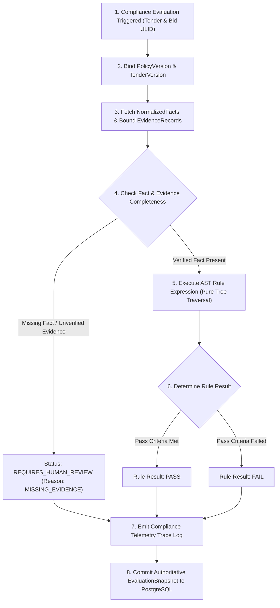

# Phase 1 — Compliance Engine & Rule Execution Observability Architecture

**Document Control Information**
- **Project Name:** SIH26100 — AI-Powered Integrated Bid Compliance Verification Platform for GeM Procurement
- **Organization:** Ministry of Petroleum & Natural Gas / CPCL
- **Document Version:** 1.0.0 (Phase 1 — Task 9 Compliance Observability Specification)
- **Status:** DESIGN DRAFT / PENDING REVIEW
- **Security Classification:** INTERNAL
- **Mode:** DESIGN ONLY — ZERO CODE IMPLEMENTATION

---

## 1. Executive Summary & Purpose

This specification defines the observability architecture for the Deterministic Compliance & Policy/Rules Engine (Task 6). The compliance engine evaluates normalized facts against temporal policy rules using non-executable AST tree traversals. Observability must allow authorized operators and auditors to answer: *"WHY did a specific requirement receive its compliance status?"* while preserving historical evaluation reproducibility.

The core compliance observability principle is:
> **"Compliance observability provides full diagnostic visibility into rule evaluation paths, AST calculation steps, fact inputs, and policy version bindings. Operational telemetry is diagnostic information and must not independently modify authoritative compliance facts, compliance evaluations, risk outcomes, or qualification outcomes."**

---

## 2. Rule Evaluation Diagnostic Trace Flow



---

## 3. Compliance Telemetry Schema (`ComplianceEvaluationTelemetryEvent`)

```json
{
  "$schema": "https://json-schema.org/draft/2020-12/schema",
  "title": "ComplianceEvaluationTelemetryEvent",
  "type": "object",
  "required": [
    "timestamp",
    "compliance_telemetry_id",
    "correlation_id",
    "tender_id",
    "tender_version_id",
    "policy_version_id",
    "bid_submission_id",
    "rule_id",
    "evaluation_status",
    "evaluation_duration_ms",
    "calculation_trace_summary"
  ],
  "properties": {
    "timestamp": { "type": "string", "format": "date-time" },
    "compliance_telemetry_id": { "type": "string" },
    "correlation_id": { "type": "string" },
    "tender_id": { "type": "string" },
    "tender_version_id": { "type": "string" },
    "policy_version_id": { "type": "string" },
    "bid_submission_id": { "type": "string" },
    "rule_id": { "type": "string", "example": "RULE_LOCAL_CONTENT_MIN_50" },
    "rule_version": { "type": "string", "example": "1.2.0" },
    "evaluation_status": { "type": "string", "enum": ["PASS", "FAIL", "REQUIRES_HUMAN_REVIEW", "SKIPPED_PREREQUISITE_FAILED"] },
    "missing_fact_flag": { "type": "boolean" },
    "conflicting_facts_flag": { "type": "boolean" },
    "stale_evidence_flag": { "type": "boolean" },
    "evaluation_duration_ms": { "type": "number" },
    "calculation_trace_summary": { 
      "type": "string", 
      "example": "AST: (fact.local_content_pct >= policy.min_pct) => (58.5 >= 50.0) => TRUE" 
    },
    "evidence_record_ids": { 
      "type": "array", 
      "items": { "type": "string" } 
    },
    "evaluation_snapshot_id": { "type": "string" }
  }
}
```

---

## 4. Compliance Subsystem Metrics Taxonomy

| Metric Name | Type & Unit | Label Dimensions | Alert Trigger Condition |
|---|---|---|---|
| `compliance_evaluations_total` | Counter (Count) | `policy_version_id`, `evaluation_status` | Baseline throughput monitoring |
| `compliance_rule_duration_seconds` | Histogram (Sec) | `rule_id`, `policy_version_id` | p95 rule execution time $> 0.5$s |
| `compliance_missing_evidence_total` | Counter (Count) | `rule_id`, `tenant_org_id` | Spikes in missing evidence files |
| `compliance_conflicting_facts_total` | Counter (Count) | `rule_id`, `fact_type` | Multi-source fact conflict spike |
| `compliance_stale_evidence_total` | Counter (Count) | `rule_id`, `evidence_type` | Stale evidence rate $> 10\%$ |
| `compliance_human_review_routed_total` | Counter (Count) | `policy_version_id`, `reason` | Review routing rate $> 25\%$ |
| `compliance_evaluation_snapshot_commits` | Counter (Count)| `status` | Tracking PostgreSQL snapshot commits |

---

## 5. Diagnostic Tracing: "Why Did This Requirement Pass or Fail?"

To enable diagnostic troubleshooting without opening raw source documents, compliance telemetry exposes a structured **Calculation Trace**:

### 5.1 Sample Diagnostic Log Trace
```text
[INFO] [COMPLIANCE_EVALUATION] correlation_id="01HXXXXXX1234567890ABCDEF" rule_id="RULE_FINANCIAL_TURNOVER"
  Policy Context: policy_version="PV_CPCL_2026_V1" (min_turnover_inr=50000000)
  Fact Input: normalized_fact_id="FACT_TURNOVER_01" value_inr=75000000 status="VERIFIED"
  Evidence Link: evidence_record_id="EVID_AUDITED_BALANCE_SHEET_01" (confidence_score=0.98, status="VALIDATED")
  AST Evaluation: (FACT_TURNOVER_01.value_inr >= PV_CPCL_2026_V1.min_turnover_inr) -> (75000000 >= 50000000) -> TRUE
  Evaluation Status: PASS (snapshot_id="SNAP_01HXXXXXXEVALUATION01")
```

---

## 6. Separation of Telemetry from Authoritative Evidence

1. **Non-Authoritative Telemetry:** Operational log traces are designed for technical monitoring and troubleshooting. They do not constitute legal proof of compliance.
2. **Authoritative Ledger:** Legal compliance proof resides exclusively in the PostgreSQL `EvaluationSnapshot` table and linked `AuditEvent` hash chain.
3. **Reproducibility Guarantee:** Re-executing an evaluation snapshot using its preserved `policy_version_id` and `normalized_fact` inputs produces identical rule outcomes.
