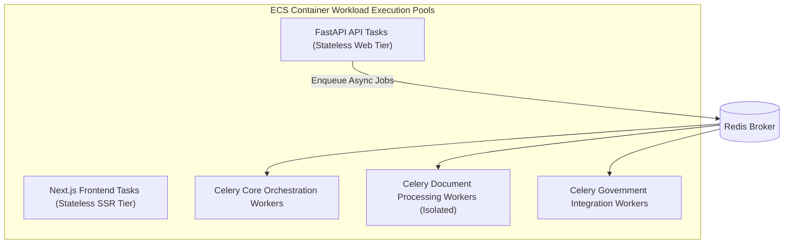

# Phase 1 — Compute & Workload Architecture Specification

**Document Control Information**
- **Project Name:** SIH26100 — AI-Powered Integrated Bid Compliance Verification Platform for GeM Procurement
- **Organization:** Ministry of Petroleum & Natural Gas / CPCL
- **Document Version:** 1.0.0 (Phase 1 — Task 10 Compute Specification)
- **Status:** DESIGN DRAFT / PENDING REVIEW
- **Security Classification:** INTERNAL
- **Mode:** DESIGN ONLY — ZERO CODE IMPLEMENTATION

---

## 1. Executive Summary & Purpose

This specification defines the compute deployment model for the platform's execution workloads.

> **"Managed Container Compute Reference Architecture (AWS ECS Fargate) is selected as the primary reference deployment model; the logical compute architecture remains portable to equivalent managed container platforms. It provides process isolation, auto-scaling, and low operational overhead for the SIH26100 platform."**

---

## 2. Workload Compute Allocation Topology

---

## 3. Workload Compute Sizing & Profile Specifications

| Workload Name | Compute Strategy | CPU Allocation (vCPU) | Memory Allocation (RAM) | Scaling Metric | Max Scale Bounds |
|---|---|---|---|---|---|
| **FastAPI Backend API** | ECS Fargate Container Tasks | 1.0 vCPU | 2.0 GB | Target Tracking: 60% CPU / Request Rate | 2 to 10 Tasks |
| **Next.js Frontend UI** | ECS Fargate Container Tasks | 0.5 vCPU | 1.0 GB | Target Tracking: 70% CPU | 2 to 6 Tasks |
| **Celery Core Orchestration** | ECS Fargate Worker Tasks | 1.0 vCPU | 2.0 GB | Redis Queue Depth (`celery_queue_depth > 100`) | 2 to 8 Tasks |
| **Celery Document / OCR** | ECS Fargate Isolated Workers | 2.0 vCPU | 4.0 GB | Document Queue Backlog (`ocr_queue_depth > 20`) | 2 to 12 Tasks |
| **Celery Govt Integration** | ECS Fargate Adapter Workers | 0.5 vCPU | 1.0 GB | Egress Rate & Gateway Timeouts | 2 to 6 Tasks |

---

## 4. Compute Isolation & Runtime Governance

1. **Non-Root Execution:** Container processes execute under dedicated non-privileged UID/GID accounts (e.g., `appuser:10001`).
2. **Read-Only Root Filesystem:** Workload containers run with read-only root filesystems; temporary writes use bounded `tmpfs` mounts.
3. **Graceful Termination:** Workers intercept `SIGTERM` signals, allowing active Celery tasks up to 60 seconds to finish or pause before shutdown.
