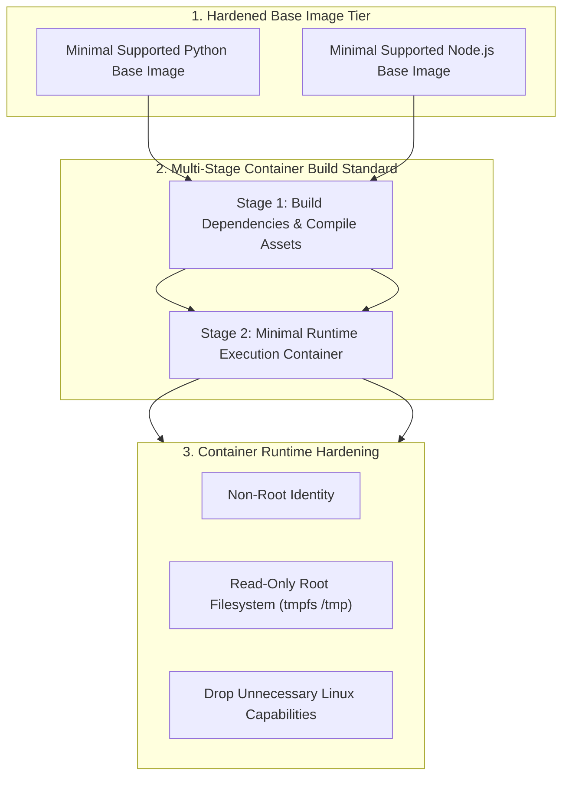

# Phase 1 — Container Architecture & Security Specification

**Document Control Information**
- **Project Name:** SIH26100 — AI-Powered Integrated Bid Compliance Verification Platform for GeM Procurement
- **Organization:** Ministry of Petroleum & Natural Gas / CPCL
- **Document Version:** 1.0.0 (Phase 1 — Task 10 Container Specification)
- **Status:** DESIGN DRAFT / PENDING REVIEW
- **Security Classification:** INTERNAL
- **Mode:** DESIGN ONLY — ZERO CODE IMPLEMENTATION

---

## 1. Executive Summary & Purpose

This specification defines the container architecture, base image standards, security hardening controls, and image registry governance rules.

> **"This specification defines container packaging standards. No Dockerfiles are executed, no images are built, and no container images are pushed to registries in Task 10."**

---

## 2. Container Packaging Standards

1. **Base Image Selection:** Use a minimal supported base image selected through security, compatibility, maintainability, and vulnerability-management criteria.
2. **Runtime Privilege Isolation:** Containers should run as non-root identities and drop unnecessary Linux capabilities; exact UID/GID and capability configuration are implementation-specific and validated through security testing.
3. **Artifact Digest References:** Deployments reference immutable container image digests; human-readable version tags may accompany them.
4. **Supply-Chain vs Audit Separation:** Artifact signing/provenance is a supply-chain security control and is independent of the application's tamper-evident AuditEvent SHA-256 hash chain.

---

## 3. Container Image Specifications

| Image Identifier | Base Image | Included Dependencies | Runtime Configuration | Target Container Workload |
|---|---|---|---|---|
| `sih26100/backend-api` | Minimal Python Base Image | FastAPI, Pydantic, SQLAlchemy, psycopg3, OpenTelemetry | Port 8000, non-root execution | FastAPI REST API Container |
| `sih26100/frontend-ui` | Minimal Node.js Base Image | Next.js 14, React, Tailwind CSS static assets | Port 3000, non-root execution | Next.js Frontend Container |
| `sih26100/celery-worker`| Minimal Python Base Image | Celery, Redis, AST Interpreter, Pydantic, OpenTelemetry | Celery worker process, non-root execution | Core Workflow & AST Workers |
| `sih26100/doc-processor`| Minimal Python Base Image | PyPDF, Tesseract OCR, pdf2image, ClamAV SDK | Network-isolated worker, read-only FS | Untrusted Document CDR Workers |

---

## 4. Container Registry & Supply Chain Governance

1. **Private Container Registry:** Container images are stored in a private container registry with KMS encryption; deployments reference immutable container image digests.
2. **Vulnerability Scanning:** Container image scanning executes automated vulnerability scans on build/push; images violating security policy are blocked from deployment.
3. **Artifact Provenance:** Images carry OCI distribution signatures and Software Bill of Materials (SBOM) metadata. Artifact signing/provenance is a supply-chain security control and is independent of the application's tamper-evident AuditEvent SHA-256 hash chain.
