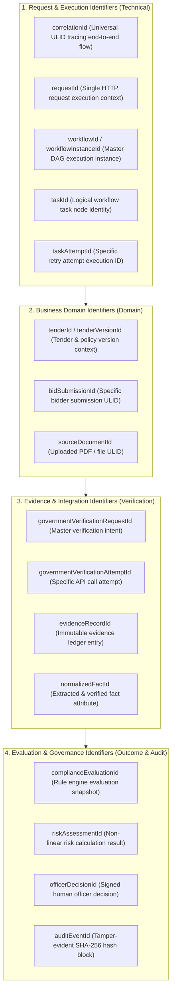
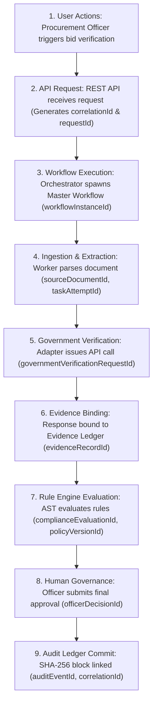

# Phase 1 — Correlation Taxonomy & End-to-End Lineage Architecture

**Document Control Information**
- **Project Name:** SIH26100 — AI-Powered Integrated Bid Compliance Verification Platform for GeM Procurement
- **Organization:** Ministry of Petroleum & Natural Gas / CPCL
- **Document Version:** 1.0.0 (Phase 1 — Task 9 Correlation & Lineage Specification)
- **Status:** DESIGN DRAFT / PENDING REVIEW
- **Security Classification:** INTERNAL
- **Mode:** DESIGN ONLY — ZERO CODE IMPLEMENTATION

---

## 1. Executive Summary & Purpose

This specification defines the correlation taxonomy and end-to-end execution lineage architecture for the SIH26100 platform. Complex multi-stage compliance verification platforms require explicit identifier linking across distributed processes to track every bid evaluation from initial document upload down to the final officer decision and audit ledger entry.

The foundational lineage principle is:
> **"Every operation carries a universal correlation hierarchy linking technical execution tasks directly to business domain entities, evidence records, and tamper-evident audit ledger entries."**

---

## 2. Correlation Identifier Taxonomy

The system defines seventeen standardized identifiers across technical and domain boundaries:

---

## 3. Detailed Correlation Identifier Catalog

| Identifier Name | Type & Format | Scope & Lifecycle | Permitted Telemetry Context | Access Restriction |
|---|---|---|---|---|
| **`correlationId`** | Crockford ULID (26 chars) | Unique per end-to-end bid evaluation lifecycle. Passed in HTTP headers, Celery messages, AI calls. | Safe for all logs, metrics, traces, telemetry streams. | `INTERNAL` (Visible in system logs) |
| **`requestId`** | UUIDv4 / ULID | Single HTTP request/response transaction context. | Safe for API gateway access logs, trace spans. | `INTERNAL` |
| **`workflowInstanceId`** | Crockford ULID | Life of the master workflow state machine execution instance. | Safe for workflow logs, task telemetry, status polling endpoints. | `INTERNAL` |
| **`taskId`** | String / Slug | Specific DAG task node name (e.g., `task_extract_pan`). | Safe for queue metrics, worker traces, retry logs. | `INTERNAL` |
| **`taskAttemptId`** | Crockford ULID | Specific retry execution attempt (e.g., attempt 2 of task X). | Safe for worker retry logs, exception traces. | `INTERNAL` |
| **`tenderId`** | Crockford ULID | Master tender record reference. | Safe for business metrics, audit traces. | `INTERNAL` |
| **`tenderVersionId`** | Crockford ULID | Temporal version of tender criteria and policy rules. | Safe for compliance engine logs, evaluation traces. | `INTERNAL` |
| **`bidSubmissionId`** | Crockford ULID | Unique bid submission reference. | Safe for evaluation workflow logs, officer review queue. | `INTERNAL` |
| **`sourceDocumentId`** | Crockford ULID | Uploaded document metadata record. | Safe for CDR disarming logs, OCR worker metrics. | `INTERNAL` |
| **`evidenceRecordId`** | Crockford ULID | First-class immutable evidence ledger record. | Safe for compliance traces, evidence provenance maps. | `INTERNAL` |
| **`governmentVerificationRequestId`** | Crockford ULID | Master government integration request intent. | Safe for adapter gateway logs, correlation headers. | `INTERNAL` |
| **`governmentVerificationAttemptId`** | Crockford ULID | Specific outbound API request call to government portal. | Safe for mTLS transport logs, circuit breaker metrics. | `INTERNAL` |
| **`complianceEvaluationId`**| Crockford ULID | Snapshot of deterministic rule evaluation run. | Safe for compliance engine traces, snapshot logs. | `INTERNAL` |
| **`riskAssessmentId`** | Crockford ULID | Risk calculation run output record. | Safe for risk engine logs, officer review badges. | `INTERNAL` |
| **`officerDecisionId`** | Crockford ULID | Procurement Officer decision record. | Safe for decision logs, audit ledger linkages. | `CONFIDENTIAL` |
| **`auditEventId`** | Crockford ULID | Primary key of SHA-256 tamper-evident hash block. | Safe for audit log cross-references, verification jobs. | `INTERNAL` (Audit Linkage) |

---

## 4. End-to-End Data Execution Lineage Trace

---

## 5. Correlation Rules & Privacy Constraints

1. **No Sensitive PII as Correlation Keys:** Correlation identifiers must use non-sensitive Crockford Base32 ULIDs or UUIDv4 values. PAN numbers, GSTIN numbers, bidder corporate names, or officer names must never be used as correlation identifiers.
2. **Context Injection:** Background Celery message headers carry `correlationId`, `workflowInstanceId`, and `tenantOrgId` inside task metadata headers to maintain lineage across process boundaries.
3. **Trace-to-Audit Linkage:** Every `LogEvent` written during a critical operation includes `audit_event_id` where applicable, allowing security engineers to cross-reference operational logs directly against the tamper-evident audit ledger.
