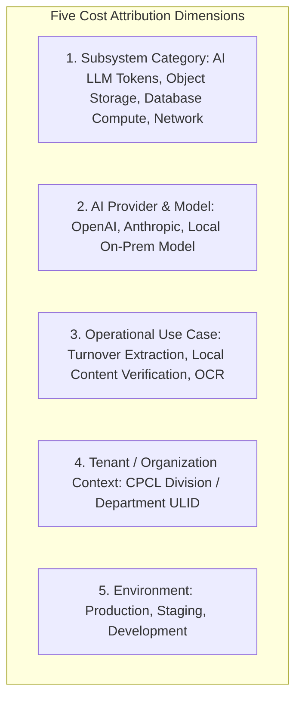

# Phase 1 — Operational Cost Observability Architecture

**Document Control Information**
- **Project Name:** SIH26100 — AI-Powered Integrated Bid Compliance Verification Platform for GeM Procurement
- **Organization:** Ministry of Petroleum & Natural Gas / CPCL
- **Document Version:** 1.0.0 (Phase 1 — Task 9 Cost Observability Specification)
- **Status:** DESIGN DRAFT / PENDING REVIEW
- **Security Classification:** INTERNAL
- **Mode:** DESIGN ONLY — ZERO CODE IMPLEMENTATION

---

## 1. Executive Summary & Purpose

This specification defines the operational cost observability framework for the SIH26100 platform. Operating an AI-assisted compliance platform incurs operational costs across cloud LLM token usage, object storage growth, database compute, network bandwidth, and external government verification API transactions. Cost telemetry provides real-time visibility into resource expenditure without exposing sensitive bidder data.

The core cost observability principle is:
> **"Cost telemetry tracks token consumption, compute units, and storage volume. Cost metrics MUST associate expenditure with system use cases and AI providers without exposing sensitive bidder or tender content."**

---

## 2. Cost Allocation Taxonomy & Multi-Dimensional Tracking

Cost telemetry attributes expenditure across five operational dimensions:



---

## 3. Cost Telemetry Metrics & Schema

### 3.1 Key Cost Telemetry Metrics
- `ai_token_cost_estimated_usd_total` (Counter: tracks estimated LLM token expenditure based on prompt and completion token counts).
- `minio_storage_cost_bytes_total` (Gauge: tracks document storage footprint per tender).
- `govt_api_transaction_count_total` (Counter: tracks external government API call volume).

### 3.2 Cost Metric Attribution Model
```text
ai_token_cost_estimated_usd_total{
  provider_id="openai",
  model_id="gpt-4o-2024-08-06",
  use_case_id="extract_turnover_facts",
  tenant_org_id="01HXXXXXXORG00000000001",
  environment="production"
} = 0.045
```

---

## 4. Privacy & Cost Governance Rules

1. **Zero Content Leakage in Cost Metrics:** Cost metrics record token numbers, byte sizes, and estimated currency values. They must never capture document text, company turnover numbers, or prompt content.
2. **No Hardcoded Vendor Pricing:** Vendor token rates (e.g., $USD per 1K tokens) are specified in configurable pricing tables (`CostConfigTable`) rather than hardcoded in system logic.
3. **Budget Limit Alerts:** Triggers an `AI_TOKEN_BUDGET_EXCEEDED` warning alert if monthly LLM token expenditure exceeds department budget allocations.
