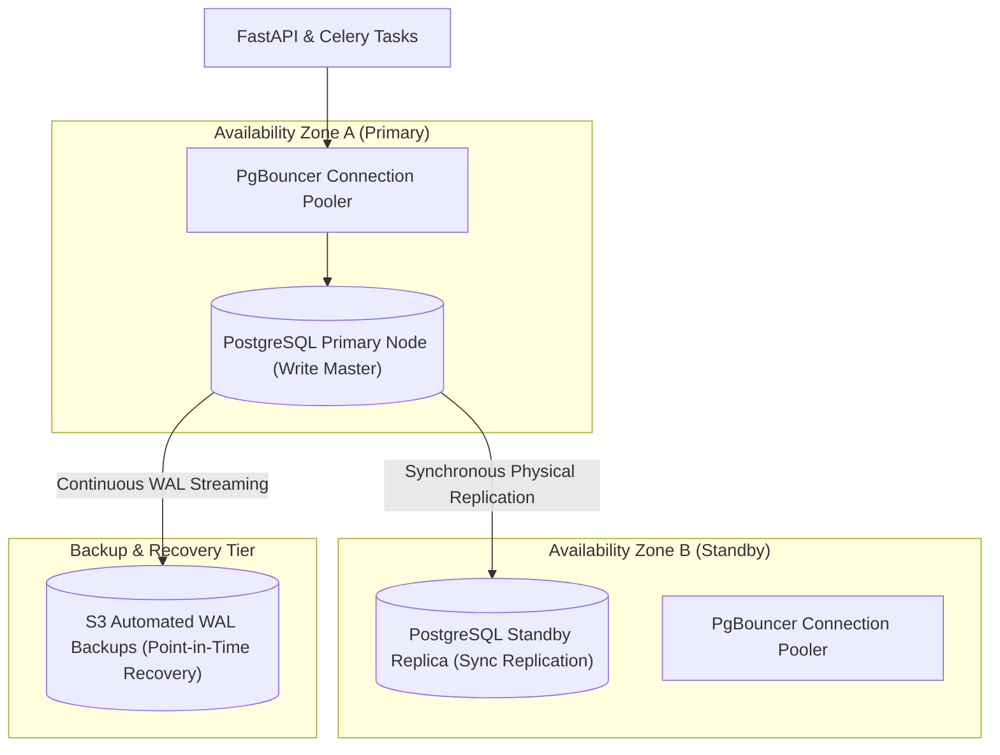

# Phase 1 — Database Deployment & High-Availability Architecture

**Document Control Information**
- **Project Name:** SIH26100 — AI-Powered Integrated Bid Compliance Verification Platform for GeM Procurement
- **Organization:** Ministry of Petroleum & Natural Gas / CPCL
- **Document Version:** 1.0.0 (Phase 1 — Task 10 Database Specification)
- **Status:** DESIGN DRAFT / PENDING REVIEW
- **Security Classification:** INTERNAL
- **Mode:** DESIGN ONLY — ZERO CODE IMPLEMENTATION

---

## 1. Executive Summary & Purpose

This specification defines the database deployment architecture for PostgreSQL 16+ (incorporating `pgvector` for embedding searches, JSONB for document facts, ULID keys, and the tamper-evident SHA-256 audit ledger).

> **"This specification defines database deployment architecture. No database migrations, SQL scripts, or database clusters are executed or deployed in Task 10."**

---

## 2. PostgreSQL Multi-AZ Deployment Topology

---

## 3. Database Cluster Configuration Parameters

| Configuration Property | Target Specification | Rationale & Governance |
|---|---|---|
| **Database Engine** | PostgreSQL 16.x | Native JSONB optimizations, `pgvector` 0.7+ support, robust logical replication |
| **High Availability** | AWS RDS Multi-AZ (Sync Replication) | Automatic failover ($< 60$s recovery), zero data loss synchronous WAL commit |
| **Connection Pooling** | PgBouncer (Transaction Pooling) | Manages 1,000+ client task connections without exhaustion (`max_client_conn = 2000`) |
| **Storage Encryption** | AWS KMS Customer-Managed Key | AES-256 block-level storage encryption covering DB instances, read replicas & WAL |
| **Audit Ledger Isolation** | Dedicated Append-Only DB User | `audit_writer_user` possesses `INSERT`-only rights on `audit_events`; `UPDATE`/`DELETE` revoked |
| **Data Extensions** | `pgvector`, `uuid-ossp`, `pg_trgm` | Vector search embeddings, text search trigrams, UUID generation utilities |

---

## 4. Connection Pooling & Resource Governance

1. **Transaction Pooling Mode:** PgBouncer operates in `transaction` mode to maximize connection reuse across asynchronous worker tasks.
2. **Dedicated Read Replicas:** Heavy analytical queries, audit verification jobs, and dashboard reporting target read replicas, protecting the primary writer node from IOPS starvation.
