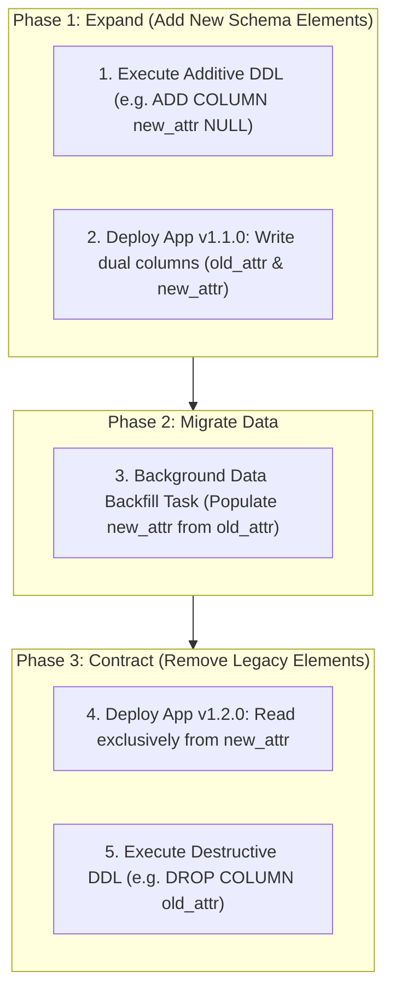

# Phase 1 — Database Migration & Schema Evolution Strategy Specification

**Document Control Information**
- **Project Name:** SIH26100 — AI-Powered Integrated Bid Compliance Verification Platform for GeM Procurement
- **Organization:** Ministry of Petroleum & Natural Gas / CPCL
- **Document Version:** 1.0.0 (Phase 1 — Task 10 Database Migration Specification)
- **Status:** DESIGN DRAFT / PENDING REVIEW
- **Security Classification:** INTERNAL
- **Mode:** DESIGN ONLY — ZERO CODE IMPLEMENTATION

---

## 1. Executive Summary & Purpose

This specification defines safe database schema migration strategies, backward-compatible DDL execution, the expand/contract pattern, and migration rollback constraints.

> **"Database migrations MUST BE backward-compatible. Application rollback does NOT automatically roll back database DDL changes due to data loss risks."**

---

## 2. Expand / Contract Migration Lifecycle

---

## 3. Migration Safety Rules & Lockouts

1. **Exclusive Lock Controls:** DDL migrations must set restrictive statement timeouts (`SET statement_timeout = '5s';`) to prevent locking production tables for extended periods.
2. **Pre-Migration Database Snapshot:** Pre-deployment pipeline gates mandate an automated RDS database snapshot before executing DDL migrations.
3. **No Code Migration Lockout:** Migration execution is handled by an isolated pre-deployment ECS task, executing under an explicit database migration role (`db_migrator_role`) separate from application web task roles.
