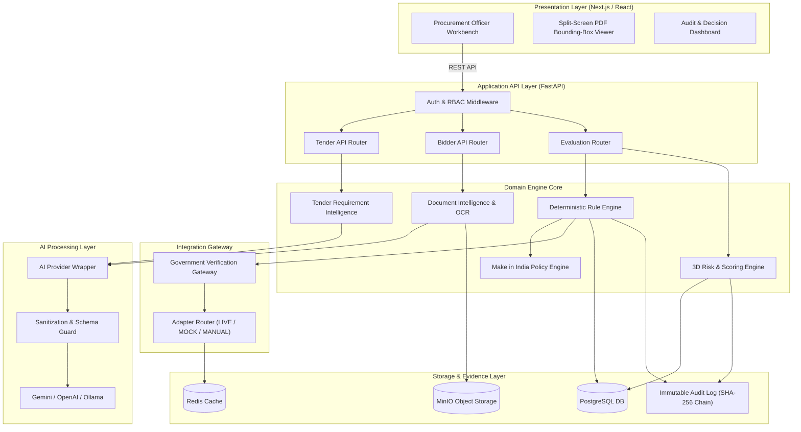
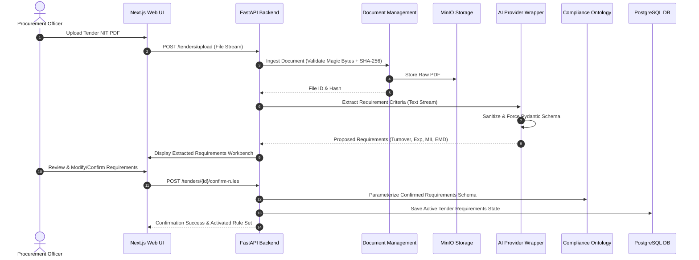
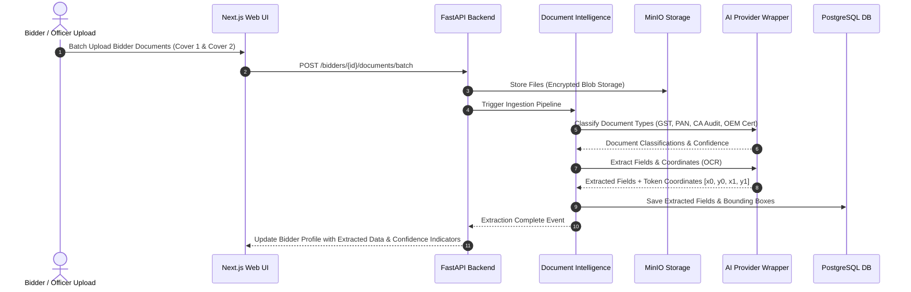
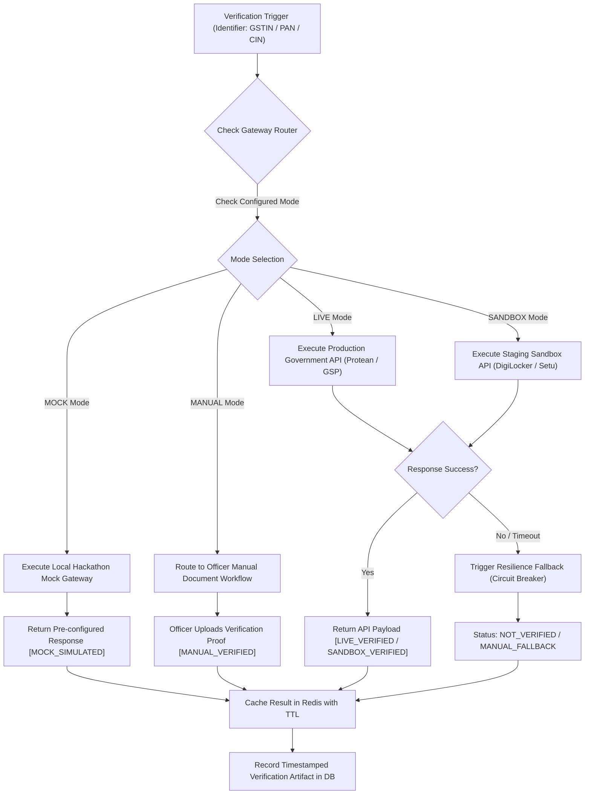
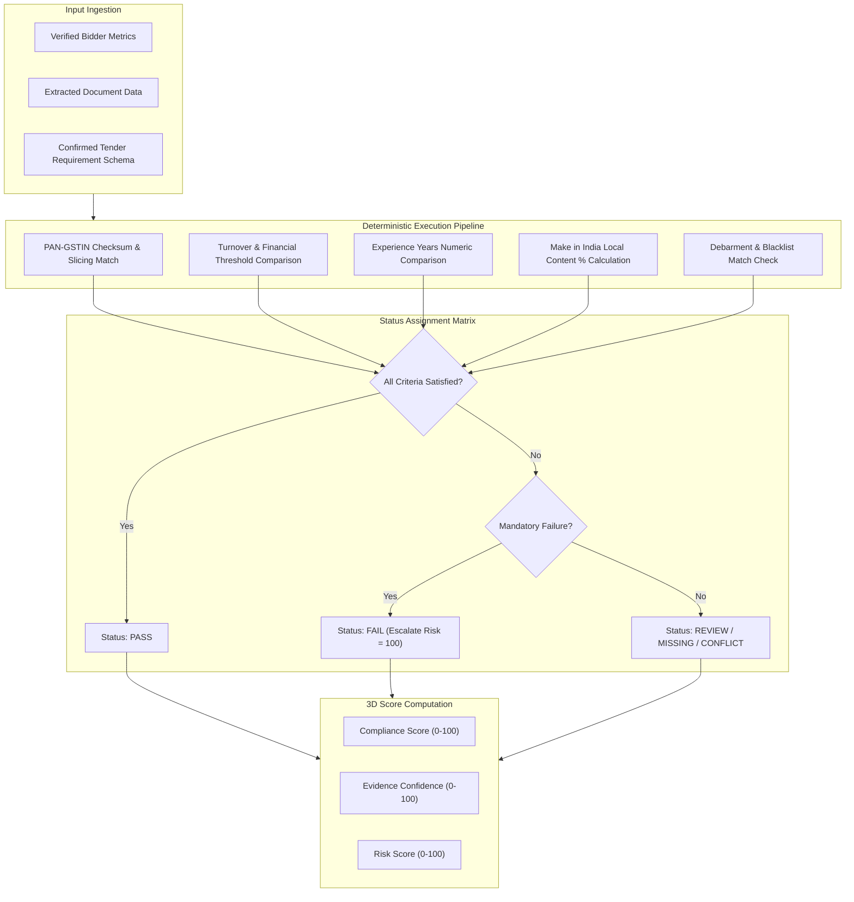
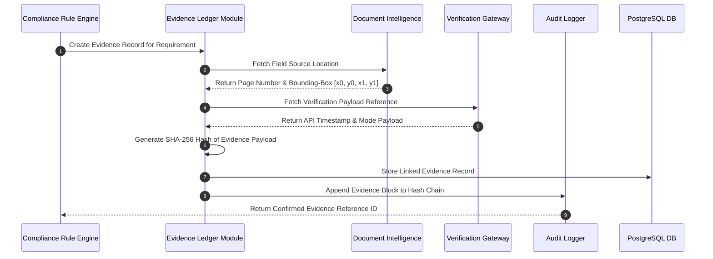
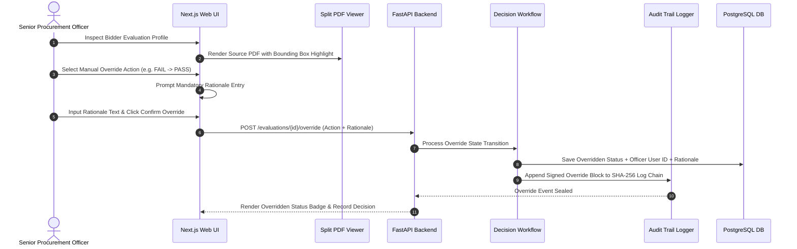

# Phase 1 Data Flow Specifications & Diagrams

## SIH 26100: AI-Powered Integrated Bid Compliance Verification Platform for GeM Procurement

**Organization:** Ministry of Petroleum & Natural Gas / Chennai Petroleum Corporation Limited (CPCL)  
**Phase:** 1 — Architecture & Technical Design  
**Document ID:** SIH26100-ARCH-004  
**Version:** 1.0.0  
**Date:** 2026-09-05  
**Implementation Status:** ZERO APPLICATION CODE GENERATED

---

## Executive Notice

**Core Authorization Notice:** Phase 0 establishes research and architecture inputs; government integrations requiring authorization remain subject to official onboarding/approval.

---

## Flow A: Complete System Architecture Overview



---

## Flow B: Tender Ingestion & Requirement Intelligence Flow



---

## Flow C: Bidder Document Verification & Field Extraction Flow



---

## Flow D: Multi-Tier Government Verification Gateway Flow



---

## Flow E: Deterministic Compliance Evaluation Flow



---

## Flow F: Evidence Generation & Provenance Chain Flow



---

## Flow G: Officer Decision & Manual Override Flow



---

## Flow H: Failure & Degraded-Mode Resilience Flow

```mermaid
flowchart TD
    A["Verification Request to External Government API"] --> B{"Circuit Breaker State?"}
    
    B -->|OPEN (Tripped)| C["Bypass External Network Call"]
    B -->|CLOSED (Normal)| D["Dispatch HTTP Request (Timeout = 10s)"]

    D --> E{"HTTP Response Status"}
    E -->|200 OK| F["Parse Data & Update Success Count"]
    E -->|5xx Error / Timeout / Connection Failed| G["Increment Failure Counter"]

    G --> H{"Failure Count >= Threshold (5)?"}
    H -->|Yes| I["Trip Circuit Breaker to OPEN State"]
    H -->|No| J["Log API Error Event"]

    C & I & J --> K["Fallback Execution: Transition Status to NOT_VERIFIED / MANUAL_FALLBACK"]
    K --> L["Preserve Error Trace Artifact in DB"]
    L --> M["Notify Procurement Officer: Manual Document Verification Required"]
    M --> N["System Continues Independent Evaluation Tasks (Zero Crash)"]
```
