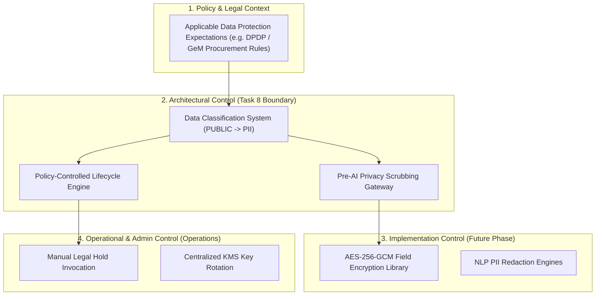
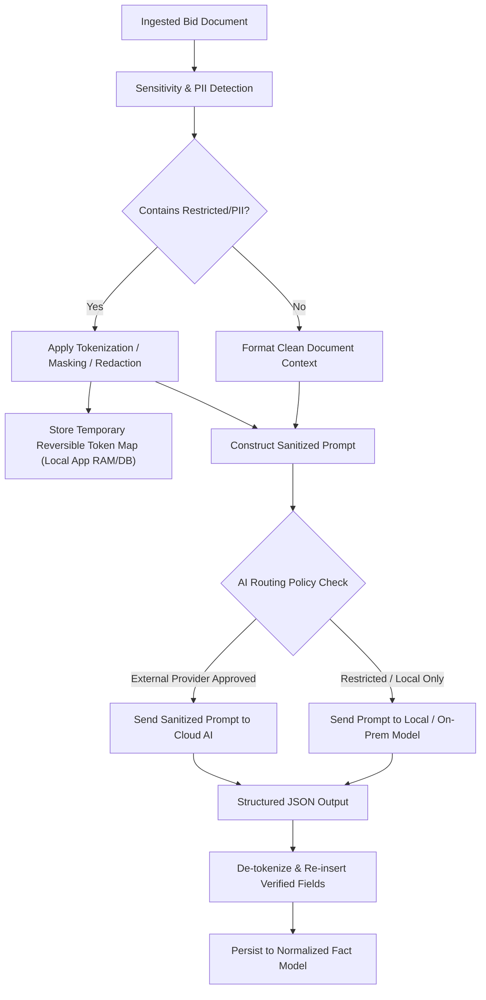
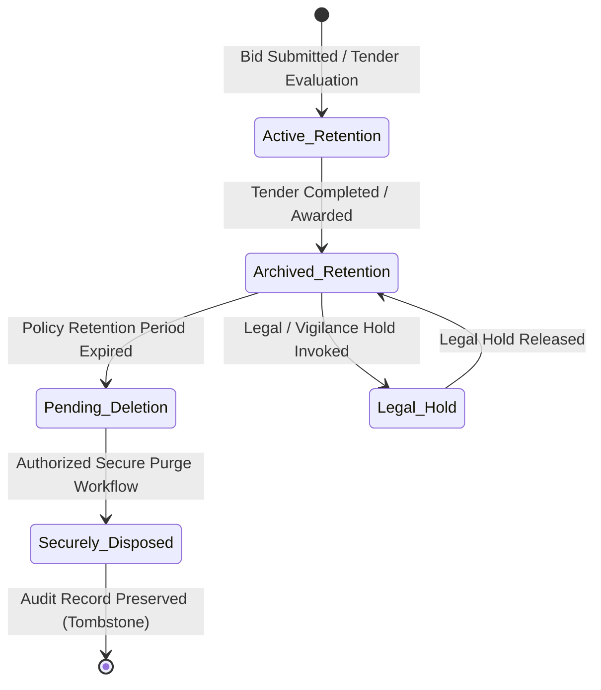

# Phase 1 — Data Privacy & Privacy-By-Design Architecture Specification

**Document Control Information**
- **Project Name:** SIH26100 — AI-Powered Integrated Bid Compliance Verification Platform for GeM Procurement
- **Organization:** Ministry of Petroleum & Natural Gas / CPCL
- **Document Version:** 1.0.0 (Phase 1 — Task 8 Data Privacy Specification)
- **Status:** DESIGN DRAFT / PENDING REVIEW
- **Security Classification:** INTERNAL
- **Mode:** DESIGN ONLY — ZERO CODE IMPLEMENTATION

---

## 1. Executive Summary & Purpose

This specification outlines the data privacy and privacy-by-design architecture for the SIH26100 platform. The platform handles sensitive commercial procurement filings, corporate financial metrics, government registry verification responses, and personally identifiable information (PII) belonging to bidder representatives and procurement personnel.

The foundational privacy principle is:
> **"Designed to support privacy obligations and applicable data-protection requirements through data minimization, purpose limitation, field-level masking, policy-controlled AI privacy routing, and configurable retention lifecycles."**

---

## 2. Distinction of Regulatory, Architectural, and Operational Controls

To ensure absolute architectural clarity, privacy mechanisms are classified across four operational tiers:

---

## 3. Security & Sensitivity Data Classification System

Reusing the frozen Task 2 data classification baseline, all platform entities, document payloads, database fields, and log streams are tagged with one of five explicit sensitivity levels:

| Level ID | Classification Level | Description & Example Data | Handling & Storage Requirements | AI Routing Eligibility |
|---|---|---|---|---|
| **L-01** | `PUBLIC` | Open procurement notices, published GeM tender titles, public eligibility rules. | Stored in standard DB fields and object storage. No encryption required for public reads. | Eligible for all external/internal AI models without restriction. |
| **L-02** | `INTERNAL` | Workflow task statuses, aggregated compliance scores, system execution metrics. | Accessible to authenticated procurement personnel within assigned organization context. | Eligible for external AI processing. |
| **L-03** | `CONFIDENTIAL` | Commercial turnover figures, technical proposal text, bill of quantities, local content declarations. | Restricted to assigned Procurement Officers and Reviewers. Encrypted at rest in storage. | Eligible for external AI models **only after** passing through Pre-AI Privacy Gateway scrubbing. |
| **L-04** | `RESTRICTED` | Bank account numbers, PAN numbers, GSTIN filings, raw government verification API payloads. | Encrypted at field level using AES-256-GCM. Access requires explicit capability permissions. | **Ineligible** for external public cloud LLMs by default. Must use local models or tokenized replacement. |
| **L-05** | `PII` | Personal names, Aadhaar numbers, personal phone numbers, email addresses, director photos/signatures. | Encrypted at field level. Masked in UI views by default (`XXXX-XXXX-1234`). | **Strictly prohibited** from transmission to external cloud LLM providers. Requires local model or complete redaction. |

### 3.1 Key Architectural Rules
1. **Classification Is Not Authorization:** A data classification tag specifies storage and handling rules; it does not replace fine-grained RBAC or capability authorization. Access is determined by:
   $$\text{Access} = \text{User Authorization} + \text{Organization Context} + \text{Policy Verification} + \text{Classification Handling}$$
2. **Coexistence of PII:** PII can coexist inside documents of varying classifications (e.g., a `CONFIDENTIAL` technical bid document may contain `PII` signatures of company directors). The highest sensitivity classification governs field handling.

---

## 4. Privacy-By-Design Principles & Technical Controls

### 4.1 Data Minimization & Collection Limitation
- Platform ingestion collects only document sections and fields explicitly required for compliance rule verification.
- Background OCR and extraction pipelines extract targeted schemas rather than dumping unindexed raw text into searchable databases.

### 4.2 Field-Level Masking & Pseudonymization
- Sensitive identifiers (such as PAN numbers, GSTIN numbers, bank account numbers, and personal phone numbers) are masked in standard UI presentations by default.
- Example Masking Patterns:
  - PAN: `XXXXX1234X`
  - Phone: `+91-XXXXX-X5678`
  - Bank Account: `XXXXXXXX1234`
- Unmasking requires explicit capability authorization (`field:unmask_pii`) and logs a high-priority `PII_UNMASK_VIEWED` event in the SHA-256 audit ledger.

### 4.3 Pre-AI Privacy Routing Pipeline
1. **Document Input:** Raw text extracted from uploaded bid documents.
2. **Sensitivity Assessment:** Automated regex and NLP rules scan for PII and restricted identifiers.
3. **Tokenization:** Detected PII items are replaced with deterministic placeholder tokens (e.g., `[PERSON_NAME_1]`, `[COMPANY_PAN_TOKEN_4]`).
4. **Local Token Mapping:** A short-lived, encrypted token lookup table is preserved locally in application memory for the duration of the processing job.
5. **Sanitized Prompt Transmission:** The tokenized, sanitized prompt is transmitted to the approved AI provider.
6. **Output De-Tokenization:** The structured JSON response returned by the AI provider is mapped back to actual field values within the secure internal application boundary.

---

## 5. Policy-Controlled Data Retention & Deletion Architecture

Data retention in the SIH26100 platform is **policy-controlled** and dynamically bound to system configuration settings. The architecture avoids static, hardcoded retention periods or mandatory universal deletion times.

### 5.1 Retention Categories & Policy Binding

| Data Category | Target Artifacts | Retention Governance Basis | Default Architectural Support |
|---|---|---|---|
| **Procurement Master Data** | Tender Notices, Eligibility Rules, Corrigenda. | Bound to `PolicyVersion` and GeM Procurement Rules. | Policy-configurable (e.g., retained for duration of tender + archive period). |
| **Bidder Document Artifacts** | Uploaded PDFs, Technical Bids, Scans. | Bound to Tender Lifecycle & Department Policy. | Soft-deleted upon expiration; storage objects securely scrubbed. |
| **Normalized Facts & Evidence** | Extracted facts, verification records, evaluation traces. | Bound to CVC Vigilance Audit Requirements. | Immutable during active retention; archived after tender close. |
| **Tamper-Evident Audit Ledger** | SHA-256 `AuditEvent` hash-chain records. | Statutory Vigilance & Audit Requirements. | Permanently preserved as lightweight audit chain ledgers (tombstone summaries). |

### 5.2 Legal & Policy Hold Subsystem
- Authorized Reviewers or Auditors can place a `LegalHold` on specific tenders or bid submissions under active investigation.
- Placing a `LegalHold` freezes all automated deletion and archiving policies for all associated documents, facts, evidence records, and evaluation traces.
- A `LegalHold` cannot be removed by system background workers or standard Procurement Officers; removal requires dual-control authorization by an authorized Senior Reviewer or Auditor.

### 5.3 Secure Disposal & Anonymization Workflow
- Upon reaching retention expiration without active legal holds, the secure disposal worker executes:
  1. **Document Storage Purge:** MinIO storage objects are permanently overwritten and unlinked.
  2. **Database Anonymization:** PII fields in database records are replaced with irreversible cryptographic hashes or tombstone placeholders.
  3. **Audit Event Recording:** A `DATA_DISPOSAL_EXECUTED` audit event is recorded in the SHA-256 audit ledger, capturing the disposal timestamp, policy reference, and executing service identity.

---

## 6. Summary of Data Privacy Protection Matrix

| Data Item | Sensitivity | Storage Encryption | Masking in UI | Pre-AI Treatment | Retention Basis |
|---|---|---|---|---|---|
| **Tender Notice Text** | `PUBLIC` | Standard DB | None | Raw Text | Policy Controlled |
| **Turnover Figure** | `CONFIDENTIAL` | AES-256 At Rest | None | Raw Value | Policy Controlled |
| **GSTIN Number** | `RESTRICTED` | AES-256 Field Level | Partial Mask | Tokenized | Policy Controlled |
| **PAN Number** | `RESTRICTED` | AES-256 Field Level | Masked | Tokenized | Policy Controlled |
| **Director Name / Contact** | `PII` | AES-256 Field Level | Masked | Redacted / Tokenized | Policy Controlled |
| **Govt Verification Payload** | `RESTRICTED` | AES-256 Field Level | Partial Mask | Local Model Only | Policy Controlled |
| **Audit Ledger Record** | `INTERNAL` | Standard DB | Unmasked (Auditor) | Not Transmitted | Permanent Ledger |
