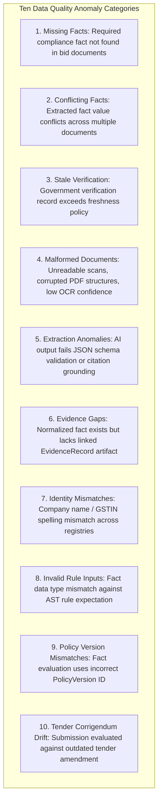

# Phase 1 — Data Quality & Evidence Completeness Observability Architecture

**Document Control Information**
- **Project Name:** SIH26100 — AI-Powered Integrated Bid Compliance Verification Platform for GeM Procurement
- **Organization:** Ministry of Petroleum & Natural Gas / CPCL
- **Document Version:** 1.0.0 (Phase 1 — Task 9 Data Quality Specification)
- **Status:** DESIGN DRAFT / PENDING REVIEW
- **Security Classification:** INTERNAL
- **Mode:** DESIGN ONLY — ZERO CODE IMPLEMENTATION

---

## 1. Executive Summary & Purpose

This specification defines the data quality, evidence completeness, and fact consistency observability framework for the SIH26100 platform. Ingesting multi-page bid documents and verifying claims across external government portals can encounter missing data fields, conflicting extracted facts, stale verification records, or policy-version mismatches.

The core data quality rule is:
> **"Data quality anomalies (missing facts, unverified evidence, conflicting data) MUST route tasks to human officer review. Data quality alerts MUST NEVER trigger automated bidder disqualification or a compliance FAIL outcome."**

---

## 2. Ten Data Quality Anomaly Taxonomies

---

## 3. Data Quality Telemetry Schema & Metrics

### 3.1 Data Quality Telemetry Metrics
- `data_quality_missing_facts_total` (Counter: tracks missing required facts by rule ID).
- `data_quality_fact_conflicts_total` (Counter: tracks fact value conflicts across document sources).
- `data_quality_stale_evidence_total` (Counter: tracks verification records exceeding freshness thresholds).
- `data_quality_identity_mismatch_total` (Counter: tracks name/GSTIN string match discrepancies).

### 3.2 Routing Reaction Matrix
When a data quality anomaly is detected, the workflow executes a safe routing reaction:

| Data Quality Anomaly | Workflow Reaction | Evaluation Status | Business Outcome |
|---|---|---|---|
| **Missing Fact** | Pause Workflow at Checkpoint | `REQUIRES_HUMAN_REVIEW` | Routed to Officer Review Queue |
| **Conflicting Facts** | Flag Multi-Source Discrepancy | `REQUIRES_HUMAN_REVIEW` | Routed to Officer Review Queue |
| **Stale Govt Record** | Re-verify or Trigger Fallback | `PENDING_REVERIFICATION` | Adapter Retries / Fallback |
| **Identity Mismatch** | Flag Identity Match Warning | `REQUIRES_HUMAN_REVIEW` | Routed to Officer Review Queue |
| **Policy Version Mismatch** | Re-bind Correct PolicyVersion | `RE_EVALUATING` | Rule Engine Re-evaluates |

---

## 4. Human Review Routing Integrity

In accordance with Task 6 deterministic rules engine principles, a missing fact or evidence gap strictly yields a status of `REQUIRES_HUMAN_REVIEW` / `MISSING_EVIDENCE`. It **NEVER** triggers automated bidder disqualification.
