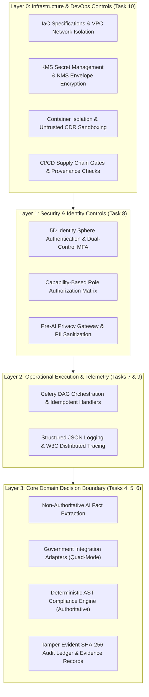

# Phase 1 — Master Deployment, Infrastructure & DevOps Architecture

**Document Control Information**
- **Project Name:** SIH26100 — AI-Powered Integrated Bid Compliance Verification Platform for GeM Procurement
- **Organization:** Ministry of Petroleum & Natural Gas / CPCL (Chennai Petroleum Corporation Limited)
- **Document Version:** 1.0.0 (Phase 1 — Task 10 Master Deployment Specification)
- **Status:** DESIGN DRAFT / PENDING REVIEW
- **Security Classification:** INTERNAL
- **Mode:** DESIGN ONLY — ZERO CODE IMPLEMENTATION

---

## 1. Executive Summary & Purpose

This specification establishes the master Deployment, Infrastructure, and DevOps Architecture for the SIH26100 platform. It defines how the modular monolith application architecture (FastAPI backend, Next.js frontend, PostgreSQL/pgvector database, MinIO object storage, Redis cache, and Celery background workers) is structured, built, packaged, deployed, operated, scaled, backed up, recovered, monitored, and released across environments.

The core infrastructure principle is:
> **"Infrastructure enables and enforces the system responsibility chain (AI INTERPRETS → AUTHORIZED SOURCES VERIFY → RULES EVALUATE → EVIDENCE PROVES → HUMAN APPROVES) without introducing security bypasses, un-audited access channels, or automated qualification triggers."**

---

## 2. Infrastructure Responsibility Boundary

---

## 3. Twenty-Two Infrastructure Principles

| # | Principle | Architectural Meaning & Application |
|---|---|---|
| 1 | **Infrastructure as Code (IaC)** | All infrastructure environments are specified declaratively as code definitions; manual console edits are strictly prohibited. |
| 2 | **Immutable Versioned Artifacts** | Build outputs (container images, static assets) are immutable, tagged with Git commit SHAs, and signed before deployment. |
| 3 | **Strict Environment Isolation** | Development, testing, staging, and production run in isolated VPC subnets; production data never flows into lower tiers. |
| 4 | **Least Privilege IAM** | System workloads execute under dedicated service identities with minimal IAM policies and zero persistent root credentials. |
| 5 | **Defense in Depth** | Multi-layered network boundaries (WAF, edge protection, private subnets, security groups, app firewalls) isolate core assets. |
| 6 | **Secret & Config Separation** | Application configuration parameters are stored separately from sensitive credentials; plaintext secrets in code/Git are forbidden. |
| 7 | **Reproducible Builds** | Dependencies are pinned via lockfiles and base container digests to guarantee bit-identical build reproduction. |
| 8 | **Controlled Release Gates** | Deployments require multi-stage validation gates, automated security checks, and explicit approval before production promotion. |
| 9 | **Instant Rollback Capability** | Infrastructure supports blue/green and rolling deployments with automated health verification and instant version rollback. |
| 10 | **Disaster Recovery Readiness** | Point-in-time database restoration and multi-region backup replication ensure rapid operational recovery. |
| 11 | **Automated Backup Verification** | Backups execute automated integrity checks and periodic restore tests to verify data recoverability. |
| 12 | **Observability-First Deployment** | Workload deployments automatically wire telemetry signals into central logging, metrics, and distributed tracing. |
| 13 | **Security-First Deployment** | Container images are scanned for vulnerabilities and malware before registry insertion and workload execution. |
| 14 | **Supply-Chain Verification** | Software Bill of Materials (SBOM) and artifact provenance signatures validate dependency integrity before deployment. |
| 15 | **Minimal Public Exposure** | Databases, Redis brokers, Celery workers, and object storage buckets are housed in private subnets with zero public IP routing. |
| 16 | **Horizontal Scalability** | Stateless API and background worker tiers scale horizontally based on queue depth, CPU, and request throughput. |
| 17 | **Failure Isolation** | Untrusted document parsing workloads run in isolated sandbox environments with strict memory and CPU limits. |
| 18 | **Environment Configuration Isolation**| Environment-specific settings are injected at runtime via secure secret managers and environment variables. |
| 19 | **Policy-Controlled Retention** | Data storage lifecycle policies enforce policy-defined retention schedules and dual-control legal holds. |
| 20 | **Cost Governance & Tagging** | Infrastructure resources carry standard environment, owner, and service tags for granular cost attribution. |
| 21 | **Vendor-Neutral Architecture** | Infrastructure designs use open standards (Docker, OCI, OTLP, S3 API, SQL) to prevent cloud vendor lock-in. |
| 22 | **Auditable Operational Changes** | All deployment events, administrative actions, and infrastructure modifications emit tamper-evident audit logs. |

---

## 4. Relationship to Tasks 1–9 Baseline

Task 10 respects the frozen architecture established in Tasks 1–9:
- **Task 1 Baseline:** Preserves modular monolith, FastAPI, Next.js, PostgreSQL/pgvector, MinIO, Redis, and Celery boundaries.
- **Task 2 Baseline:** Preserves ULID identifiers, temporal versioning, evidence records, and policy-controlled retention.
- **Task 3 Baseline:** Preserves REST endpoints, async job polling, correlation IDs, idempotency keys, and RFC 7807 error models.
- **Task 4 Baseline:** Enforces Non-Authoritative AI boundary; AI gateway deployment preserves sensitivity routing and fallback safety gates.
- **Task 5 Baseline:** Deploys Quad-Mode adapters (`LIVE`, `SANDBOX`, `MOCK`, `MANUAL_FALLBACK`) with strict outbound egress controls.
- **Task 6 Baseline:** Preserves deterministic AST compliance engine execution, policy versioning, and snapshot evaluation locks.
- **Task 7 Baseline:** Deploys Celery workers for at-least-once execution, idempotent handlers, and two-phase cancellation.
- **Task 8 Baseline:** Enforces 4-tier trust zones, PII tokenization, document quarantine sandboxing, and SHA-256 audit ledger protection.
- **Task 9 Baseline:** Connects container deployments directly to structured JSON logging, Prometheus metrics, and OpenTelemetry traces.

---

## 5. Out-of-Scope & Implementation Notice

- **Zero Cloud Resource Provisioning:** No AWS, Azure, GCP, or local cloud resources are created.
- **Zero Source Code & Manifests:** No application code, Dockerfiles, Kubernetes YAML manifests, or Terraform code files are generated.
- **Zero Real Credentials:** No real database passwords, API keys, certificates, or cloud access tokens exist.
- **Status:** DESIGN DRAFT / PENDING REVIEW. Task 11 remains NOT STARTED.
