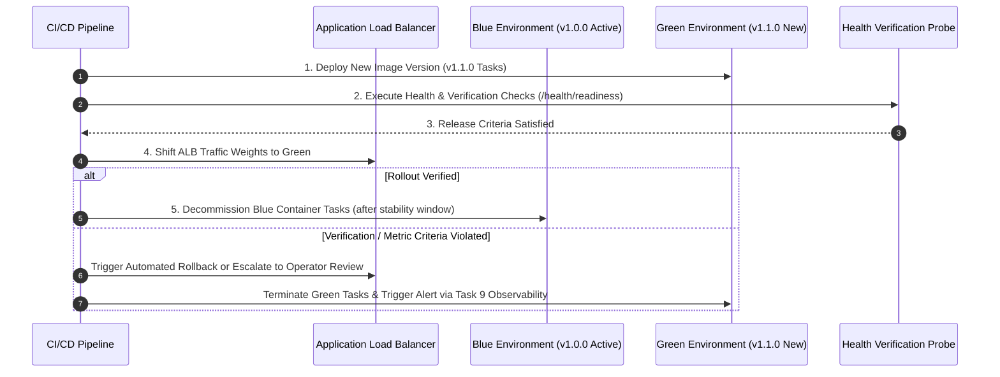

# Phase 1 — Deployment & Release Execution Strategy Specification

**Document Control Information**
- **Project Name:** SIH26100 — AI-Powered Integrated Bid Compliance Verification Platform for GeM Procurement
- **Organization:** Ministry of Petroleum & Natural Gas / CPCL
- **Document Version:** 1.0.0 (Phase 1 — Task 10 Deployment Strategy Specification)
- **Status:** DESIGN DRAFT / PENDING REVIEW
- **Security Classification:** INTERNAL
- **Mode:** DESIGN ONLY — ZERO CODE IMPLEMENTATION

---

## 1. Executive Summary & Purpose

This specification evaluates deployment execution strategies (Blue/Green, Rolling, Canary, Recreate) and defines the recommended release deployment procedure for system components.

---

## 2. Deployment Strategy Comparison & Selection

| Deployment Strategy | Mechanism & Description | Rollback Speed | Compute Overhead | Selection Decision & Rationale |
|---|---|---|---|---|
| **Blue/Green Deployment** | Parallel environment provisioned (`Green`); traffic shifted via ALB weighted target groups | Instant ($< 10$s ALB target swap) | 100% temporary duplicate compute | **RECOMMENDED for Core FastAPI & Next.js API/UI Releases:** Guarantees zero downtime and instant rollback. |
| **Rolling Deployment** | Tasks updated incrementally batch-by-batch | Moderate ($1\text{--}3$ minutes) | Low ($20\text{--}25\%$ buffer compute) | **RECOMMENDED for Celery Background Workers:** Workers complete active tasks before terminating. |
| **Canary Deployment** | Small traffic percentage ($5\%$) routed to new release for verification | Fast | Low | Optional future enhancement for high-volume public endpoints. |
| **Recreate Deployment** | Complete shutdown of active tasks before launching new version | N/A (Downtime required) | Zero | **PROHIBITED for production services;** permitted only in local dev environments. |

---

## 3. Blue/Green Release Sequence & Verification Gates

---

## 4. Release Verification & Rollback Policy

1. **Verification Gate:** Required health/readiness checks and deployment verification criteria must satisfy the approved release policy before traffic is shifted to Green.
2. **Rollback Policy:** Automated rollback MAY be triggered when configured release-health criteria are violated; otherwise the deployment enters the approved operator review/escalation path. All release anomalies integrate directly with Task 9 alerting and operational observability.
