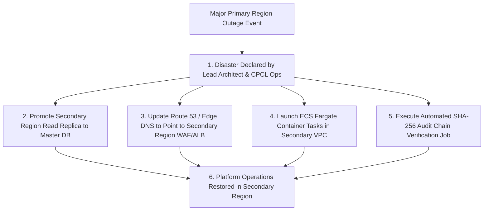

# Phase 1 — Disaster Recovery Architecture Specification

**Document Control Information**
- **Project Name:** SIH26100 — AI-Powered Integrated Bid Compliance Verification Platform for GeM Procurement
- **Organization:** Ministry of Petroleum & Natural Gas / CPCL
- **Document Version:** 1.0.0 (Phase 1 — Task 10 Disaster Recovery Specification)
- **Status:** DESIGN DRAFT / PENDING REVIEW
- **Security Classification:** INTERNAL
- **Mode:** DESIGN ONLY — ZERO CODE IMPLEMENTATION

---

## 1. Executive Summary & Purpose

This specification defines the disaster recovery (DR) strategy, candidate Recovery Point Objective (RPO) and Recovery Time Objective (RTO) targets, regional failover topologies, and recovery verification procedures.

Candidate RPO/RTO objectives SHALL be established through approved business continuity, service criticality, and organizational/government policy. Illustrative numerical targets in this document are illustrative examples only; not production requirements.

---

## 2. Recovery Objectives Framework

| System Data / Asset Class | Candidate RPO (Illustrative Target) | Candidate RTO (Illustrative Target) | Disaster Recovery Strategy |
|---|---|---|---|
| **Authoritative Audit Ledger (`AuditEvent`)** | Candidate RPO Target (Policy Defined) | Candidate RTO Target (Policy Defined) | Multi-AZ DB replication + Continuous WAL streaming |
| **Bid Compliance Snapshots & Evidence** | Candidate RPO Target (Policy Defined) | Candidate RTO Target (Policy Defined) | Multi-AZ DB replication + Cross-Region Backup Replication |
| **Document Object Files (MinIO / S3)** | Candidate RPO Target (Policy Defined) | Candidate RTO Target (Policy Defined) | S3 Cross-Region Replication (CRR) to secondary recovery bucket |
| **Redis Queue & Cache State** | Candidate RPO Target (Policy Defined) | Candidate RTO Target (Policy Defined) | Re-creatable queue state; task handlers enforce Task 7 idempotency |

---

## 3. Disaster Recovery Failover Lifecycle

