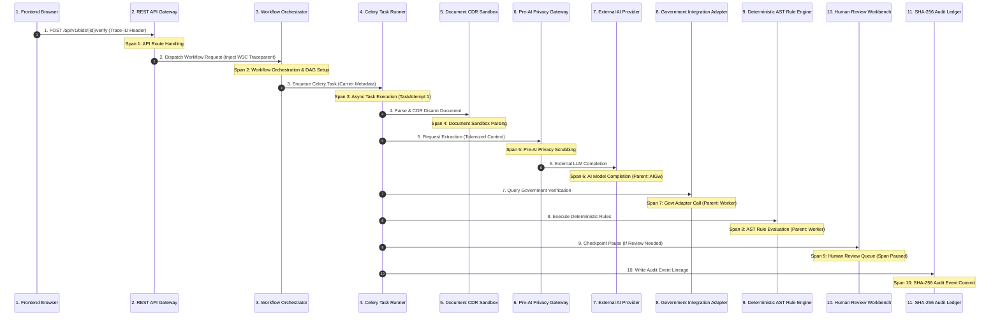
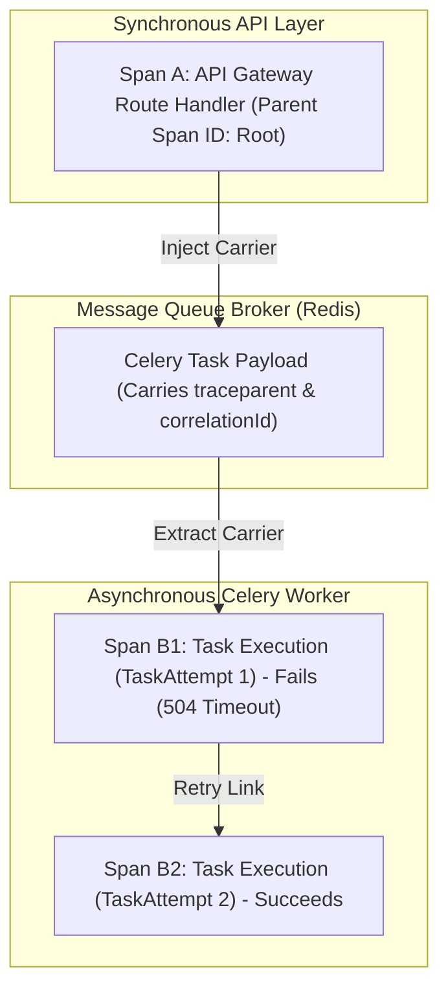

# Phase 1 — Distributed Tracing & Context Propagation Architecture Specification

**Document Control Information**
- **Project Name:** SIH26100 — AI-Powered Integrated Bid Compliance Verification Platform for GeM Procurement
- **Organization:** Ministry of Petroleum & Natural Gas / CPCL
- **Document Version:** 1.0.0 (Phase 1 — Task 9 Distributed Tracing Specification)
- **Status:** DESIGN DRAFT / PENDING REVIEW
- **Security Classification:** INTERNAL
- **Mode:** DESIGN ONLY — ZERO CODE IMPLEMENTATION

---

## 1. Executive Summary & Purpose

This specification defines the distributed tracing and context propagation architecture for the SIH26100 platform. Modern asynchronous, multi-stage compliance verification pipelines span HTTP API endpoints, background worker queues, document disarming sandboxes, AI extraction gateways, government registry integration adapters, and deterministic AST rule evaluation engines.

The foundational tracing principle is:
> **"Distributed tracing provides end-to-end visibility into request execution paths across synchronous and asynchronous boundary crossings. Trace spans MUST propagate correlation contexts without leaking PII or credentials."**

---

## 2. End-to-End Trace Propagation Topology

A single user or system action generates a unified `TraceContext` propagated across eleven processing spans:



---

## 3. `TraceContext` Header & Span Data Model

Context propagation follows W3C Trace Context specifications (`traceparent`, `tracestate`) augmented with platform correlation attributes:

### 3.1 Trace Header Specification
- **`traceparent` Header Format:** `00-{trace_id}-{parent_span_id}-{trace_flags}`
  - Example: `00-4bf92f3577b34da6a3ce929d0e0e4736-00f067aa0ba902b7-01`
- **`tracestate` Header Format:** `sih26100=corr_{correlation_ulid};org_{tenant_org_id}`

### 3.2 Span Attribute Model
Every trace span records core operational metadata:

```json
{
  "trace_id": "4bf92f3577b34da6a3ce929d0e0e4736",
  "span_id": "00f067aa0ba902b7",
  "parent_span_id": "5c398e826b528b12",
  "name": "government_adapter.verify_gstn",
  "kind": "CLIENT",
  "start_time": "2026-09-06T01:00:00.000000Z",
  "end_time": "2026-09-06T01:00:00.450000Z",
  "status": { "code": "OK" },
  "attributes": {
    "sih26100.correlation_id": "01HXXXXXX1234567890ABCDEF",
    "sih26100.tender_id": "01HXXXXXXTENDER0000000001",
    "sih26100.bid_submission_id": "01HXXXXXXBID00000000001",
    "sih26100.govt_source": "gstn",
    "sih26100.govt_mode": "LIVE",
    "sih26100.http_status_code": 200,
    "sih26100.task_attempt_id": "01HXXXXXXATTEMPT00000001"
  }
}
```

---

## 4. Async Task Queue Propagation & TaskAttempt Distinction

Asynchronous Celery background task execution requires explicit context handling:



### 4.1 Operation Identity vs. Retry `TaskAttempt` Spans
- **Operation Span:** Represents the overarching logical business task (e.g., "Verify GSTN Filing").
- **TaskAttempt Spans:** Each execution retry creates a distinct child span linked to the parent operation span (`task_attempt_id: 01H...`, `attempt_number: 2`).
- This guarantees that retries are tracked accurately without polluting the overarching operation identity.

---

## 5. Trace Sampling Strategy & High-Traceability Requirements

To balance diagnostic visibility against storage and compute overhead, tracing implements **Capability-Based Adaptive Sampling**.

> **"The architecture should prioritize enhanced trace capture for failed requests, security incidents, and human-review escalations, subject to telemetry availability, privacy policy, cost, and environment configuration."**

| Processing Area | Tracing Requirement | Target Sampling Strategy | Rationale |
|---|---|---|---|
| **High-Risk Bids / Manual Overrides** | **Enhanced Trace Capture** | Priority Capture (Head-Based) | High vigilance liability; requires comprehensive diagnostic auditability. |
| **Government Integration Adapters** | **Enhanced Trace Capture** | Priority Capture (Head-Based) | External portal connectivity requires detailed transport diagnostic traces. |
| **AI Extraction Gateway** | **Enhanced Trace Capture** | Priority Capture (Head-Based) | Model provenance and schema validation require detailed trace coverage. |
| **Standard Bid Ingestion Pipeline** | Adaptive Sampling | Adaptive (Tail-Based) | Routine ingestion flows sampled to manage storage costs. |
| **Public API Read Requests** | Light Sampling | Minimum (Head-Based) | High-volume public read endpoints require minimal tracing. |

---

## 6. Privacy & Security Rules for Trace Attributes

1. **Zero Secret Leakage:** Trace attributes must never capture bearer tokens, API keys, certificates, or DB passwords.
2. **Zero Raw PII in Attributes:** Full names, PAN numbers, bank account details, and full document text are forbidden as span attributes.
3. **Allowed Attribute Types:** Only ULID references, status codes, component names, and numeric latencies are permitted as span attributes.
4. **Sanitized Error Logs:** Exception details captured in span events are scrubbed of raw document text or PII variables.
