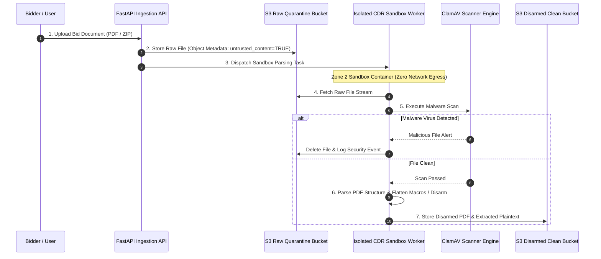

# Phase 1 — Document Processing Isolation Architecture

**Document Control Information**
- **Project Name:** SIH26100 — AI-Powered Integrated Bid Compliance Verification Platform for GeM Procurement
- **Organization:** Ministry of Petroleum & Natural Gas / CPCL
- **Document Version:** 1.0.0 (Phase 1 — Task 10 Document Isolation Specification)
- **Status:** DESIGN DRAFT / PENDING REVIEW
- **Security Classification:** INTERNAL
- **Mode:** DESIGN ONLY — ZERO CODE IMPLEMENTATION

---

## 1. Executive Summary & Purpose

This specification defines the isolated document processing architecture for parsing, OCR, and disarming untrusted uploaded tender documents (PDFs, images, Office docs).

The foundational security rule for document processing is:
> **"All uploaded bidder documents are untrusted content vectors. Document parsing, OCR extraction, and disarming execute inside isolated sandbox containers with zero network access and strict resource boundaries."**

---

## 2. Document Processing Sandbox Isolation Topology

---

## 3. Sandbox Container Isolation Rules

| Security Layer | Sandbox Isolation Parameter | Architectural Enforce Mechanism |
|---|---|---|
| **Network Isolation** | **Zero Outbound Egress** | Document-processing workloads operate in a network-isolated execution boundary with no outbound network access by default; implementation may use runtime-specific network isolation such as disabled networking |
| **Filesystem Isolation** | **Read-Only Root Filesystem** | Mount root `/` as read-only; use ephemeral `tmpfs` RAM-disk for `/tmp` scratch |
| **Resource Limits** | **Strict CPU & Memory Caps** | Workload containers execute under defined CPU/RAM caps; auto-kill on `OOMKilled` threshold breach |
| **Process Privileges** | **Non-Root & Capability Hardening** | Containers should run as non-root identities and drop unnecessary Linux capabilities; exact UID/GID and capability configuration are implementation-specific and validated through security testing |
| **Execution Timeout** | **Hard Task Deadline** | Celery task timeout hard kill enforced per document page/file processing task |
| **Original Evidence Preservation** | **Immutability Protection** | Original raw file hash is recorded in `EvidenceRecord` before processing |

---

## 4. Derived Text Sanitization & Untrusted Tagging

1. **Untrusted Metadata Tag:** All extracted text, OCR outputs, and table structures carry an immutable attribute `untrusted_content_source = TRUE`.
2. **Pre-AI Injection Filtering:** Extracted text passes through the Pre-AI Privacy Gateway for prompt injection pattern scanning before LLM processing.
