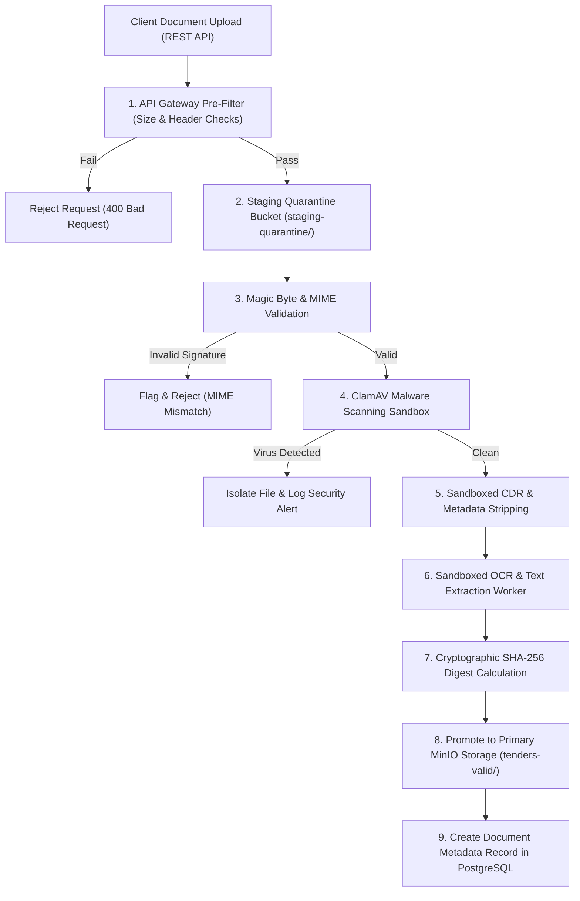

# Phase 1 — Document Ingestion & Storage Security Architecture

**Document Control Information**
- **Project Name:** SIH26100 — AI-Powered Integrated Bid Compliance Verification Platform for GeM Procurement
- **Organization:** Ministry of Petroleum & Natural Gas / CPCL
- **Document Version:** 1.0.0 (Phase 1 — Task 8 Document Security Specification)
- **Status:** DESIGN DRAFT / PENDING REVIEW
- **Security Classification:** INTERNAL
- **Mode:** DESIGN ONLY — ZERO CODE IMPLEMENTATION

---

## 1. Executive Summary & Purpose

This specification defines the document security, ingestion pipeline, and isolation architecture for the SIH26100 platform. Modern bid management platforms ingest thousands of multi-page PDF documents, financial balance sheets, scanned certificates, and compressed archives. These files present significant attack vectors if not handled with rigorous security controls.

The core document security axiom is:
> **"Every uploaded file is untrusted content. Files must be validated, scanned, sandboxed, disarmed, hashed, and isolated before entering application database stores or AI processing pipelines."**

---

## 2. Ingestion Threat Taxonomy & Security Matrix

The architecture mitigates thirteen primary document-borne security threats:

| Threat ID | Threat Name | Description & Attack Vector | Architectural Mitigation Control |
|---|---|---|---|
| **T-DOC-01** | **Malware / Viruses** | Uploaded executable malware, Trojans, or ransomware disguised as document attachments. | ClamAV automated malware scanner running in isolated container sandbox before storage. |
| **T-DOC-02** | **Malicious PDF Exploits** | PDFs containing malicious JavaScript, launch actions, or font parsing exploits targeting viewer applications. | Content Disarm & Reconstruction (CDR) pipeline stripping embedded JS, launch actions, and form streams. |
| **T-DOC-03** | **Macro-Enabled Documents** | Microsoft Office files (.doc, .xls) containing automated VBA malware scripts. | Strict MIME-type rejection; auto-conversion of legacy Office documents to static PDF images in sandboxed worker. |
| **T-DOC-04** | **Decompression Bombs** | Highly compressed zip archives (e.g., zip bombs) designed to cause disk/RAM exhaustion when unpacked. | Strict uncompressed size limits, maximum expansion ratios (e.g., max 10:1 ratio), and recursive depth limits (max 2 levels). |
| **T-DOC-05** | **Oversized Payloads** | Massive files uploaded to exhaust bandwidth, CPU parsing time, or MinIO storage allocations. | **Policy-configurable** request size limits enforced at API Gateway and application ingestion handler. |
| **T-DOC-06** | **Polyglot Files** | Files constructed to be valid under two different formats (e.g., valid PDF and valid ZIP executable simultaneously). | Strict magic byte signature verification cross-referenced against file extensions and MIME headers. |
| **T-DOC-07** | **Malformed Formats** | Corrupted or intentionally broken file structures designed to crash underlying OCR or parser libraries. | Sandboxed parser containers with memory caps, execution time limits, and non-root execution privileges. |
| **T-DOC-08** | **Indirect Prompt Injection** | White-on-white text, micro-fonts, or hidden prompt instructions embedded in bid PDFs to manipulate AI extractions. | Structural text extraction normalization, optical isolation, and mandatory `untrusted_content_source` prompt labeling. |
| **T-DOC-09** | **Malicious OCR Content** | Images formatted to cause OCR engine memory corruption or text injection. | Isolated Tesseract/OCR engine worker containers running with no network access and strict RAM bounds. |
| **T-DOC-10** | **Embedded Steganography** | Malicious payloads hidden inside image layers of scanned certificates. | Image re-encoding (converting incoming scans to standardized PNG/JPEG without auxiliary metadata chunks). |
| **T-DOC-11** | **EXIF / Metadata Leakage** | Metadata inside uploaded files leaking creator location, software versions, or internal network paths. | Metadata stripping during ingestion disarm stage. |
| **T-DOC-12** | **File Extension Spoofing** | Executables renamed with `.pdf` or `.jpg` extensions. | Mandatory header inspection checking initial magic bytes (e.g., `%PDF-1.`, `\xFF\xD8\xFF`). |
| **T-DOC-13** | **Path Traversal Attacks** | Filenames containing `../` or special characters attempting to write files outside target storage directories. | Filename sanitization; original filenames replaced with system-generated ULID identifiers. |

---

## 3. Multi-Stage Secure Document Ingestion Lifecycle



---

## 4. Ingestion Security Controls & Processing Details

### 4.1 Policy-Configurable File Size Limits
- File upload size thresholds are **policy-configurable** rather than statically hardcoded.
- Parameters defined per tender type or organization policy:
  - `MAX_SINGLE_FILE_SIZE_MB`: Configurable default (e.g., 50 MB per single PDF).
  - `MAX_AGGREGATE_BID_SIZE_MB`: Configurable default (e.g., 500 MB total per bid submission).
  - `MAX_ZIP_DECOMPRESSION_RATIO`: Configurable ratio limit (e.g., 10:1 uncompressed-to-compressed limit).

### 4.2 File Validation & Magic Byte Inspection
- All uploads undergo header inspection before reading the full stream into application memory.
- Approved Magic Byte Signatures:
  - PDF: `%PDF-` (`0x25 0x50 0x44 0x46`)
  - PNG: `0x89 0x50 0x4E 0x47 0x0D 0x0A 0x1A 0x0A`
  - JPEG: `0xFF 0xD8 0xFF`
  - ZIP: `0x50 0x4B 0x03 0x04`
- If the magic bytes do not match the expected content type, the file is rejected immediately.

### 4.3 Content Disarm & Reconstruction (CDR)
For PDF documents passing malware scanning, a disarm worker generates a sanitized copy:
1. Strips embedded JavaScript scripts (`/JS`, `/JavaScript` actions).
2. Disarms external URI launch actions (`/Launch`, `/SubmitForm`).
3. Strips embedded attachments, audio, and video streams.
4. Removes EXIF authoring metadata while preserving document page visual structure.

### 4.4 Cryptographic Hashing & Immutability Ledger
- Upon promotion from quarantine to primary storage, the system calculates the **SHA-256 digest** ($H_{\text{doc}}$) of the clean disarmed document payload.
- $H_{\text{doc}}$ is recorded immutably in the PostgreSQL `Document` metadata record and linked into the workflow `AuditEvent` hash chain.
- If a document is re-read during downstream processing, its SHA-256 digest is re-verified to ensure zero file tampering.

---

## 5. Storage Security & Access Control

```mermaid
graph TD
    subgraph Public_Domain ["Public Internet Zone"]
        ClientBrowser["User Browser"]
    end

    subgraph API_Zone ["Application API Zone"]
        APIServer["API Gateway / FastAPI Service"]
    end

    subgraph Storage_Zone ["Protected Object Storage Zone"]
        QuarantineBucket[("staging-quarantine/ Bucket (No External Access)")]
        ValidDocsBucket[("tenders-valid/ Bucket (Private Access Only)")]
    end

    ClientBrowser -->|HTTP POST Upload| APIServer
    APIServer -->|Write Temp Raw File| QuarantineBucket
    APIServer -->|Promote Clean File| ValidDocsBucket

    ClientBrowser -.->|Direct Read Attempt (Blocked)| ValidDocsBucket
    APIServer -->|Generate Short-Lived Signed URL (e.g., 15 min expiration)| ClientBrowser
```

### 5.1 Object Storage Isolation Rules
- **No Public Buckets:** All MinIO object storage buckets (`staging-quarantine/`, `tenders-valid/`, `evidence-artifacts/`) strictly forbid public read or write access.
- **Pre-Signed Short-Lived URLs:** When an authorized Procurement Officer views a document in the presentation UI, the application API issues a temporary, pre-signed URL with short validity (e.g., 15 minutes max) bound to the user's IP/session context.
- **Server-Side Encryption:** All stored objects are encrypted at rest using MinIO server-side encryption (SSE-S3 / AES-256).

---

## 6. Document Isolation & Processing Container Limits

Background workers that parse documents (OCR workers, PDF splitters, table extractors) run inside constrained execution containers:
- **Zero Network Access:** Container networking is disabled (`--net=none`); workers cannot initiate outgoing internet connections.
- **Read-Only File System:** Worker root file systems are mounted read-only. Temporary scratch files use ephemeral `tmpfs` mounts with strict memory caps.
- **Non-Root Execution:** Workers execute under unprivileged UID/GID accounts (`nobody` / `nogroup`).
- **Resource Constraints:** Execution containers enforce strict CPU limits and memory limits to contain DoS or parser memory leaks.

---

## 7. Document Security Control Summary

| Ingestion Step | Threat Mitigated | Security Control Applied | Failure Outcome |
|---|---|---|---|
| **1. Ingress** | DoS, Bandwidth Exhaustion | API Gateway payload limit check | 413 Payload Too Large |
| **2. Staging** | Immediate Malware Write | Upload written only to `staging-quarantine/` | File Isolated |
| **3. Validation** | Extension Spoofing, Polyglots | Magic byte & MIME cross-check | 400 Bad Request |
| **4. Scanning** | Malware, Viruses, Trojans | Containerized ClamAV scan | Quarantine & Alert |
| **5. Disarming** | Malicious PDF JS, Macros | CDR sanitization & metadata strip | Disarmed Copy Created |
| **6. Extraction** | Memory Exploits, Injection | Isolated sandbox, `untrusted` prompt label | Parser Timeout / Reject |
| **7. Persistence** | Storage Tampering, Public Leak | SHA-256 hashing, Private SSE-S3 bucket | Write Rejected |
