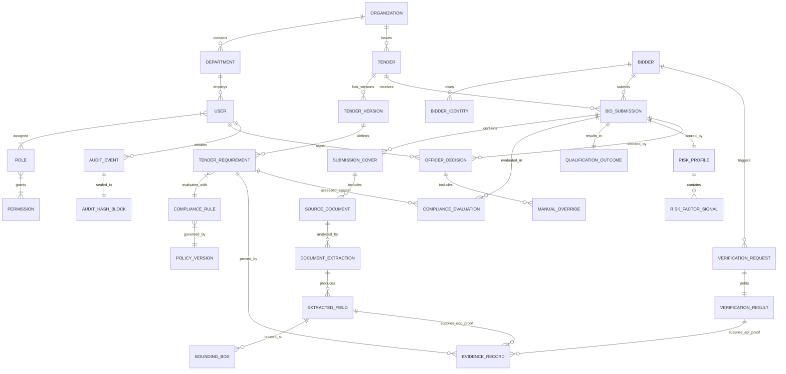
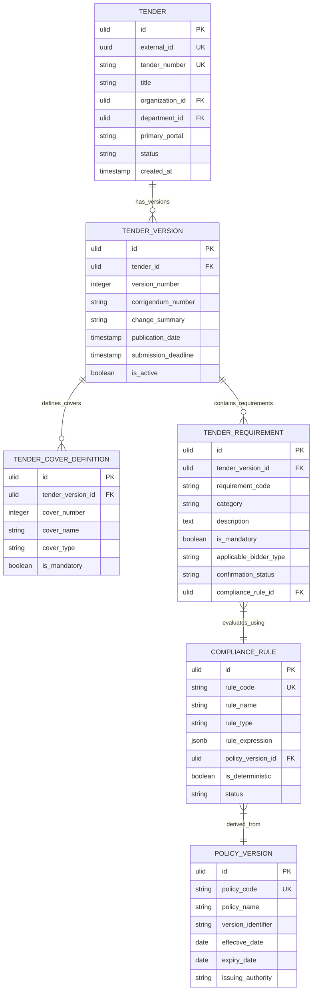
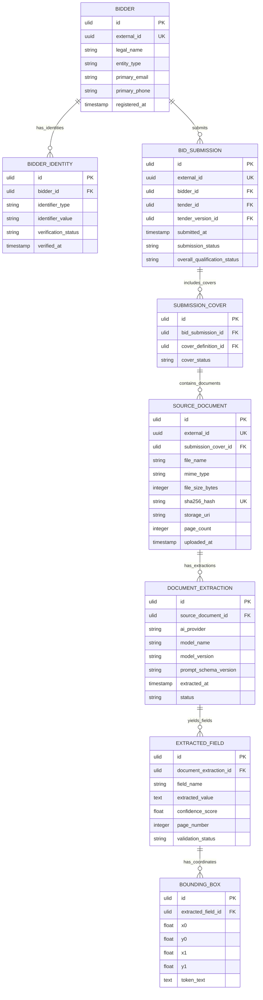

# Phase 1 Entity Relationship Diagrams (ERD) Specification

## SIH 26100: AI-Powered Integrated Bid Compliance Verification Platform for GeM Procurement

**Organization:** Ministry of Petroleum & Natural Gas / Chennai Petroleum Corporation Limited (CPCL)  
**Phase:** 1 — Architecture & Technical Design  
**Document ID:** SIH26100-ARCH-008  
**Version:** 1.0.0  
**Date:** 2026-09-05  
**Implementation Status:** ZERO APPLICATION CODE GENERATED

---

## Executive Notice

**Core Authorization Notice:** Phase 0 & Phase 1 establish research, architecture inputs, and system boundaries; government integrations requiring authorization remain subject to official onboarding/approval.

**Zero Application Code Mandate:** This document defines entity relationships, structural cardinalities, foreign key connections, and visual ER diagrams. No SQL migration scripts, database schemas, ORM models, or backend/frontend code files are created.

---

## 1. Complete Conceptual Entity Relationship Diagram

This high-level ERD visualizes the system topology across all 11 Bounded Contexts.



---

## 2. Tender, Version, Requirement, and Rule ERD

Visualizes tender publication lifecycle, corrigenda versioning, requirements, deterministic rules, and policy versions.



---

## 3. Bidder, Submission, Document, and OCR Extraction ERD

Visualizes bidder master entities, child registration identities, submission packages, source document files, and OCR field extractions with bounding box overlays.



---

## 4. Government Verification, Evidence, Compliance, and Risk ERD

Visualizes multi-mode government API verifications, immutable evidence records, requirement-level compliance evaluations, and independent risk profiles.

```mermaid
erDiagram
    GOVERNMENT_VERIFICATION_REQUEST {
        ulid id PK
        uuid external_id UK
        ulid bidder_id FK
        string source_adapter
        string identifier_type
        string identifier_value
        string requested_mode
        timestamp requested_at
    }

    GOVERNMENT_VERIFICATION_RESULT {
        ulid id PK
        ulid request_id FK UK
        string status
        string execution_mode
        string source_authority
        jsonb raw_payload
        string payload_hash
        timestamp responded_at
        string error_message
    }

    EVIDENCE_RECORD {
        ulid id PK
        uuid external_id UK
        ulid tender_requirement_id FK
        ulid bid_submission_id FK
        ulid extracted_field_id FK
        ulid verification_result_id FK
        string evidence_type
        string verification_mode
        text evidence_summary
        string evidence_sha256 UK
        timestamp created_at
        ulid parent_evidence_id FK
    }

    COMPLIANCE_EVALUATION {
        ulid id PK
        ulid bid_submission_id FK
        ulid tender_requirement_id FK
        ulid evidence_record_id FK
        string compliance_status
        boolean is_mandatory
        jsonb execution_trace
        timestamp evaluated_at
    }

    QUALIFICATION_OUTCOME {
        ulid id PK
        ulid bid_submission_id FK UK
        string outcome_status
        integer total_mandatory_requirements
        integer passed_mandatory_requirements
        integer failed_mandatory_requirements
        timestamp calculated_at
    }

    RISK_ASSESSMENT_PROFILE {
        ulid id PK
        ulid bid_submission_id FK UK
        float overall_risk_score
        string risk_level
        float confidence_rating
        timestamp assessed_at
    }

    RISK_FACTOR_SIGNAL {
        ulid id PK
        ulid risk_profile_id FK
        string factor_category
        string factor_name
        string severity
        text description
        float score_contribution
    }

    GOVERNMENT_VERIFICATION_REQUEST ||--|| GOVERNMENT_VERIFICATION_RESULT : "produces"
    EVIDENCE_RECORD }|--o| EXTRACTED_FIELD : "links_ocr"
    EVIDENCE_RECORD }|--o| GOVERNMENT_VERIFICATION_RESULT : "links_api"
    COMPLIANCE_EVALUATION }|--|| EVIDENCE_RECORD : "justified_by"
    BID_SUBMISSION ||--o{ COMPLIANCE_EVALUATION : "evaluated_by"
    BID_SUBMISSION ||--|| QUALIFICATION_OUTCOME : "summarized_by"
    BID_SUBMISSION ||--|| RISK_ASSESSMENT_PROFILE : "scored_by"
    RISK_ASSESSMENT_PROFILE ||--o{ RISK_FACTOR_SIGNAL : "composed_of"
```

---

## 5. Officer Decision, Audit Trail, and System Configuration ERD

Visualizes human officer decision workflows, mandatory rationale records, manual overrides, system RBAC, and tamper-evident SHA-256 hash-chained audit blocks.

```mermaid
erDiagram
    USER {
        ulid id PK
        uuid external_id UK
        string username UK
        string email UK
        string full_name
        ulid organization_id FK
        ulid department_id FK
        boolean is_active
        timestamp created_at
    }

    OFFICER_DECISION {
        ulid id PK
        uuid external_id UK
        ulid bid_submission_id FK
        ulid officer_user_id FK
        string decision_choice
        text justification_rationale
        timestamp decision_timestamp
        string snapshot_hash UK
    }

    MANUAL_OVERRIDE {
        ulid id PK
        ulid officer_decision_id FK
        ulid compliance_evaluation_id FK
        string previous_status
        string overridden_status
        text override_reason
        timestamp overridden_at
    }

    AUDIT_EVENT {
        ulid id PK
        uuid correlation_id
        ulid actor_user_id FK
        string action_type
        string entity_name
        string entity_id
        jsonb payload_snapshot
        timestamp timestamp
    }

    AUDIT_HASH_CHAIN_BLOCK {
        ulid id PK
        ulid audit_event_id FK UK
        integer block_sequence
        string previous_block_hash
        string current_block_hash UK
        timestamp sealed_at
    }

    SYSTEM_CONFIGURATION {
        ulid id PK
        string config_key UK
        jsonb config_payload
        string description
        timestamp updated_at
        ulid updated_by_user_id FK
    }

    USER ||--o{ OFFICER_DECISION : "makes"
    BID_SUBMISSION ||--o{ OFFICER_DECISION : "decided_in"
    OFFICER_DECISION ||--o{ MANUAL_OVERRIDE : "contains_overrides"
    USER ||--o{ AUDIT_EVENT : "performs"
    AUDIT_EVENT ||--|| AUDIT_HASH_CHAIN_BLOCK : "sealed_by"
    USER ||--o{ SYSTEM_CONFIGURATION : "maintains"
```
