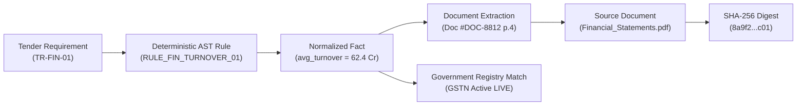

# Phase 1 — Evidence Lineage UI Architecture Specification

**Document Control Information**
- **Project Name:** SIH26100 — AI-Powered Integrated Bid Compliance Verification Platform for GeM Procurement
- **Organization:** Ministry of Petroleum & Natural Gas / CPCL
- **Document Version:** 1.0.0 (Phase 1 — Task 11 Evidence Lineage UI Specification)
- **Status:** DESIGN DRAFT / PENDING REVIEW
- **Security Classification:** INTERNAL
- **Mode:** DESIGN ONLY — ZERO CODE IMPLEMENTATION

---

## 1. Executive Summary & Lineage Chain Scope

This specification defines the interactive backward and forward Evidence Lineage Chain UI, enabling officers and auditors to trace any conclusion back to its raw origin.

---

## 2. Evidence Lineage Visual Chain Topology

---

## 3. Backward Navigation Protocol

1. **Backward Inspection Capability:** Clicking any element in the chain allows the user to step backward from final decision $\rightarrow$ qualification outcome $\rightarrow$ rule evaluation $\rightarrow$ normalized fact $\rightarrow$ extraction bounding box $\rightarrow$ raw uploaded document SHA-256 digest.
