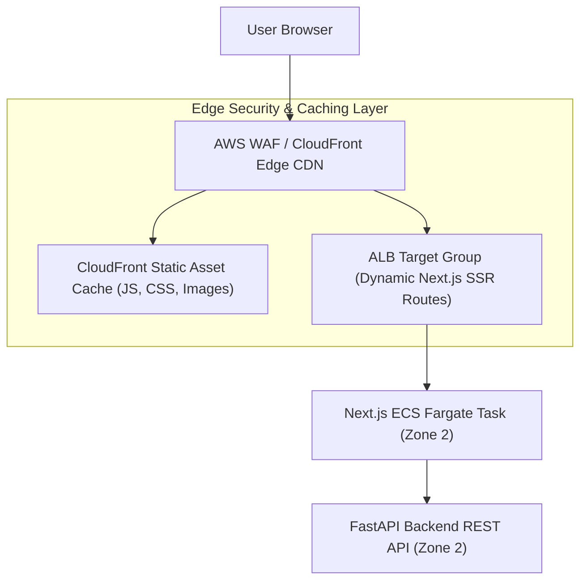

# Phase 1 — Frontend Deployment & Edge Architecture Specification

**Document Control Information**
- **Project Name:** SIH26100 — AI-Powered Integrated Bid Compliance Verification Platform for GeM Procurement
- **Organization:** Ministry of Petroleum & Natural Gas / CPCL
- **Document Version:** 1.0.0 (Phase 1 — Task 10 Frontend Deployment Specification)
- **Status:** DESIGN DRAFT / PENDING REVIEW
- **Security Classification:** INTERNAL
- **Mode:** DESIGN ONLY — ZERO CODE IMPLEMENTATION

---

## 1. Executive Summary & Purpose

This specification defines the deployment architecture for the Next.js frontend application (Officer Workbench, Admin Dashboard, Verification Portal).

---

## 2. Frontend Infrastructure Topology

---

## 3. Frontend Security Controls

1. **Strict Content Security Policy (CSP):** Emits strict CSP headers (`script-src 'self'`, `object-src 'none'`, `frame-ancestors 'none'`) to prevent cross-site scripting (XSS) and clickjacking.
2. **Zero Server Secrets in Bundle:** Public environment variables (`NEXT_PUBLIC_*`) contain zero API secret keys, DB passwords, or internal URLs.
3. **Session Cookie Security:** Authentication tokens store in `SameSite=Strict`, `HttpOnly`, `Secure` encrypted session cookies.
