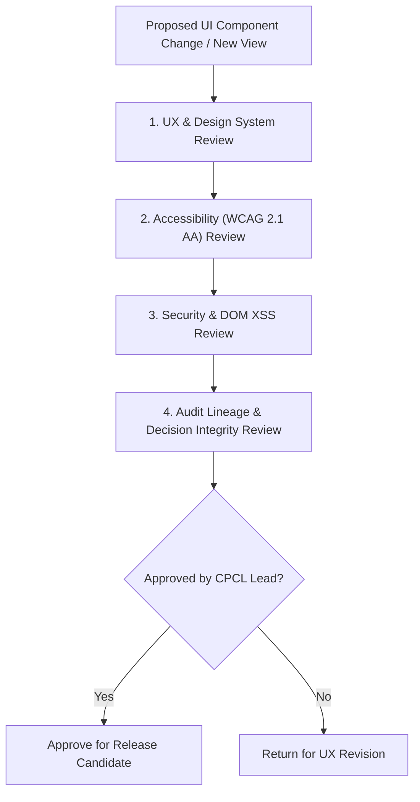

# Phase 1 — Frontend Governance & UX Change Management Specification

**Document Control Information**
- **Project Name:** SIH26100 — AI-Powered Integrated Bid Compliance Verification Platform for GeM Procurement
- **Organization:** Ministry of Petroleum & Natural Gas / CPCL
- **Document Version:** 1.0.0 (Phase 1 — Task 11 Frontend Governance Specification)
- **Status:** DESIGN DRAFT / PENDING REVIEW
- **Security Classification:** INTERNAL
- **Mode:** DESIGN ONLY — ZERO CODE IMPLEMENTATION

---

## 1. Executive Summary & UX Governance Framework

This specification defines the governance model for design system updates, UX change management, accessibility reviews, security audits, and feature flag controls.

---

## 2. UX Change Management Protocol

---

## 3. Governance Rules & Release Controls

1. **Non-Mutation of Audit UX:** Changes to UI components rendering evidence traces or officer decision recording workspaces require formal security and audit governance sign-off.
2. **Feature Flag Boundary:** Operational feature flags (e.g. enabling new experimental visualizers) **MUST NOT** bypass authentication, authorization, or evidence provenance displays.
