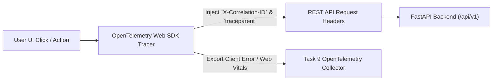

# Phase 1 — Frontend Observability Architecture Specification

**Document Control Information**
- **Project Name:** SIH26100 — AI-Powered Integrated Bid Compliance Verification Platform for GeM Procurement
- **Organization:** Ministry of Petroleum & Natural Gas / CPCL
- **Document Version:** 1.0.0 (Phase 1 — Task 11 Frontend Observability Specification)
- **Status:** DESIGN DRAFT / PENDING REVIEW
- **Security Classification:** INTERNAL
- **Mode:** DESIGN ONLY — ZERO CODE IMPLEMENTATION

---

## 1. Executive Summary & Task 9 Observability Integration

This specification defines client-side telemetry collection, browser error tracking, correlation ID propagation, and integration with Task 9 operational observability.

---

## 2. Telemetry Propagation Architecture

---

## 3. Privacy & Telemetry Safeguards

1. **Correlation ID Propagation:** Every HTTP request dispatched by the UI attaches the active `X-Correlation-ID` header, enabling end-to-end tracing across browser $\rightarrow$ API $\rightarrow$ Celery $\rightarrow$ PostgreSQL.
2. **Strict Telemetry PII Redaction:** Client telemetry payloads are scrubbed before export to remove bidder names, PAN numbers, and document text.
3. **Telemetry Boundary Axiom:** Frontend operational telemetry **MUST NEVER** become authoritative compliance evidence or influence qualification decisions.
