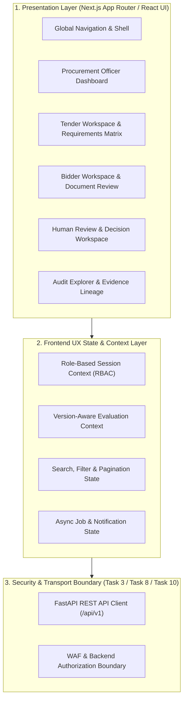

# Phase 1 — Frontend, User Experience & Procurement Officer Dashboard Architecture Specification

**Document Control Information**
- **Project Name:** SIH26100 — AI-Powered Integrated Bid Compliance Verification Platform for GeM Procurement
- **Organization:** Ministry of Petroleum & Natural Gas / CPCL
- **Document Version:** 1.0.0 (Phase 1 — Task 11 Master UX Architecture Specification)
- **Status:** DESIGN DRAFT / PENDING REVIEW
- **Security Classification:** INTERNAL
- **Mode:** DESIGN ONLY — ZERO CODE IMPLEMENTATION

---

## 1. Executive Summary & Foundational UX Axiom

This specification defines the frontend, user experience, information architecture, dashboard design, interaction models, accessibility framework, and human-in-the-loop review interfaces for the SIH26100 platform.

The UX architecture strictly preserves the system's foundational core axiom:
> **"AI interprets. Authorized sources verify. Rules evaluate. Evidence proves. Human approves."**

The user interface **MUST NEVER** imply that AI independently qualifies or disqualifies a bidder. The human Procurement Officer remains the sole, final decision authority for all qualification outcomes.

---

## 2. Master UX Architecture & Layer Boundaries

---

## 3. Core UX Design Principles

1. **Government/Enterprise-Grade Aesthetics:** Professional deep navy (`#0A192F`), white, neutral grey layout with accessible contrast, dense data presentation, and clear status badges. Purple AI aesthetics, excessive gradients, glassmorphism, chatbot-first interfaces, and decorative AI graphics are **STRICTLY PROHIBITED**.
2. **Evidence-First Presentation:** Every compliance conclusion is backed by clickable evidence traces linking requirements, rules, normalized facts, government verification results, and original document excerpts.
3. **Multi-Dimensional Status Separation:** The UI explicitly separates technical compliance status (`PASS`/`FAIL`), qualification outcome (`QUALIFIED`/`NOT_QUALIFIED`), evidence quality/confidence, advisory risk scores, and AI extraction confidence.
4. **Human Decision Authority:** AI is presented strictly as an advisory extraction and analysis assistant. Automated qualification or disqualification UX actions are prohibited.
5. **Traceability & Version Transparency:** Every workspace explicitly displays the active `TenderVersion`, `PolicyVersion`, and evaluation timestamp.

---

## 4. UI Component Architecture Mapping

| UI Module / Workspace | Target Primary Role | Primary Function | Core Data Artifacts Displayed |
|---|---|---|---|
| **Procurement Officer Dashboard** | `PROCUREMENT_OFFICER` | Multi-tender overview, assigned workloads, pending reviews | Tenders, Evaluation Summaries, Pending Action Items |
| **Tender Workspace** | `PROCUREMENT_OFFICER`, `SENIOR_REVIEWER` | Requirement management, corrigenda tracking, bidder comparison | `TenderVersion`, `TenderRequirement`, `BidSubmission` |
| **Compliance Matrix UI** | `PROCUREMENT_OFFICER`, `AUDITOR` | Requirement-by-requirement fact & verification evaluation | `ComplianceEvaluation`, `NormalizedFact`, `EvidenceRecord` |
| **Human Review Workspace** | `PROCUREMENT_OFFICER`, `SENIOR_REVIEWER` | Exception handling, conflict resolution, manual overrides | `OfficerDecision`, `ManualOverride`, `TaskAttempt` |
| **Audit Explorer UI** | `AUDITOR`, `SYSTEM_ADMIN` | SHA-256 hash-chain verification & full event lineage | `AuditEvent`, `AuditHashChainBlock`, System Telemetry |
