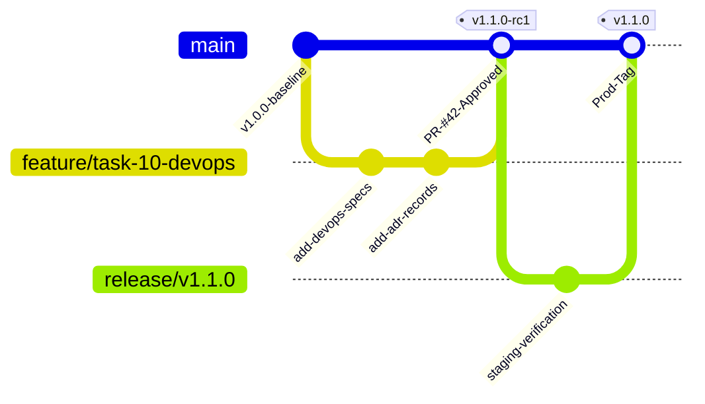

# Phase 1 — Git Branching & Release Strategy Specification

**Document Control Information**
- **Project Name:** SIH26100 — AI-Powered Integrated Bid Compliance Verification Platform for GeM Procurement
- **Organization:** Ministry of Petroleum & Natural Gas / CPCL
- **Document Version:** 1.0.0 (Phase 1 — Task 10 Git Strategy Specification)
- **Status:** DESIGN DRAFT / PENDING REVIEW
- **Security Classification:** INTERNAL
- **Mode:** DESIGN ONLY — ZERO CODE IMPLEMENTATION

---

## 1. Executive Summary & Purpose

This specification defines the Git branching model, pull request governance, semantic versioning scheme, and release management lifecycle.

> **"Direct pushes to `main` and release branches are strictly disabled. All changes enter via pull requests requiring code reviews and automated gate checks."**

---

## 2. Git Branching Model Topology

---

## 3. Semantic Versioning & Tagging Policy

1. **Semantic Version Format:** Releases use standard `vMAJOR.MINOR.PATCH` versioning (e.g., `v1.2.0`).
   - `MAJOR`: Structural architecture breaking change or major framework upgrade.
   - `MINOR`: New compliance domain feature, adapter additions, or policy model enhancements.
   - `PATCH`: Bug fixes, security patch updates, or non-breaking performance optimizations.
2. **Release Candidate Tags:** Staging deployments build from `vX.Y.Z-rcN` tags.
3. **Hotfix Workflow:** Emergency security patches branch directly from production release tags (`hotfix/v1.1.1`), execute accelerated CI/CD testing gates, and cherry-pick back into `main`.
