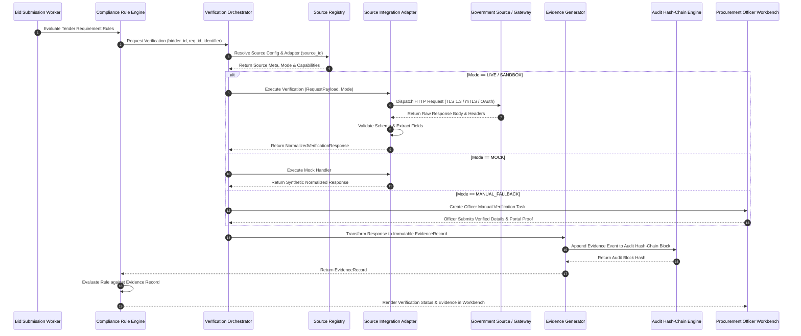

# Phase 1 — Government Integration Data Flow Architecture

## Overview

This document specifies the end-to-end data flow architectures, sequence diagrams, and Procurement Officer UI visibility controls for government verification in the **SIH26100 Bid Compliance Verification Platform**.

---

## 1. End-to-End Government Verification Data Flow

The following Mermaid sequence diagram traces the complete lifecycle of a verification request—from tender submission parsing to UI presentation in the Procurement Officer Workbench:



---

## 2. Dynamic UI & Dashboard Display Specifications

Procurement Officers must be able to immediately distinguish verified government evidence from synthetic mock data, sandbox test records, or manual fallback entries.

```
+---------------------------------------------------------------------------------------------------+
| VERIFICATION EVIDENCE DETAIL CARD (Procurement Officer Workbench UI)                              |
+---------------------------------------------------------------------------------------------------+
| REQUIREMENT: GST Registration Compliance (Rule Ref: RULE-GST-001)                                 |
| BIDDER: ABC Heavy Industries Pvt Ltd (Bidder ID: BDR-2026-881)                                    |
+---------------------------------------------------------------------------------------------------+
|                                                                                                   |
|  [OPERATING MODE BADGE]                                                                          |
|  +---------------------------------------------------------------------------------------------+  |
|  | OPERATING MODE: [ MOCK_SYNTHETIC_DATA ] (SIH 2026 Demo Mode - Non-Production Verification)  |  |
|  +---------------------------------------------------------------------------------------------+  |
|                                                                                                   |
|  VERIFICATION METRICS:                                                                             |
|  • Source System: Goods & Services Tax Network (SRC_GSTN)                                         |
|  • Adapter Version: gst_verification_adapter v1.2.0                                               |
|  • Technical Status: [ SUCCESS ] (HTTP 200 OK - Latency: 340ms)                                   |
|  • Business Status:  [ VERIFIED ] (GSTIN Active - Registered Taxpayer)                            |
|  • Checked At: 2026-09-05 14:30:02 UTC                                                            |
|  • Freshness Status: [ CURRENT ] (Valid until 2026-10-05)                                          |
|                                                                                                   |
|  FIELD COMPARISON MATRIX:                                                                         |
|  +---------------------------+------------------------------+--------------------+--------------+  |
|  | Field Name                | Bidder Submitted Value       | Source Returned    | Status       |  |
|  +---------------------------+------------------------------+--------------------+--------------+  |
|  | GSTIN                     | 33ABCDE1234F1Z5              | 33ABCDE1234F1Z5    | EXACT_MATCH  |  |
|  | Legal Entity Name         | ABC Heavy Industries Pvt Ltd | ABC HEAVY IND P LTD| NORMALIZED   |  |
|  | Taxpayer Status           | Active                       | Active             | EXACT_MATCH  |  |
|  +---------------------------+------------------------------+--------------------+--------------+  |
|                                                                                                   |
|  PROVENANCE & AUDIT TRAIL:                                                                        |
|  • Source Reference: REF-GST-2026-998811                                                           |
|  • Raw Response Hash (SHA-256): a4f8b91c...8821a90e                                               |
|  • Audit Block Link: Block #14882 (Hash: 9f8e71c4...3312)                                        |
|  • Evidence Record Link: [ View Raw Evidence JSON ] [ Download Verified Certificate ]              |
+---------------------------------------------------------------------------------------------------+
```

### 2.1 UI Operating Mode Badge Specifications

To guarantee visual clarity and prevent misinterpretation, the UI enforces strict color and banner coding:

| Operating Mode | Visual Badge Style | Header Warning Banner |
| :--- | :--- | :--- |
| `LIVE` | **Solid Green Badge** (`#10B981` / `LIVE_PRODUCTION`) | *"Official Production Government Verification Confirmed"* |
| `SANDBOX` | **Amber Badge** (`#F59E0B` / `SANDBOX_TEST`) | *"NOTICE: Test Data from Official Government Sandbox Environment"* |
| `MOCK` | **Dark Purple Badge** (`#8B5CF6` / `MOCK_DEMO`) | *"WARNING: Synthetic Prototype Data (SIH 2026 Hackathon Demo Mode)"* |
| `MANUAL_FALLBACK` | **Blue Badge** (`#3B82F6` / `MANUAL_OFFICER`) | *"Officer Verified Document (Manual Portal Verification Flow)"* |

> [!IMPORTANT]
> **SECURITY & VERIFICATION BOUNDARY NOTICE:**
> UI badge colors and visual banners are **presentation mechanisms** designed to enhance officer situational awareness and prevent accidental confusion between mock, sandbox, and production records.
> **UI presentation styling does NOT constitute a security control.** System integrity and non-repudiation are enforced exclusively by backend operating-mode metadata, immutable `EvidenceRecord` objects, cryptographically chained audit logs, and strict API authorization controls.

---

## 3. Data Transformation & Pipeline Stages

```
[Raw Gateway Response] 
          │
          ▼
┌────────────────────────────────────────────────────────┐
│ STAGE 1: Transport & Schema Validation                 │
│ Validates HTTP 200, parses JSON/XML Pydantic model     │
└────────────────────────────────────────────────────────┘
          │
          ▼
┌────────────────────────────────────────────────────────┐
│ STAGE 2: PII Scrubbing & Security Inspection           │
│ Removes unneeded PII, validates HTML/XSS safety        │
└────────────────────────────────────────────────────────┘
          │
          ▼
┌────────────────────────────────────────────────────────┐
│ STAGE 3: Canonical Field Normalization                 │
│ Standardizes names, dates, uppercase string formats    │
└────────────────────────────────────────────────────────┘
          │
          ▼
┌────────────────────────────────────────────────────────┐
│ STAGE 4: Identity Comparison & Freshness Scoring       │
│ Calculates Levenshtein match score & freshness window  │
└────────────────────────────────────────────────────────┘
          │
          ▼
┌────────────────────────────────────────────────────────┐
│ STAGE 5: Evidence Envelope & Audit Chain Binding       │
│ Hashes payload, writes EvidenceRecord, appends Audit   │
└────────────────────────────────────────────────────────┘
```
