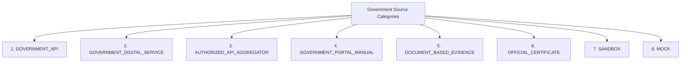

# Phase 1 — Government Integration & Verification Architecture

## Executive Summary & System Overview

The **Government Integration & Verification Architecture** for the **SIH26100 Bid Compliance Verification Platform** establishes a secure, auditable, and resilient framework for connecting external government data sources, digital services, and document verification channels to the platform’s compliance engine. Built specifically for **Ministry of Petroleum & Natural Gas (CPCL)** procurement compliance, this architecture ensures that all bidder-submitted credentials—including GST status, MSME/Udyam registrations, PAN/Tax records, MCA corporate filings, EPFO/ESIC compliance, Startup India recognitions, NSIC listings, DigiLocker digital credentials, OEM authorizations, and national debarment lists—are verified against authoritative records in a tamper-evident, privacy-preserving manner.

```
+---------------------------------------------------------------------------------------------------+
|                                 APPLICATION SERVICE LAYER                                         |
+---------------------------------------------------------------------------------------------------+
                                                  |
                                                  v
+---------------------------------------------------------------------------------------------------+
|                            GOVERNMENT VERIFICATION ORCHESTRATOR                                   |
|   * Source Authorization Check   * Consent Verification    * Idempotency & Rate Limiting        |
|   * Attempt History Tracking     * Adapter Dispatch        * Result Normalization Router       |
+---------------------------------------------------------------------------------------------------+
                                                  |
                                                  v
+---------------------------------------------------------------------------------------------------+
|                              GOVERNMENT INTEGRATION ADAPTERS                                      |
|  [GST Adapter]  [Udyam Adapter]  [PAN Adapter]  [MCA Adapter]  [EPFO/ESIC Adapter]  [DigiLocker] |
|  [Startup India Adapter]  [NSIC Adapter]  [OEM Adapter]  [Debarment Adapter]  [Manual Fallback]  |
+---------------------------------------------------------------------------------------------------+
         |                                |                                |
         v                                v                                v
+-------------------+            +-------------------+            +-------------------+
|   LIVE SOURCE     |            |  SANDBOX / MOCK   |            |  MANUAL FALLBACK  |
|  (Govt / API Setu)|            |    (Prototype)    |            | (Officer Gateway) |
+-------------------+            +-------------------+            +-------------------+
         |                                |                                |
         +--------------------------------+--------------------------------+
                                                  |
                                                  v
+---------------------------------------------------------------------------------------------------+
|                               NORMALIZED VERIFICATION RESULT                                      |
|   * Field Mismatches Calculated   * Freshness Validated   * Technical/Business Status Separated   |
+---------------------------------------------------------------------------------------------------+
                                                  |
                                                  v
+---------------------------------------------------------------------------------------------------+
|                                    EVIDENCE RECORD GENERATION                                     |
|   * Immutable Evidence Linked to Requirement   * Provenance & Hashes to Audit Hash-Chain        |
+---------------------------------------------------------------------------------------------------+
                                                  |
                                                  v
+---------------------------------------------------------------------------------------------------+
|                              DETERMINISTIC COMPLIANCE RULE ENGINE                                 |
|   * Evaluates Rules against Evidence   * Computes ComplianceEvaluation & Risk Factor Signals    |
+---------------------------------------------------------------------------------------------------+
                                                  |
                                                  v
+---------------------------------------------------------------------------------------------------+
|                              PROCUREMENT OFFICER WORKBENCH (UI)                                   |
|   * Displays Verified Evidence, Mismatches, Operating Mode Flags, and Manual Action Triggers      |
+---------------------------------------------------------------------------------------------------+
```

---

## 1. Core Architectural Axiom & Governance Boundaries

### 1.1 The Core Axiom
Every government verification action in the platform adheres to the foundational system axiom:

$$\text{AI Interprets} \longrightarrow \text{Authorized Sources Verify} \longrightarrow \text{Rules Evaluate} \longrightarrow \text{Evidence Proves} \longrightarrow \text{Human Approves}$$

### 1.2 Boundary Restrictions
To maintain strict compliance with CVC guidelines and Indian public procurement law:
1. **No Autonomous AI Execution:** AI models (LLMs/vision models) are strictly barred from directly invoking government endpoints, modifying verification results, issuing pass/fail decisions, or overriding deterministic rule evaluations.
2. **Deterministic Verification:** Only authoritative government sources, digital signature validation engines, or officer-approved manual workflows produce valid verification outcomes.
3. **Evidence Requirement:** No bidder requirement may be marked as satisfied without an underlying, traceable `EvidenceRecord` linked to a `GovernmentVerificationResult`.

---

## 2. Absolute Government API Qualification Rule

### 2.1 API Availability Qualification Standard
In strict compliance with project governance, the platform **never assumes or claims** that every government portal exposes a public, unauthenticated, or freely accessible API.

All integration documentation, user interfaces, and architectural specifications must qualify external capabilities using explicit terminology:

> *"The system supports integration through an authorized or approved source or integration mechanism, subject to onboarding, credentials, permissions, availability, and applicable policy."*

### 2.2 Qualification Taxonomy
Each target source must be categorized into one of eight clear integration readiness states:

| Status Code | Definition & Legal Boundary |
| :--- | :--- |
| **CONFIRMED_DOCUMENTATION** | Integration pathway officially documented in government API standards (e.g., API Setu specs), but production credentials and access remain subject to formal department onboarding. |
| **OFFICIAL_DOCUMENTED** | Endpoint documented in official government technical specifications, but requires department-level G2G onboarding, credentials, or IP allowlisting. |
| **AUTHORIZATION_DEPENDENT** | Portal/service integration exists architecturally but requires custom MOU/G2G agreement or bidder OAuth consent delegation to access production endpoints. |
| **CONDITIONAL** | Integration pathway identified; subject to partner gateway agreements, commercial licensing (e.g., GSPs), or administrative permissions. |
| **PRODUCTION_ACCESS_NOT_ESTABLISHED** | Official documentation or sandbox may exist, but production API credentials and live network connectivity are not currently established for the platform. |
| **MOCK_ONLY** | Local synthetic adapter constructed for SIH 2026 hackathon demonstration and offline evaluation purposes. |
| **MANUAL_FALLBACK** | Approved workflow allowing an officer to verify credentials on official government portals manually and capture traceable source evidence. |
| **FUTURE_ONBOARDING** | Conceptual integration pathway reserved for future G2G expansion upon government agency onboarding. |

> [!IMPORTANT]
> The platform UI and API layers **never represent MOCK or SANDBOX data as LIVE government verification**. Mock and synthetic attempts are stamped with explicit operating mode metadata.

---

## 3. Four-Tier Operating Mode Strategy

To support seamless transitions between SIH development, sandbox evaluation, production deployment, and service outages, the Government Integration Orchestrator operates across four explicit modes:

```
                      +---------------------------------------+
                      | OPERATING MODE SELECTION ENGINE       |
                      +---------------------------------------+
                                          |
        +------------------+--------------+--------------+------------------+
        |                  |                             |                  |
        v                  v                             v                  v
+---------------+  +---------------+             +---------------+  +---------------+
|     LIVE      |  |    SANDBOX    |             |     MOCK      |  | MANUAL_FALLBACK|
| Real Production|  | Official Test |             |  Deterministic|  |  Officer-Led  |
|  Endpoints    |  |  Environments |             |  Synthetic Data|  | Verification  |
+---------------+  +---------------+             +---------------+  +---------------+
```

### 3.1 Mode Definitions

1. **`LIVE` Mode:**
   * **Execution:** Communication with authorized production endpoints where official onboarding, mTLS certificates, OAuth client secrets, and API credentials are established.
   * **Credentials:** Production mutual TLS (mTLS) certificates, OAuth2 client secrets, and static API keys injected via secure secret stores.
   * **Evidence Status:** Traceable verification evidence and provenance recorded in `EvidenceRecord`.

2. **`SANDBOX` Mode:**
   * **Execution:** Communication with official government sandbox/staging endpoints.
   * **Credentials:** Test API keys and sandbox credentials.
   * **Evidence Status:** Flagged as `SANDBOX_TEST_EVIDENCE`; usable for validation, pre-flight testing, and integration verification, but clearly marked as non-production in audit trails.

3. **`MOCK` Mode:**
   * **Execution:** Internal deterministic python handlers returning structured, schema-compliant synthetic payloads.
   * **Use Case:** Primary operating mode for SIH 2026 prototype demonstrations, developer unit testing, and offline evaluation.
   * **Evidence Status:** Flagged as `MOCK_SYNTHETIC_EVIDENCE`; visibly tagged with prominent warning badges in UI components.

4. **`MANUAL_FALLBACK` Mode:**
   * **Execution:** Triggered when automated endpoints fail, time out, rate limit, or are unavailable.
   * **Workflow:** Procurement Officers inspect official government web portals directly, obtain portal verification receipts or evidence artifacts according to applicable procedure, enter verification details, and upload evidence documentation.
   * **Evidence Status:** Flagged as `MANUAL_OFFICER_VERIFICATION`; subject to auditable governance controls and mandatory audit logging.

---

## 4. Government Source Classification Model

Government integration channels are categorized into eight distinct functional classifications:



1. **`GOVERNMENT_API`:** Direct REST/SOAP/gRPC interfaces operated directly by government departments (e.g., Income Tax e-Filing API).
2. **`GOVERNMENT_DIGITAL_SERVICE`:** Open digital identity and document infrastructure (e.g., DigiLocker Gateway, Aadhaar e-KYC where applicable).
3. **`AUTHORIZED_API_AGGREGATOR`:** Governed national integration gateways (e.g., MeitY API Setu, NIC eProcurement Gateway).
4. **`GOVERNMENT_PORTAL_MANUAL`:** Official web portals accessed via officer browser workflows when APIs are absent (e.g., CPPP Debarment List Portal).
5. **`DOCUMENT_BASED_EVIDENCE`:** Physical or digital certificates submitted by bidders containing verifiable QR codes or digital signatures.
6. **`OFFICIAL_CERTIFICATE/DOCUMENT`:** Standardized government PDFs with embedded cryptographic signatures (e.g., MCA Certificate of Incorporation).
7. **`SANDBOX`:** Staging environments provided by API gateways for developer integration validation.
8. **`MOCK`:** Local synthetic data generators simulating government responses.

---

## 5. Domain Model Integration & Entity Boundaries

Task 5 reuses existing domain entities frozen in Phase 1 Task 2 without introducing redundant entity classes:

```
+-----------------------------+        1:N        +--------------------------------+
| GovernmentVerificationRequest| ----------------> | GovernmentVerificationAttempt  |
+-----------------------------+                   +--------------------------------+
               |                                                   |
               | 1:1                                               | 1:1
               v                                                   v
+-----------------------------+                   +--------------------------------+
| GovernmentVerificationResult| <---------------- |   (Raw Attempt Metadata)       |
+-----------------------------+                   +--------------------------------+
               |
               | 1:1
               v
+-----------------------------+        1:N        +--------------------------------+
|       EvidenceRecord        | ----------------> |      ComplianceEvaluation      |
+-----------------------------+                   +--------------------------------+
```

### 5.1 Reused Domain Entities
* `GovernmentVerificationRequest`: Represents the intent to verify a specific bidder credential against an external source.
* `GovernmentVerificationAttempt`: Records an individual technical execution attempt (including retries, sandbox tests, or live calls).
* `GovernmentVerificationResult`: The normalized outcome containing field comparison results, business statuses, and timestamps.
* `EvidenceRecord`: The immutable evidence package passed into the deterministic compliance engine.
* `ComplianceEvaluation`: Rule evaluation outcome referencing the generated evidence record.
* `OfficerDecision` & `ManualOverride`: Human governance entities capturing manual approvals or overrides.
* `AuditEvent` & `AuditHashChainBlock`: Cryptographic audit logging tracking request and result history.

---

## 6. High-Level Modular Monolith Architecture

The Government Integration Architecture is organized as an isolated module within the existing FastAPI backend:

```
src/modules/government_integration/
├── orchestrator.py            # GovernmentVerificationOrchestrator
├── registry.py                # SourceRegistry & Configuration Manager
├── normalization.py           # Canonical Result Transformer & Field Matcher
├── privacy.py                 # PII Masking & Pre-AI Privacy Gateway
├── manual_fallback.py         # Officer Manual Verification Handler
└── adapters/                  # Specialized Source Adapters
    ├── base_adapter.py        # BaseAdapter Interface Contract
    ├── gst_adapter.py         # GSTIN Verification Adapter
    ├── udyam_adapter.py       # Udyam / MSME Verification Adapter
    ├── pan_adapter.py         # PAN / Income Tax Verification Adapter
    ├── mca_adapter.py         # MCA Corporate Verification Adapter
    ├── epfo_adapter.py        # EPFO Compliance Verification Adapter
    ├── esic_adapter.py        # ESIC Compliance Verification Adapter
    ├── startup_adapter.py     # Startup India / DPIIT Adapter
    ├── nsic_adapter.py        # NSIC Registration Adapter
    ├── digilocker_adapter.py  # DigiLocker Digital Document Adapter
    ├── oem_adapter.py         # OEM Authorization Adapter
    ├── debarment_adapter.py   # Multi-Source Debarment Verification Adapter
    └── gem_adapter.py         # GeM Vendor Verification Adapter
```

All interactions between external government APIs and internal domain services are strictly routed through the `GovernmentVerificationOrchestrator`. Direct adapter invocation by external clients or AI services is forbidden.
