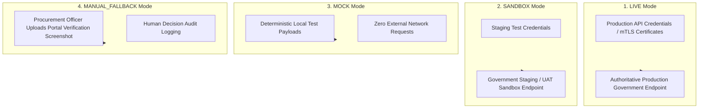

# Phase 1 — Government Integration Security Architecture Specification

**Document Control Information**
- **Project Name:** SIH26100 — AI-Powered Integrated Bid Compliance Verification Platform for GeM Procurement
- **Organization:** Ministry of Petroleum & Natural Gas / CPCL
- **Document Version:** 1.0.0 (Phase 1 — Task 8 Government Integration Security Specification)
- **Status:** DESIGN DRAFT / PENDING REVIEW
- **Security Classification:** INTERNAL
- **Mode:** DESIGN ONLY — ZERO CODE IMPLEMENTATION

---

## 1. Executive Summary & Purpose

This specification defines the integration security, credential isolation, and defense-in-depth controls governing connectivity with external government registries (e.g., MCA21, GSTN, Udyam MSME, Income Tax PAN API, CBBB Blacklist). Verifying bidder-submitted claims against authoritative government databases is vital for eliminating tender fraud; however, external integration points represent critical trust boundaries that must be shielded against credential exposure, transport tampering, and service outages.

The core government integration axiom is:
> **"Integrations connect exclusively to authorized government sources under strict credential isolation, explicit operating modes (LIVE/SANDBOX/MOCK/MANUAL_FALLBACK), mutual TLS transport security, and absolute separation of technical transport failures from domain business evaluation outcomes."**

---

## 2. Quad-Operating Mode Security Architecture

Preserving the frozen Task 5 architecture, the Government Integration Gateway operates under four explicit execution modes, each with distinct security controls:



### 2.1 Security Controls Across Operating Modes
1. **LIVE Mode:** Production API credentials, secret API keys, and client mTLS certificates are loaded exclusively in `LIVE` mode. Strict IP allowlisting, TLS 1.3 certificate pinning, and audit logging are enforced.
2. **SANDBOX Mode:** Test credentials point to staging endpoints. Used for pre-flight integration testing without accessing live production government records.
3. **MOCK Mode:** Completely isolated from external networks. Uses static, schema-validated JSON fixtures to support unit testing and demonstration scenarios.
4. **MANUAL_FALLBACK Mode:** Activated when government APIs are unreachable or unintegrated. Procurement Officers manually verify details via official government web portals and upload verified screenshots/receipts. All manual fallbacks are audited.

---

## 3. Credential Isolation & Key Management Boundary

Government integration credentials (API tokens, OAuth2 client secrets, private RSA keys, client mTLS certificates) are isolated from general application memory and user sessions:

```mermaid
graph LR
    subgraph User_Domain ["User / Application Session Space"]
        OfficerSession["User JWT / Session Context"]
        AppLogic["Application Domain Services"]
    end

    subgraph Secret_Boundary ["Isolated Secret Vault Boundary"]
        GovtSecretVault[("KMS / Secret Manager Abstraction")]
        CredentialManager["Government Credential Manager Service"]
    end

    subgraph Adapter_Boundary ["Government Integration Gateway"]
        MCA_Adapter["MCA Adapter"]
        GSTN_Adapter["GSTN Adapter"]
        MSME_Adapter["MSME Adapter"]
    end

    OfficerSession -.->|User Session CANNOT Read Secrets| GovtSecretVault
    AppLogic -->|Request Verification (VerificationRequest ULID)| CredentialManager
    GovtSecretVault -->|Inject Scoped Token At Transport Layer| CredentialManager
    CredentialManager --> MCA_Adapter
    CredentialManager --> GSTN_Adapter
    CredentialManager --> MSME_Adapter
```

### 3.1 Credential Isolation Rules
- **No User Injection:** User requests cannot supply, modify, or override government API keys or credentials.
- **Environment Isolation:** Secrets are loaded dynamically via secure environment variables or vault abstractions (`SecretManagerInterface`). Secrets are **never** committed to Git, hardcoded in source files, exposed to frontend clients, or written to standard log files.
- **Least-Privilege Scoping:** Each government adapter receives only the specific credentials required for its target government endpoint (e.g., the GSTN adapter cannot access MCA API keys).

---

## 4. Transport Security & Request Integrity Controls

Data flows between the platform's Government Integration Gateway and external government endpoints enforce seven security transport controls:

1. **Mandatory TLS 1.3:** All outgoing HTTP requests mandate TLS 1.3 transport encryption. Legacy SSL/TLS versions (SSLv3, TLS 1.0, TLS 1.1) are explicitly disabled.
2. **Strict Certificate Validation:** Server TLS certificates returned by government portals are validated against trusted Certificate Authority (CA) root stores. Certificate validation suppression (e.g., `verify=False`) is strictly forbidden in production mode.
3. **Mutual TLS (mTLS):** Where required by specific government services (e.g., GSTN or Income Tax gateway specs), requests authenticate using client X.509 certificates managed within the secure key vault.
4. **Request Signing:** Where specified by government API contracts, outgoing payloads are signed using HMAC-SHA256 or RSA signatures generated at the transport gateway boundary.
5. **IP Allowlisting:** Integration outbound gateways route requests through fixed, dedicated static IP addresses configured in government firewall allowlists.
6. **Request Throttling & Rate Limiting:** Outbound request rate limiters protect government APIs from thundering herd spikes during batch bid evaluations.
7. **Correlation Tracking:** Outgoing requests include an `X-Correlation-ID` header matching the internal `VerificationAttempt` ULID, enabling end-to-end request tracing for vigilance audits.

---

## 5. Resilience, Circuit Breakers & Status Isolation

External government portals may experience high latency, rate-limiting blocks, or service outages. The security architecture isolates external network failures from core application evaluation pipelines:

```mermaid
stateDiagram-v2
    [*] --> Closed: Normal Operations
    Closed --> Open: Failures Exceed Threshold (e.g., 5 consecutive 5xx errors)
    Open --> HalfOpen: Cooldown Timer Elapsed (e.g., 60 seconds)

    HalfOpen --> Closed: Probe Request Succeeds
    HalfOpen --> Open: Probe Request Fails

    note right of Open
        Circuit Breaker OPEN:
        Requests fail fast or route to
        MANUAL_FALLBACK workflow.
        Prevents thundering herd retries.
    end
```

### 5.1 Technical Transport Failures vs. Business Verification Results
The architecture preserves strict separation between network transport status and domain business outcome:
- **Technical Transport Status (`502 Bad Gateway`, `504 Gateway Timeout`, Connection Error):** Represents an infrastructure failure. The adapter executes exponential backoff retries with equal jitter. If failures persist, the workflow triggers the `MANUAL_FALLBACK` human review path. **It NEVER triggers a business compliance `FAIL`.**
- **Business Verification Result (`VERIFIED`, `UNMATCHED`, `NOT_FOUND`):** Represents an authoritative business response returned by the government portal. A `NOT_FOUND` business response passes cleanly to the rule engine to evaluate against compliance policies.

---

## 6. Summary of Government Integration Security Controls

| Threat / Risk Area | Architectural Security Control | Technical Implementation Mechanism | Failure Behavior |
|---|---|---|---|
| **Credential Leakage** | Secret Manager Abstraction, Environment Isolation | Injected at transport layer; zero storage in Git/logs | Block Request & Alert Admin |
| **Transport Interception** | Mandatory TLS 1.3, mTLS, Certificate Validation | Strict CA verification; PIN checks | Abort Connection |
| **Portal Thundering Herd** | Outbound Rate Limiting, Backoff Jitter | Leaky bucket rate limiter per government portal | Queue Request |
| **Portal Outage / Unreachable** | Circuit Breaker Pattern, Fallback Isolation | Transitions to `MANUAL_FALLBACK` after retry limits | Route to Human Review |
| **Tampered Response Payload** | HMAC / RSA Signature Verification | Payload signature validation against government public key | Reject Payload & Audit Log |
| **Unauthorized Source** | Authorized Source Catalog Enforcement | Gateways query only registered, approved endpoints | Block Endpoint Access |
