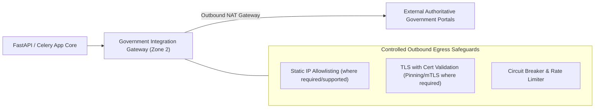

# Phase 1 — Government Integration Network Architecture Specification

**Document Control Information**
- **Project Name:** SIH26100 — AI-Powered Integrated Bid Compliance Verification Platform for GeM Procurement
- **Organization:** Ministry of Petroleum & Natural Gas / CPCL
- **Document Version:** 1.0.0 (Phase 1 — Task 10 Govt Network Specification)
- **Status:** DESIGN DRAFT / PENDING REVIEW
- **Security Classification:** INTERNAL
- **Mode:** DESIGN ONLY — ZERO CODE IMPLEMENTATION

---

## 1. Executive Summary & Purpose

This specification defines the network architecture for outbound government registry integrations, controlled egress gateways, mTLS transport security, and integration boundary isolation.

The core government network rule is:
> **"Government integrations MUST pass through dedicated backend adapter boundaries. Direct network connections from frontend UI code or LLM services to external government APIs are strictly prohibited."**

---

## 2. Government Outbound Egress Boundary Topology

---

## 3. Adapter Transport Configuration Standard

| Integration Adapter | Endpoint Connectivity Mode | Transport Encryption | Authentication Mechanism | Egress Protection |
|---|---|---|---|---|
| **Income Tax PAN Adapter** | Outbound NAT Gateway | Secure TLS Transport | API Key / Client Cert (where required) | Static IP Allowlisting (where supported) + Rate Limiter |
| **GSTN Portal Adapter** | Outbound NAT / G2B Gateway | Secure TLS Transport | OAuth2 / Client Cert (where required) | Static IP Allowlisting (where supported) + Circuit Breaker |
| **MCA21 Corporate Adapter** | Outbound NAT Gateway | Secure TLS Transport | Portal API Token | Rate Limiter + 504 Timeout Handler |
| **Udyam MSME Adapter** | Outbound NAT Gateway | Secure TLS Transport | OAuth2 Token | Static IP Allowlisting (where supported) + MANUAL_FALLBACK |

---

## 4. Government Network Boundary Safeguards

1. **No Frontend Gateway Direct Access:** Client browsers and Next.js frontend code cannot invoke government APIs directly; all requests route through backend Task 5 adapters.
2. **No AI Direct Access:** AI models and LLM services are network-isolated and cannot invoke government integration adapters directly.
