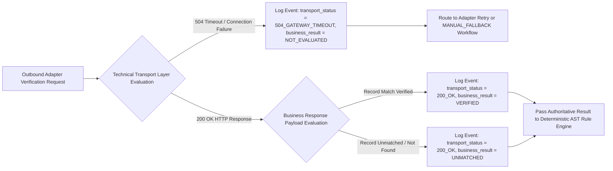

# Phase 1 — Government Integration Observability Architecture

**Document Control Information**
- **Project Name:** SIH26100 — AI-Powered Integrated Bid Compliance Verification Platform for GeM Procurement
- **Organization:** Ministry of Petroleum & Natural Gas / CPCL
- **Document Version:** 1.0.0 (Phase 1 — Task 9 Government Observability Specification)
- **Status:** DESIGN DRAFT / PENDING REVIEW
- **Security Classification:** INTERNAL
- **Mode:** DESIGN ONLY — ZERO CODE IMPLEMENTATION

---

## 1. Executive Summary & Purpose

Government integration telemetry is defined for each configured and authorized integration adapter and verification source, including applicable PAN, GST, MCA, Udyam, CPPP/debarment, GeM, DigiLocker, EPFO/ESIC, Startup/NSIC/OEM and other approved sources as applicable. Telemetry provides real-time visibility into adapter modes, portal availability, technical transport status, response latencies, source freshness, and manual fallbacks.

The core government integration rule is:
> **"A technical government API failure (504 Timeout, Connection Error) MUST NOT automatically become bidder non-compliance. Telemetry MUST explicitly separate technical transport status from domain business verification results."**

---

## 2. Quad-Operating Mode Telemetry Topology

Observability tracks integration health across four explicit runtime modes:

```mermaid
graph TD
    subgraph Mode_LIVE ["1. LIVE Mode"]
        LiveAdapter["Production Government Adapter"]
        LiveMetrics["Track Portal Latency, 504 Timeouts, mTLS Handshakes"]
    end

    subgraph Mode_SANDBOX ["2. SANDBOX Mode"]
        SandboxAdapter["Staging / UAT Test Adapter"]
        SandboxMetrics["Track Pre-flight Integration Tests"]
    end

    subgraph Mode_MOCK ["3. MOCK Mode"]
        MockAdapter["Local Static Fixture Engine"]
        MockMetrics["Track Unit / Offline Test Execution"]
    end

    subgraph Mode_FALLBACK ["4. MANUAL_FALLBACK Mode"]
        FallbackAdapter["Human Officer Manual Verification"]
        FallbackMetrics["Track Manual Officer Verification Backlog & SLA"]
    end

    LiveAdapter --> LiveMetrics
    SandboxAdapter --> SandboxMetrics
    MockAdapter --> MockMetrics
    FallbackAdapter --> FallbackMetrics
```



---

## 3. Separation of Technical Transport Status vs. Business Verification Result

Telemetry events emit distinct attributes for technical infrastructure state and business domain results:



---

## 4. Government Integration Telemetry Schema (`GovtIntegrationTelemetryEvent`)

```json
{
  "$schema": "https://json-schema.org/draft/2020-12/schema",
  "title": "GovtIntegrationTelemetryEvent",
  "type": "object",
  "required": [
    "timestamp",
    "govt_telemetry_id",
    "correlation_id",
    "govt_source",
    "govt_mode",
    "operation_name",
    "transport_status_code",
    "business_verification_result",
    "response_latency_ms",
    "circuit_breaker_state",
    "source_freshness_seconds"
  ],
  "properties": {
    "timestamp": { "type": "string", "format": "date-time" },
    "govt_telemetry_id": { "type": "string" },
    "correlation_id": { "type": "string" },
    "govt_source": { "type": "string", "enum": ["mca21", "gstn", "udyam", "cbic", "incometax"] },
    "govt_mode": { "type": "string", "enum": ["LIVE", "SANDBOX", "MOCK", "MANUAL_FALLBACK"] },
    "operation_name": { "type": "string", "example": "verify_gstin_status" },
    "transport_status_code": { "type": "integer", "example": 200 },
    "transport_error_type": { "type": "string", "enum": ["NONE", "TIMEOUT", "CONNECTION_REFUSED", "TLS_HANDSHAKE_FAIL", "RATE_LIMITED"] },
    "business_verification_result": { "type": "string", "enum": ["VERIFIED", "UNMATCHED", "NOT_FOUND", "NOT_EVALUATED_DUE_TO_TRANSPORT_ERROR"] },
    "response_latency_ms": { "type": "number" },
    "circuit_breaker_state": { "type": "string", "enum": ["CLOSED", "OPEN", "HALF_OPEN"] },
    "retry_attempt_number": { "type": "integer", "default": 1 },
    "source_freshness_seconds": { "type": "integer" },
    "identity_match_confidence": { "type": "number" },
    "manual_fallback_triggered": { "type": "boolean" }
  }
}
```

---

## 5. Government Integration Metrics Taxonomy

| Metric Name | Type & Unit | Label Dimensions | Alert Trigger Condition |
|---|---|---|---|
| `govt_requests_total` | Counter (Count) | `govt_source`, `govt_mode`, `operation` | Baseline throughput monitoring |
| `govt_request_duration_seconds` | Histogram (Sec) | `govt_source`, `govt_mode`, `transport_status_code` | p95 latency $> 10.0$ seconds |
| `govt_transport_errors_total` | Counter (Count) | `govt_source`, `transport_error_type` | Failure rate $> 15\%$ in 5 min |
| `govt_circuit_breaker_state` | Gauge (State) | `govt_source`, `state` | State == `OPEN` (Immediate Alert) |
| `govt_business_results_total` | Counter (Count) | `govt_source`, `business_verification_result` | Anomaly on `UNMATCHED` spikes |
| `govt_manual_fallback_total` | Counter (Count) | `govt_source`, `reason` | Fallback rate $> 20\%$ |
| `govt_source_freshness_seconds` | Gauge (Seconds)| `govt_source` | Freshness $> 86400$ seconds (Stale) |

---

## 6. Privacy & Payload Protection Rules

1. **No Sensitive Government Response Payloads in Telemetry:** Full raw XML/JSON verification payloads containing personal registry data are scrubbed before emitting telemetry events.
2. **Correlation ID Linkage:** Telemetry logs carry `government_verification_attempt_id` to allow authorized auditors to locate full encrypted payloads in PostgreSQL if required.
3. **Zero Secret Logging:** Outbound API authorization headers, client mTLS private key details, and API secret keys are strictly stripped from all adapter log entries.
