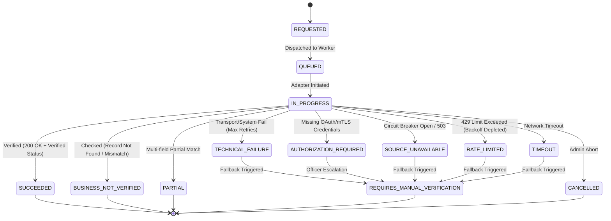

# Phase 1 — Government Verification Lifecycle Specification

## Overview

This document specifies the lifecycle models, state transition rules, attempt management logic, and audit trail requirements for government verification requests in the **SIH26100 Bid Compliance Verification Platform**.

The lifecycle distinguishes between a top-level **`GovernmentVerificationRequest`** (the business entity tracking verification intent) and nested **`GovernmentVerificationAttempt`** records (the technical execution logs).

---

## 1. Top-Level Entity Lifecycle: `GovernmentVerificationRequest`

A `GovernmentVerificationRequest` coordinates external source lookups for a specific bidder credential.

### 1.1 State Machine Taxonomy



### 1.2 State Descriptions & Classifications

| State Name | Classification | Category | Description |
| :--- | :--- | :--- | :--- |
| `REQUESTED` | Initial | Intermediate | Request instantiated by compliance workflow; pending dispatch. |
| `QUEUED` | Pending | Intermediate | Enqueued in Redis/Celery queue for adapter worker processing. |
| `IN_PROGRESS` | Active | Intermediate | Adapter currently processing network transport or payload parsing. |
| `SUCCEEDED` | Business Terminal | Terminal | Source responded successfully; credentials matched/verified. |
| `BUSINESS_NOT_VERIFIED` | Business Terminal | Terminal | Source responded successfully, but credential is invalid, expired, or not found. |
| `PARTIAL` | Business Terminal | Terminal | Source responded; some fields matched, but material fields require officer review. |
| `TECHNICAL_FAILURE` | System Failure | Retryable/Escalable | Adapter encountered network errors, 5xx failures, or unparseable responses. |
| `AUTHORIZATION_REQUIRED` | System Failure | Escalable | Source requires consent, active OAuth token, or mTLS onboarding. |
| `SOURCE_UNAVAILABLE` | System Failure | Escalable | Circuit breaker opened due to upstream service outage. |
| `RATE_LIMITED` | System Failure | Retryable/Escalable | Upstream 429 error; backoff budget exhausted. |
| `TIMEOUT` | System Failure | Retryable/Escalable | Request connection or read phase exceeded threshold. |
| `REQUIRES_MANUAL_VERIFICATION` | Fallback Terminal | Terminal | Technical failure or ambiguity triggered officer manual review workflow. |
| `CANCELLED` | Administrative | Terminal | Request cancelled by platform process or procurement officer. |

---

## 2. Transition Rules & Permissible Triggers

### 2.1 Transition Table

| Current State | Target State | Permissible Trigger / Event | System Action & Audit Event |
| :--- | :--- | :--- | :--- |
| `REQUESTED` | `QUEUED` | System enqueues task | Assign Celery Task ID; emit `AUDIT_GOVT_VERIF_QUEUED`. |
| `QUEUED` | `IN_PROGRESS` | Worker picks up task | Log `attempt_number=1`; emit `AUDIT_GOVT_VERIF_STARTED`. |
| `IN_PROGRESS` | `SUCCEEDED` | Adapter receives 200 OK + `VERIFIED` | Store `GovernmentVerificationResult`; create `EvidenceRecord`. |
| `IN_PROGRESS` | `BUSINESS_NOT_VERIFIED` | Adapter receives 200 OK + `NOT_FOUND` | Store `GovernmentVerificationResult`; set `requires_human_review=True`. |
| `IN_PROGRESS` | `TECHNICAL_FAILURE` | Max retries exhausted on 5xx/network err | Log technical failure attempt; check fallback policy. |
| `IN_PROGRESS` | `TIMEOUT` | Socket read/connect timeout | Trigger exponential backoff retry or transition to failure. |
| `TECHNICAL_FAILURE` | `REQUIRES_MANUAL_VERIFICATION` | Fallback policy evaluation | Trigger officer workbench alert; assign manual task. |
| `AUTHORIZATION_REQUIRED` | `REQUIRES_MANUAL_VERIFICATION` | Consent missing or token expired | Create officer task for manual document verification. |

> [!CRITICAL]
> **NO RETRIES ON TERMINAL STATES:** Once a request reaches `SUCCEEDED`, `BUSINESS_NOT_VERIFIED`, `PARTIAL`, `REQUIRES_MANUAL_VERIFICATION`, or `CANCELLED`, state transitions are strictly frozen. Re-verification requires instantiating a **new** `GovernmentVerificationRequest`.

---

## 3. Attempt Management Model (`1:N` Request to Attempt Structure)

A single `GovernmentVerificationRequest` may spawn multiple `GovernmentVerificationAttempt` records due to transport retries, sandbox tests, or fallback executions:

```
+-----------------------------------------------------------------------------------+
|                         GovernmentVerificationRequest                             |
|  * request_id: ULID                                                               |
|  * bidder_id: ULID                                                                |
|  * status: REQUIRES_MANUAL_VERIFICATION                                           |
+-----------------------------------------------------------------------------------+
                                          |
        +---------------------------------+---------------------------------+
        | 1:1                             | 1:2                             | 1:3
        v                                 v                                 v
+-----------------------+       +-----------------------+       +-----------------------+
| VerificationAttempt #1|       | VerificationAttempt #2|       | VerificationAttempt #3|
| * Mode: LIVE          |       | * Mode: LIVE          |       | * Mode: MANUAL        |
| * Error: TIMEOUT      |       | * Error: HTTP_503     |       | * Result: VERIFIED    |
| * Retried: True       |       | * Retried: False      |       | * Completed By: Officer|
+-----------------------+       +-----------------------+       +-----------------------+
```

### 3.1 Attempt Record Schema Constraints
Every attempt record preserves immutable technical telemetry:
* `attempt_id`: ULID string
* `request_id`: Parent ULID string
* `attempt_number`: Integer sequence (1, 2, 3...)
* `operating_mode`: Mode enum (`LIVE`, `SANDBOX`, `MOCK`, `MANUAL_FALLBACK`)
* `adapter_id`: Adapter key string
* `adapter_version`: Adapter version string
* `started_at`: ISO 8601 timestamp
* `completed_at`: ISO 8601 timestamp
* `latency_ms`: Response duration in milliseconds
* `transport_status_code`: HTTP status integer or socket error code
* `technical_error_category`: Normalized error enum
* `sanitized_request_headers`: JSON map (stripped of Authorization/Secrets)
* `sanitized_response_metadata`: JSON map of headers and non-PII metadata
* `raw_payload_hash`: SHA-256 string
* `correlation_id`: Guid string (`X-Correlation-ID`)

> [!IMPORTANT]
> **HISTORICAL ATTEMPTS ARE NEVER OVERWRITTEN:** Old attempts remain permanently stored in `GovernmentVerificationAttempt` table to support technical troubleshooting and compliance auditing.

---

## 4. Audit & Hash-Chain Integration

Every verification lifecycle transition triggers a tamper-evident audit log entry in the system's audit hash-chain:

```
[State Transition Occurs]
          │
          ▼
┌────────────────────────────────────────────────────────┐
│ Construct AuditEvent                                   │
├────────────────────────────────────────────────────────┤
│ • event_type: GOVT_VERIFICATION_STATE_CHANGED          │
│ • entity_id: request_id                                │
│ • payload: {from_state, to_state, attempt_id, mode}    │
│ • timestamp: ISO 8601 Server UTC                       │
└────────────────────────────────────────────────────────┘
          │
          ▼
┌────────────────────────────────────────────────────────┐
│ Append to AuditHashChainBlock                          │
├────────────────────────────────────────────────────────┤
│ block_hash = SHA256(previous_hash + event_data)        │
└────────────────────────────────────────────────────────┘
```

Auditors can trace the full lineage of any verification outcome by examining the linked sequence of request, attempts, result, and audit blocks.
