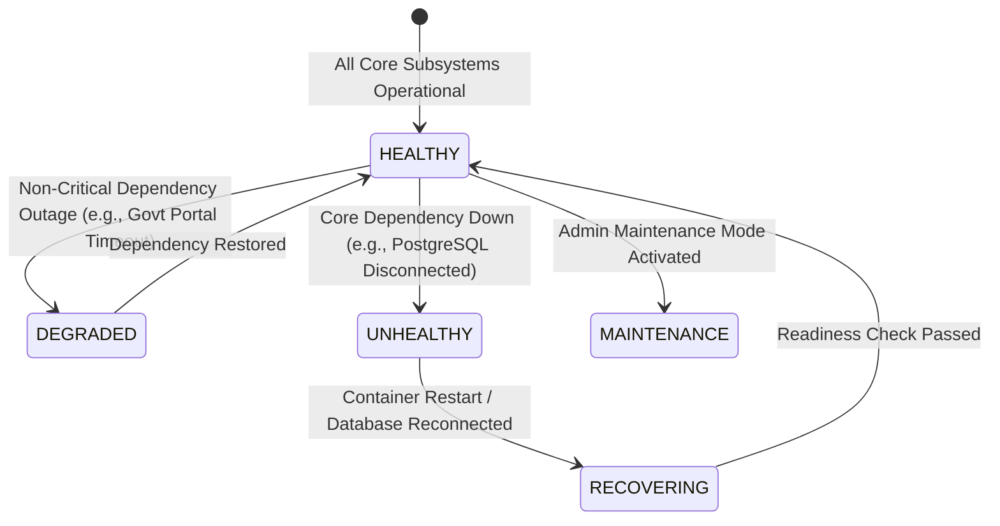
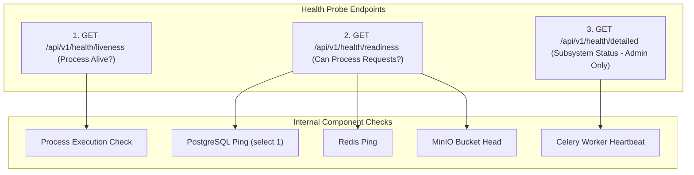

# Phase 1 — Subsystem Health Model & Multi-Tier Health Probes Architecture

**Document Control Information**
- **Project Name:** SIH26100 — AI-Powered Integrated Bid Compliance Verification Platform for GeM Procurement
- **Organization:** Ministry of Petroleum & Natural Gas / CPCL
- **Document Version:** 1.0.0 (Phase 1 — Task 9 Health & Reliability Specification)
- **Status:** DESIGN DRAFT / PENDING REVIEW
- **Security Classification:** INTERNAL
- **Mode:** DESIGN ONLY — ZERO CODE IMPLEMENTATION

---

## 1. Executive Summary & Purpose

This specification defines the subsystem health model, health probe architecture, and availability classification framework for the SIH26100 platform. Modern modular monolith architectures operating background queues, object stores, and external government/AI adapters require structured health probes to determine whether service instances can accept incoming traffic, execute background tasks, or operate under degraded fallbacks.

The foundational health principle is:
> **"Health probes MUST provide clear operational status (Liveness, Readiness, Dependency Health) without exposing sensitive internal network paths, database credentials, or stack traces."**

---

## 2. Multi-Tier Health Status Taxonomy

System health is categorized into five explicit operational states:

### 2.1 Health State Taxonomies
1. **`HEALTHY` (HTTP 200):** All internal storage engines (PostgreSQL, MinIO, Redis), background workers, and external gateways are fully operational.
2. **`DEGRADED` (HTTP 200 / Warning Header):** Primary application core is operational, but one or more secondary external dependencies are experiencing degradation (e.g., MCA government portal in `MANUAL_FALLBACK` mode, or primary cloud LLM falling back to local model).
3. **`UNHEALTHY` (HTTP 503):** Critical dependency failure (e.g., PostgreSQL connection pool exhausted, MinIO object store unreachable, Redis broker down). Instance cannot process transactions.
4. **`RECOVERING` (HTTP 503):** Service container starting up; database migrations or connection pools initializing.
5. **`MAINTENANCE` (HTTP 503 / Custom Header):** Administrative lock enabled for scheduled maintenance.

---

## 3. Health Probe Endpoints & Behavioral Contracts

The platform exposes three standardized health probe endpoints:

### 3.1 Endpoint Specifications

#### `GET /api/v1/health/liveness`
- **Purpose:** Used by container orchestrators to verify if the application process is running.
- **Access:** Public / Unauthenticated.
- **Payload:** Minimal JSON (`{"status": "UP"}`). Zero DB or network calls.

#### `GET /api/v1/health/readiness`
- **Purpose:** Used by ingress load balancers to determine if the instance should receive user traffic.
- **Access:** Public / Unauthenticated.
- **Verification:** Executes lightweight pings to PostgreSQL (`SELECT 1`), Redis (`PING`), and MinIO (`HEAD`).
- **Payload:** Standardized JSON (`{"status": "READY"}` or `{"status": "NOT_READY"}`).

#### `GET /api/v1/health/detailed`
- **Purpose:** Diagnostic health dashboard for system administrators.
- **Access:** Restricted (`R-04 SystemAdmin` role required).
- **Payload:** Detailed subsystem availability breakdown.

---

## 4. Nine Subsystem Health Indicators

| Subsystem ID | Subsystem Name | Health Check Protocol | Healthy Condition | Unhealthy Condition | Degraded Reaction |
|---|---|---|---|---|---|
| **H-01** | **API Gateway** | Process check, route listener | HTTP 200 response | Process crash | N/A (Critical) |
| **H-02** | **PostgreSQL DB** | `SELECT 1` ping, pool status | Connection pool active | Connection refused / Pool empty | Switch to Read-Only |
| **H-03** | **Redis Broker** | `PING` command | `PONG` response | Redis connection timeout | Queueing paused |
| **H-04** | **MinIO Storage** | Bucket `HEAD` request | Object store responsive | MinIO connection refused | Uploads paused |
| **H-05** | **Celery Workers** | Worker ping heartbeat | Active worker nodes $\ge 2$ | Zero workers responsive | Tasks queued |
| **H-06** | **AI Gateway** | Pre-AI proxy ping | Primary/Secondary LLM reachable | Cloud LLM unreachable | Fallback to Local Model |
| **H-07** | **Govt Adapters** | Gateway health probe | Portal API responsive | 504 Timeout / Circuit open | Switch to `MANUAL_FALLBACK` |
| **H-08** | **Rules Engine** | AST parser self-test | Expression execution $< 10$ms | AST evaluation exception | Pause evaluation |
| **H-09** | **Audit System** | Hash chain read probe | Chain integrity valid ($H_n$) | Hash chain break ($0$) | Lock writes & Alert Admin |

---

## 5. Security & Privacy Rules for Health Probes

1. **No Sensitive Path Leaks:** Unauthenticated health endpoints (`/liveness`, `/readiness`) return generic state strings (`UP`, `READY`, `NOT_READY`). They must never reveal internal IP addresses, database hostnames, container IDs, or connection string details.
2. **Zero Internal Stack Traces:** If a health probe check fails, internal database exception strings or driver stack traces are scrubbed before sending responses.
3. **Low Overhead:** Health checks must execute lightweight non-blocking queries (e.g., `SELECT 1` with a 1-second timeout) to prevent health probes from overloading the database during high-traffic spikes.
