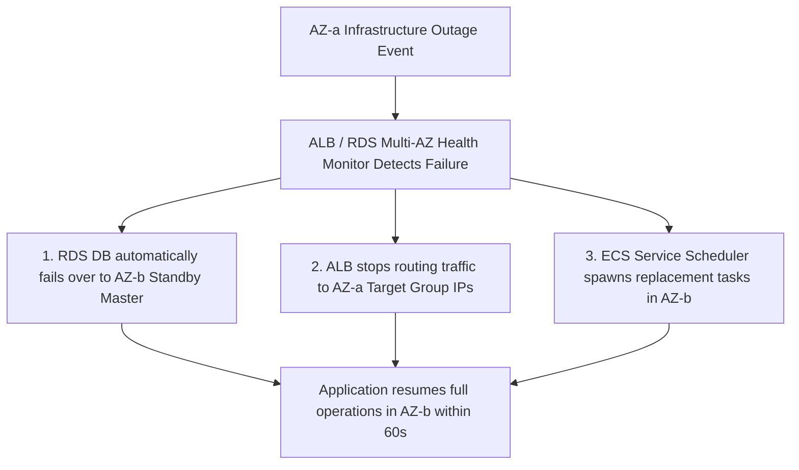

# Phase 1 — High Availability & Resilience Architecture Specification

**Document Control Information**
- **Project Name:** SIH26100 — AI-Powered Integrated Bid Compliance Verification Platform for GeM Procurement
- **Organization:** Ministry of Petroleum & Natural Gas / CPCL
- **Document Version:** 1.0.0 (Phase 1 — Task 10 High Availability Specification)
- **Status:** DESIGN DRAFT / PENDING REVIEW
- **Security Classification:** INTERNAL
- **Mode:** DESIGN ONLY — ZERO CODE IMPLEMENTATION

---

## 1. Executive Summary & Purpose

This specification defines the high-availability (HA) architecture, multi-AZ redundancy, fault isolation, and component failover mechanisms.

> **"Illustrative candidate availability targets are proposed operational benchmarks. They MUST NOT be presented as mandatory contractual SLAs until approved by department policy."**

---

## 2. Component High-Availability Architecture Matrix

| Component Tier | HA Deployment Pattern | Redundancy Mechanism | Failover Mechanism | Candidate Availability Target |
|---|---|---|---|---|
| **API & Web Tier** | Multi-AZ ECS Fargate | Minimum 2 Container Tasks per AZ | ALB Target Health Checks & Auto-drain | 99.5% Candidate Target |
| **Relational Database** | AWS RDS Multi-AZ | Synchronous Physical Standby Replication | Automated DNS failover ($< 60$s recovery) | 99.9% Candidate Target |
| **In-Memory Cache/Broker**| AWS ElastiCache Redis Cluster | Primary + Replica Nodes in separate AZs | Automatic primary failover | 99.5% Candidate Target |
| **Object Storage** | Amazon S3 Standard | Multi-AZ S3 Storage Engine | Built-in S3 erasure coding redundancy | 99.99% Candidate Target |
| **Background Workers** | Multi-AZ ECS Tasks | Distributed Worker Task Pools | Redis task lock expiration + task retry | 99.0% Candidate Target |

---

## 3. Failure Mode & Automatic Failover Procedures

