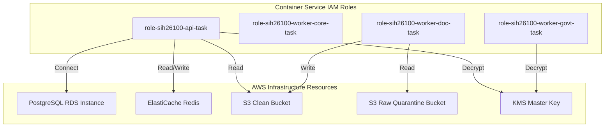

# Phase 1 — IAM & Service Identity Architecture Specification

**Document Control Information**
- **Project Name:** SIH26100 — AI-Powered Integrated Bid Compliance Verification Platform for GeM Procurement
- **Organization:** Ministry of Petroleum & Natural Gas / CPCL
- **Document Version:** 1.0.0 (Phase 1 — Task 10 IAM Specification)
- **Status:** DESIGN DRAFT / PENDING REVIEW
- **Security Classification:** INTERNAL
- **Mode:** DESIGN ONLY — ZERO CODE IMPLEMENTATION

---

## 1. Executive Summary & Purpose

This specification defines the Identity & Access Management (IAM) architecture, machine service identity models, human role mappings, least-privilege policy boundaries, and administrative access controls.

> **"All human and machine identities execute under least-privilege roles. Application roles do not grant infrastructure administrative privileges, and infrastructure roles do not bypass application compliance controls."**

---

## 2. Machine Service Identity Matrix

---

## 3. Machine Service Role Permissions Scope

| Service Identity Role | Granted Capabilities / Policies | Restricted / Prohibited Actions |
|---|---|---|
| **`role-sih26100-api-task`** | Read clean S3, Write Redis broker, Connect PostgreSQL | Cannot read raw quarantine bucket, cannot modify IAM policies |
| **`role-sih26100-worker-core-task`** | Read/Write Redis, Write PostgreSQL, Read clean S3 | Cannot access KMS government certificate secrets, cannot delete audit events |
| **`role-sih26100-worker-doc-task`** | Read raw S3, Write clean S3 scratch | Zero network egress, cannot connect directly to PostgreSQL database |
| **`role-sih26100-worker-govt-task`**| Read/Write Redis queue, Read Govt secrets | Outbound NAT access only, cannot modify compliance AST rule definitions |

---

## 4. Human Role Mapping to Operational Capabilities

1. **ProcurementOfficer:** Granted application access to evaluate bids, initiate manual verification fallbacks, and record officer decisions. Zero AWS console or infrastructure access.
2. **SeniorReviewer:** Granted four-eyes verification approvals and policy version review access. Zero infrastructure access.
3. **Auditor:** Granted read-only access to tamper-evident audit ledger verifiers and compliance snapshot reports. Zero database write access.
4. **SystemAdmin:** Granted infrastructure deployment and monitoring dashboard access. Prohibited from executing officer qualification decisions or altering audit ledgers.
