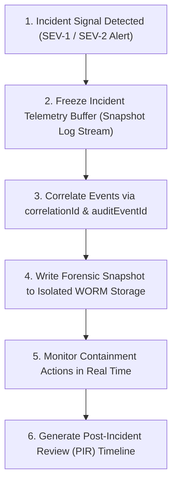

# Phase 1 — Incident Telemetry & Post-Incident Forensics Architecture

**Document Control Information**
- **Project Name:** SIH26100 — AI-Powered Integrated Bid Compliance Verification Platform for GeM Procurement
- **Organization:** Ministry of Petroleum & Natural Gas / CPCL
- **Document Version:** 1.0.0 (Phase 1 — Task 9 Incident Observability Specification)
- **Status:** DESIGN DRAFT / PENDING REVIEW
- **Security Classification:** INTERNAL
- **Mode:** DESIGN ONLY — ZERO CODE IMPLEMENTATION

---

## 1. Executive Summary & Purpose

This specification defines the incident observability, telemetry preservation, and forensic correlation architecture for the SIH26100 platform. When security incidents, data breaches, or critical operational failures occur, observability must capture high-fidelity incident timelines, preserve diagnostic evidence, and link technical log streams directly to authoritative audit records.

The core incident telemetry principle is:
> **"Incident telemetry MUST capture complete end-to-end execution timelines and preserve forensic evidence without violating privacy laws or corrupting ongoing SHA-256 audit ledgers."**

---

## 2. Incident Telemetry Life Cycle & Evidence Preservation



---

## 3. Incident Event Schema (`IncidentTelemetryEvent`)

```json
{
  "$schema": "https://json-schema.org/draft/2020-12/schema",
  "title": "IncidentTelemetryEvent",
  "type": "object",
  "required": [
    "timestamp",
    "incident_id",
    "correlation_id",
    "severity",
    "incident_category",
    "triggering_alert_id",
    "affected_component",
    "containment_action_taken",
    "evidence_snapshot_ulid"
  ],
  "properties": {
    "timestamp": { "type": "string", "format": "date-time" },
    "incident_id": { "type": "string", "pattern": "^INC-[0-9]{8}-[0-9]{4}$" },
    "correlation_id": { "type": "string" },
    "severity": { "type": "string", "enum": ["SEV-1", "SEV-2", "SEV-3", "SEV-4"] },
    "incident_category": { 
      "type": "string", 
      "enum": ["SECURITY_BREACH", "AUDIT_TAMPERING", "MALWARE_INGESTION", "PROMPT_INJECTION", "GOVT_PORTAL_OUTAGE", "DATA_LEAKAGE"] 
    },
    "triggering_alert_id": { "type": "string" },
    "affected_component": { "type": "string" },
    "actor_ulid": { "type": "string" },
    "tenant_org_id": { "type": "string" },
    "containment_action_taken": { "type": "string" },
    "evidence_snapshot_ulid": { "type": "string" },
    "audit_event_id": { "type": "string" }
  }
}
```

---

## 4. Forensic Evidence Preservation Rules

1. **WORM Storage Packaging:** Diagnostic log snapshots, network traces, and container execution logs collected during an incident are hashed with SHA-256 and written to write-once-read-many (WORM) storage.
2. **Non-Destructive Investigation:** Incident analysis operates strictly on read-only copies of database snapshots and log streams; production databases and SHA-256 audit ledgers are never modified during post-incident investigations.
3. **Audit Event Linkage:** Administrative containment actions (such as revoking user session tokens or switching adapter operating modes) generate explicit `INCIDENT_CONTAINMENT_EXECUTED` events in the SHA-256 audit ledger.
